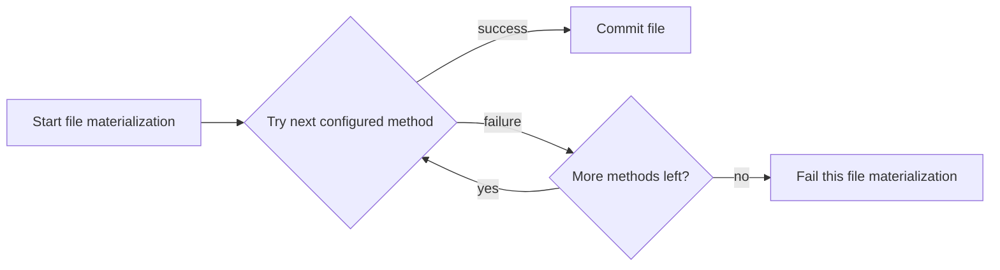
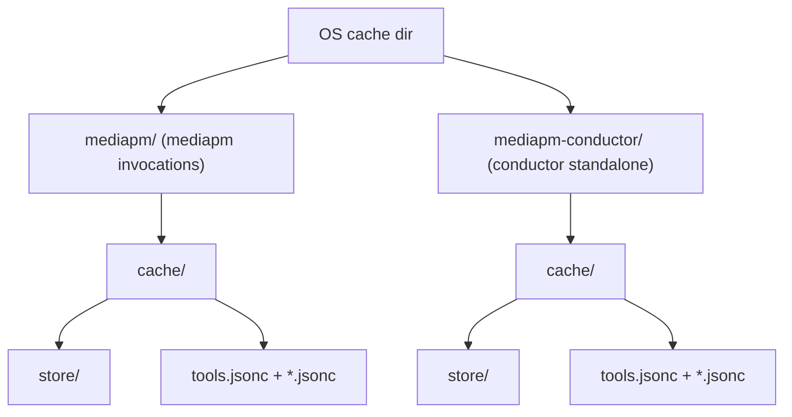

# mediapm

`mediapm` is now organized as a **Rust workspace of capability-focused crates**.

The current implementation establishes compile-ready contracts and scaffolding
for the core crate responsibilities captured in the active instruction set
(`AGENTS.md` plus `.agents/instructions/*.instructions.md`):

- CAS in `src/cas/`
- Conductor in `src/conductor/`
- Conductor built-ins in `src/conductor-builtins/*/`
- mediapm facade/CLI in `src/mediapm/`

## Workspace layout

- `src/cas/` — content identity types, constraints, and async CAS API contract
- `src/conductor/` — orchestration state model, persistence merge semantics,
  and conductor API contract
- `src/conductor-builtins/fs/` — `fs` builtin runtime (filesystem staging)
- `src/conductor-builtins/echo/` — builtin echo runtime + standalone runner
- `src/conductor-builtins/import/` — impure source-ingest builtin (`file`/`folder`/`fetch` kinds)
- `src/conductor-builtins/export/` — impure filesystem materialization builtin (`file`/`folder` kinds)
- `src/conductor-builtins/archive/` — pure archive transform builtin (ZIP-only content transforms)
- `src/mediapm/` — media API + CLI scaffold composed over CAS + Conductor
  (`mediapm-cas` + `mediapm-conductor`; builtins are reached via conductor)
- `scripts/cargo-bin/` — helper binary used by repo tooling

## Status

- Workspace split and inter-crate wiring are in place.
- Public APIs are documented and covered by baseline tests.
- Runtime behavior is intentionally minimal scaffolding for incremental
  implementation.

## Commands

### Validation

**For development (recommended for speed):**

Use targeted aliases from `.cargo/config.toml` to validate only affected crates:

- `cargo test-pkg <crate>` — run tests for a single crate (e.g., `cargo test-pkg mediapm`)
- `cargo clippy-pkg <crate>` — lint a single crate (e.g., `cargo clippy-pkg mediapm-cas`)
- `cargo build-pkg <crate>` — build a single crate

**Before submitting (pre-push):**

Run full workspace validation:

- `cargo fmt-check` — check formatting on all Rust files
- `cargo clippy-all` — lint entire workspace
- `cargo test-all` — test entire workspace

These workspace-wide commands are intentionally slow and best suited for pre-push gates.

Integration tests across workspace crates use one shared harness shape:

- top-level `tests/tests.rs` entrypoint,
- grouped modules under `tests/e2e/`, `tests/int/`, and `tests/prop/`.

CAS topology-visualization integration tests live in
`src/cas/tests/int/cas_visualize.rs`.

Run the `mediapm` CLI:

- `cargo run -p mediapm -- sync`
- `cargo run -p mediapm -- sync --check-tag-updates`
- `cargo run -p mediapm -- tools sync`
- `cargo run -p mediapm -- tools sync --no-check-tag-updates`
- `cargo run -p mediapm -- tools list`
- `cargo run -p mediapm -- global path`
- `cargo run -p mediapm -- global tool-cache status`
- `cargo run -p mediapm -- global tool-cache prune`
- `cargo run -p mediapm -- media add https://example.com/video.mkv`
- `cargo run -p mediapm -- media add-local ./path/to/local/file.mkv`

Passthrough commands (`mediapm cas ...` and `mediapm conductor ...`) now
invoke sibling workspace binaries directly and only trigger a build when the
target binary is missing for the active profile.

Tag-update default policy:

- `mediapm sync` defaults to **not** checking remote updates for tag-only tool
  selectors (for example `tag = "latest"`)
- `mediapm tools sync` defaults to checking remote updates for tag-only
  selectors
- both commands expose `--check-tag-updates` / `--no-check-tag-updates`
  overrides

Optional runtime path overrides can be supplied per command:

- `--mediapm-dir <path>`
- `--conductor-config <path>`
- `--conductor-machine-config <path>`
- `--conductor-state <path>`
- `--state <path>`

CLI overrides take precedence over `mediapm.ncl` `runtime` values.

Run `mediapm` examples:

- `cargo run -p mediapm --example bootstrap_defaults`
- `cargo run -p mediapm --example demo`
- `cargo run -p mediapm --example demo_online`

Progress rendering notes:

- managed-tool rows use minimal phase labels:
  - `<tool>: resolving`
  - `<tool>: <downloaded>/<total> — downloading` (known total)
  - `<tool>: <downloaded> — downloading` (unknown total)
  - `<tool>: <downloaded> — ready` (complete)
- aggregate tool row uses compact counts:
  - `tool downloads: resolving`
  - `tool downloads: <completed>/<total> — downloading`
  - `tool downloads: <completed> — ready`
- conductor workflow rows keep compact names while using `ready` as terminal
  success status.

`demo_online` is intentionally **compile-only** in automated test/CI flows
(`test = false` in `src/mediapm/Cargo.toml`) because it depends on external
tool distribution endpoints and third-party media/network availability.
For local development changes under `src/mediapm/**`, treat
`cargo run --package mediapm --example demo_online` plus artifact inspection
under `src/mediapm/examples/.artifacts/demo-online/` as a strict validation
gate before sign-off.

To reduce third-party rate-limit (`HTTP 429`) risk during this gate, run
`demo_online` at most once per validation pass, avoid rapid back-to-back
reruns, and apply a cool-down backoff before retrying transient provider
failures.

`demo_online` timeout/watchdog notices are intentionally single-shot,
human-facing lines with no periodic heartbeat logging while conductor progress
rows are active. Keep timeout notices plain text (no row-clear ANSI control
sequences) to avoid duplicating or corrupting progress-bar output.

`demo_online` declares one managed media workflow over
`https://www.youtube.com/watch?v=dQw4w9WgXcQ` with a downloader/transcode
sequence (`yt-dlp -> ffmpeg -> media-tagger -> rsgain`), runs full `mediapm sync`
(`MediaPmService::sync_library_with_tag_update_checks`) to provision tools and
execute the pipeline, then validates managed-tool registration,
managed-workflow shape, and materialized outputs under one metadata-resolved
Jellyfin-compatible hierarchy root under `music videos/`: metadata-templated
untagged
`${media.metadata.artist} - ${media.metadata.title} [${media.id}].untagged${media.metadata.video_ext}`
and tagged
`${media.metadata.artist} - ${media.metadata.title} [${media.id}]${media.metadata.video_ext}`
outputs (both preserving video+audio streams in Matroska), plus selected downloader sidecar families (thumbnails,
description, infojson, links, and playlist sidecars), while keeping
sidecar hierarchy folders and additionally mirroring
subtitles/thumbnails/links directly beside the media files.
For directory hierarchy targets, optional `rename_files = [{ pattern, replacement }, ...]`
rules can rewrite extracted file names (in declaration order), which `demo_online`
uses to keep mirrored thumbnails/links aligned to the same filename prefix as
primary media outputs. Rename `replacement` values also support
`${media.id}` and `${media.metadata.<key>}` placeholders.
Single-file description/infojson sidecars use stable sidecar filenames
(`sidecars/description.txt`, `sidecars/info.json`) and mirrored media-root
dotted forms (`.description.txt`, `.info.json`).
The demo dependency matrix is explicit: `yt-dlp` and `media-tagger` inherit
`ffmpeg`, `rsgain` inherits both `ffmpeg` and `sd`, while `ffmpeg` and `sd`
declare no tool dependencies.
The example also verifies that the transcoded output starts with a Matroska
container signature (EBML header `1A45DFA3`) so the emitted video variant is
real MKV content,
and verifies sidecar-family content types for thumbnails so artifact outputs
cannot silently regress into mixed payloads.

The online demo writes artifacts under
`src/mediapm/examples/.artifacts/demo-online/` and uses that directory directly
as the example workspace root (no extra nested `workspace/` folder).
On Windows, if that canonical directory is temporarily locked (for example by
an external process holding a transient sharing lock), the demo creates a
unique sibling fallback workspace directory named
`demo-online-fallback-<pid>-<timestamp>` and continues execution.

The persistent demo writes artifacts under
`src/mediapm/examples/.artifacts/demo/` and uses that `demo/` directory
directly as the example workspace root.

The persistent demo ingests the bundled binary fixture
`src/mediapm/examples/assets/sample-av.mp4` by importing it into CAS and then
configuring the source step as `import` (`kind = "cas_hash"`,
`hash = "blake3:..."`). It also imports one local metadata JSON sidecar into
CAS so both `metadata.title` and `metadata.video_id` are read via variant
bindings in the same strict metadata object. This keeps demo source ingest
fully local and removes the old local-HTTP-fixture dependency for source setup.
The demo's ffmpeg transform now uses stream-copy into `.m4a` output so local
example execution stays fast while preserving source audio fidelity.

`cargo run -p mediapm --example demo` still defaults to full sync execution.
Automated tests run the real demo entrypoint in configuration-only mode by
setting `MEDIAPM_DEMO_RUN_SYNC=false`, so the example itself is executed during
`mediapm` test runs without depending on network/tool-download availability.

`mediapm` runtime defaults:

- runtime root (`mediapm_dir`): `.mediapm`
- conductor user config (`conductor_config`): `mediapm.conductor.ncl`
- conductor machine config (`conductor_machine_config`):
  `mediapm.conductor.machine.ncl`
- conductor volatile state (`conductor_state_config`):
  `<mediapm_dir>/state.conductor.ncl`
- inherited host env names (`inherited_env_vars`):
  platform-keyed object (`windows`, `linux`, `macos`, ...) where each value is
  an ordered list of inherited environment-variable names for that platform;
  runtime merges only the active host platform entry with host defaults
  (`SYSTEMROOT`, `WINDIR`, `TEMP`, and `TMP` on Windows; empty on other
  platforms)
- machine-managed state (`media_state_config`): `<mediapm_dir>/state.ncl`
- conductor execution tmp dir (`conductor_tmp_dir`): `<mediapm_dir>/tmp`
- conductor schema export dir (`conductor_schema_dir`):
  `<mediapm_dir>/config/conductor`
- schema export dir (`mediapm_schema_dir`): `<mediapm_dir>/config/mediapm`
- materialized output root (`hierarchy_root_dir`): top-level `mediapm.ncl`
  directory
- staging directory (`mediapm_tmp_dir`): `.mediapm/tmp`
- materialization method order (`materialization_preference_order`):
  `hardlink -> symlink -> reflink -> copy` by default (list must be
  non-empty and duplicate-free; sync tries methods in order until one
  succeeds)
- shared user-level tool download cache toggle (`use_user_tool_cache`):
  enabled by default (`true` when omitted)
- ffmpeg generated input-slot limit (`tools.ffmpeg.max_input_slots`):
  `64`
- ffmpeg generated output-slot limit (`tools.ffmpeg.max_output_slots`):
  `64`

Materialization attempts for each managed file follow configured runtime order.
If every configured method fails, that file materialization fails for the sync
run.



Runtime dotenv bootstrap behavior:

- `mediapm` creates `<mediapm_dir>/.env` when missing and loads it on sync/tool
  operations,
- generated default environment-variable lines are intentionally commented
  (`# ...`) so shell/user-level environment values remain visible by default,
- users can opt in to file-based values by uncommenting the specific lines.

When `mediapm` composes conductor, it writes conductor runtime storage defaults
into `mediapm.conductor.machine.ncl` as:

- `conductor_dir = <mediapm_dir>`
- `conductor_state_config = <mediapm_dir>/state.conductor.ncl`
- `cas_store_dir = <mediapm_dir>/store`
- `conductor_tmp_dir = <mediapm_dir>/tmp`
- `conductor_schema_dir = <mediapm_dir>/config/conductor`
- `inherited_env_vars = { <host-platform> = <host default list> }`

`mediapm sync` also passes these grouped runtime paths directly to conductor
workflow execution, so volatile state persists at the resolved
`conductor_state_config` path (default `<mediapm_dir>/state.conductor.ncl`) instead of the
standalone conductor fallback `.conductor/state.ncl`. `runtime.inherited_env_vars`
values from `mediapm.ncl` are merged from the active host platform entry and
forwarded to conductor run options. Those inherited names are intentionally not
duplicated into generated `tool_configs.<tool>.env_vars`.

- when mediapm drives conductor, conductor schemas are exported under
  `<mediapm_dir>/config/conductor` by default.

Relative `runtime.hierarchy_root_dir` values in `mediapm.ncl` resolve
relative to the outermost `mediapm.ncl` directory. Relative
`runtime.mediapm_tmp_dir` values resolve relative to
`runtime.mediapm_dir` (or default `.mediapm/`). Relative
`runtime.conductor_tmp_dir` and `runtime.conductor_schema_dir` values resolve
relative to `runtime.mediapm_dir` (or default `.mediapm/`). Relative
`runtime.conductor_config`,
`runtime.conductor_machine_config`,
`runtime.conductor_state_config`, and `runtime.media_state_config` values
resolve relative to the outermost `mediapm.ncl` directory.
`runtime.use_user_tool_cache` controls whether managed-tool payload
downloads and release-metadata responses use a shared user-level cache.
When enabled (default), `mediapm` stores all tool download artifacts under:

- `<os-cache-dir>/mediapm/cache/store/` (CAS payload objects)
- `<os-cache-dir>/mediapm/cache/tools.jsonc` (metadata index)

Because `mediapm` drives all conductor tool provisioning, both share the
same cache root — no separate conductor subdirectory is used.
When conductor is invoked standalone (without `mediapm`), it uses a
distinct base directory so user data stays separate:

- `<os-cache-dir>/mediapm-conductor/cache/store/`
- `<os-cache-dir>/mediapm-conductor/cache/tools.jsonc`

The `<os-cache-dir>` is the platform cache directory:
`%LOCALAPPDATA%` (Windows), `~/Library/Caches` (macOS),
`$XDG_CACHE_HOME` or `~/.cache` (Linux/Unix).

Additional JSONC index files (`*.jsonc`) may coexist under `cache/` for
secondary lookup tables. Cache rows are evicted after 30 days of inactivity.

Cache layout:



Media source schema highlights in `mediapm.ncl`:

- each `media.<id>` can include optional `title`, optional `description`, and
  optional strict `metadata` object
- `mediapm media add <url>` and `mediapm media add-local <path>` now
  auto-populate `title` and `description` from lightweight source metadata
  probes when available (with deterministic fallbacks when metadata is
  missing)
- `metadata` keys support exactly two forms:
  - literal: `<key> = "value"`
  - variant binding:
    `<key> = { variant = "<file-variant>", metadata_key = "<json-key>", transform = { pattern = "<regex>", replacement = "<replacement>" }? }`
  Metadata bindings must target file variants (not folder captures), and
  runtime expects JSON-object payloads with string values at `metadata_key`.
  When `transform` is provided, `pattern` must fully match the extracted value
  and `replacement` supports regex capture-group substitution (for example
  `pattern = "(.+)"`, `replacement = ".$1"`).
- hierarchy paths may interpolate metadata through
  `${media.metadata.<key>}` placeholders; unknown/missing keys fail fast.
- hierarchy is one ordered node array (`hierarchy = [ { ... }, ... ]`) with
  recursive `children`; legacy flat-map and `"/kind"` forms are unsupported
  (no backward compatibility).
- hierarchy node kinds are explicit: `folder` (default), `media`,
  `media_folder`, and `playlist`.
  - `media` uses one required singular `variant`.
  - `media_folder` uses required plural `variants` and may define
    `rename_files` rewrite rules.
  - `playlist` writes one playlist file and must stay a leaf.
  - `id` is optional on all node kinds; when provided, ids must be unique
    across the flattened hierarchy.
  - `media_id` is optional on all node kinds; `media` and `media_folder`
    require a non-empty effective value (direct or inherited), while other
    kinds may set it for context propagation.
- playlist hierarchy entries (`kind = "playlist"`) write playlist files and
  resolve members by ordered `ids` entries with optional per-item path-mode
  overrides. `ids` accepts string shorthand (`"<id>"`) and object form
  (`{ id = "<id>", path = "relative"|"absolute" }`).
- directory hierarchy entries may optionally define `rename_files` as an
  ordered list of regex rewrites (`{ pattern, replacement }`) applied to
  extracted file members; `replacement` supports `${media.id}` and
  `${media.metadata.<key>}` placeholders; file hierarchy targets must keep
  `rename_files` empty.
- each `media.<id>` may optionally override managed workflow id via
  `workflow_id`; when omitted, default is `mediapm.media.<id>`
- default runtime policy limits `yt-dlp` to one active call by setting
  `tool_configs.<yt-dlp-tool-id>.max_concurrent_calls = 1`
- local sources added via `media add-local` are modeled as one managed
  `import` step with `options.kind = "cas_hash"` and `options.hash =
  "blake3:..."`
- manually seeded variant pointers may still be declared via `variant_hashes`
  (map of variant name -> CAS hash pointer)
- all media processing is declared in one ordered `steps` list where each step
  declares:
  - `tool` (`yt-dlp`, `import`, `ffmpeg`, `rsgain`, `media-tagger`)
  - `input_variants` for non-source-ingest transforms; source-ingest tools
    (`yt-dlp`, `import`) keep `input_variants` empty
  - `output_variants` as a map keyed by output variant name where values
    optionally override output-policy flags (`save`, `save_full`), with
    defaults `save = true` and `save_full = false`; hierarchy file paths must
    select file variants whose latest producer keeps `save = true` (or
    `save = "full"`), while hierarchy directory paths may keep folder
    variants at default `save_full = false`
    (`ffmpeg`, `rsgain`, and `media-tagger` output variants may also define
    optional `extension` to drive generated `output_path_<idx>` values),
    (`yt-dlp` also uses this map to expose non-primary artifact families like
    subtitles, thumbnails, descriptions, infojson, comment, link files,
    chapter splits when explicitly requested, and playlist sidecars)
  - output-variant values are object-driven across managed tools: `kind`
    determines default file-vs-folder capture behavior, optional
    `capture_kind = "file"|"folder"` can override that default, and
    optional `langs` is a capture-filter hint for subtitle-family artifacts
  - downloader language selection remains step-option owned via
    `options.sub_langs` (variant `langs` does not replace step-level download
    language selection)
  - there is no separate dedicated per-variant output-folder setting; folder
    behavior is expressed through `kind` plus optional `capture_kind`
  - `options` (tool-specific; unknown keys are rejected at load time), where
    values are scalar strings by default and list values are reserved for
    low-level bindings `option_args`, `leading_args` (inserted immediately
    after executable), and `trailing_args` (appended at end of args)
- online media URIs now live in downloader step options (`options.uri`) rather
  than one top-level source URI field
- supported option families include downloader controls
  (`uri`, `format`, `embed_metadata`, `embed_info_json`, `write_subs`,
  `write_thumbnail`, `write_all_thumbnails`,
  `write_description`, `write_info_json`, `clean_info_json`,
  `write_comments`, `write_link`, `write_url_link`, `write_webloc_link`,
  `write_desktop_link`, `embed_chapters`, `split_chapters`,
  `sleep_subtitles`,
  `merge_output_format`, `ffmpeg_location`),
  plus transform controls for `ffmpeg`, `rsgain`, and `media-tagger`
- managed `media-tagger` tool defaults `strict_identification` to `"true"`,
  `write_all_tags` to `"true"`, `write_all_images` to `"true"`, and
  `cover_art_slot_count` to `tools.ffmpeg.max_input_slots - 1` (default `63`)
  unless explicitly overridden in tool input defaults or step options

Managed media-tool defaults (when not overridden by tool config or step options):

- `yt-dlp`: `format = "bestvideo*+bestaudio/best"`, metadata embedding
  enabled, `sub_langs = "all"`, manual subtitle capture enabled by default
  (`write_subs = "true"`, mapped to both manual and automatic subtitle
  downloader toggles) while broad translated subtitle requests are still
  discouraged to reduce provider throttling risk; use precise
  `options.sub_langs` selectors and optionally `options.sleep_subtitles`,
  thumbnail capture enabled with highest-quality single-thumbnail default
  (`write_thumbnail = "true"`, `write_all_thumbnails = "false"`),
  `merge_output_format = "mkv"`, embedded chapters enabled by default
  (`embed_chapters = "true"`, `split_chapters = "false"`),
  comments capture enabled by default (`write_comments = "true"`),
  `clean_info_json = "true"`, and link sidecar formats enabled by default
  (`write_url_link = "true"`, `write_webloc_link = "true"`,
  `write_desktop_link = "true"`), plus deterministic output template marker
  insertion (`%(title)s [%(id)s]__mediapm__.%(ext)s`) so one shared downloader
  step can isolate sidecar families without mixed artifact bundles,
  `cache_dir = "<mediapm_dir>/cache/yt-dlp"`,
  `ffmpeg_location = "ffmpeg"`
- `ffmpeg`: stream copy + metadata copy preservation defaults
  (`codec_copy = "true"`, `map_metadata = "0"`, `map_chapters = "0"`),
  with container-conditional auto-inject flags when `container` is set:
  MP4/MOV family values (`mp4`, `mov`, `m4a`, `m4v`, `3gp`, `3g2`) add
  `-movflags +faststart`, while Matroska/WebM family values
  (`mkv`, `mka`, `mks`, `webm`) add `-cues_to_front 1`.
  Explicit `movflags`/`cues_to_front` values and trailing args can still
  override or compose with these defaults.
- `rsgain`: tool-level defaults keep single-track normalization with
  true-peak clipping safety and timestamp preservation
  (`album = "false"`, `album_mode = "false"`).
- `media-tagger`: strict identification defaults enabled with AcoustID and
  MusicBrainz endpoint defaults, broad Picard-compatible tag projection,
  metadata-preserving merges over existing source tags (media-tagger keys win
  on conflict), and MusicBrainz cover-art enrichment that keeps one
  highest-quality payload per distinct artwork entry (original image preferred,
  thumbnail fallbacks allowed), emits deterministic attachment slots for
  ffmpeg `attached_pic` mapping, and preserves Picard-compatible
  `coverart_*` aliases synchronized with,
  `cache_dir = "<mediapm_dir>/cache"` (shared cache root),
  with payloads under `<mediapm_dir>/cache/store/` and metadata index rows in
  `<mediapm_dir>/cache/media-tagger.jsonc` (no dedicated media-tagger subfolder
  inside `store/`),
  `cache_expiry_seconds = "86400"` (negative values disable expiry),
  and transient 500-class fallback behavior that reuses stale cache rows when
  available to reduce hard failures,
  synchronized with
  `https://github.com/metabrainz/picard/blob/master/picard/coverart/image.py`
- when `recording_mbid` is explicitly provided, the metadata-fetch stage can
  run without input media bytes
- when `media-tagger` needs AcoustID lookup (no explicit
  `recording_mbid` override), missing/empty credentials now fail immediately;
  when credentials are provided via CLI `--acoustid-api-key` or
  `ACOUSTID_API_KEY`, lookup/authentication failures are surfaced as errors.
  For `mediapm sync` workflow execution, include `ACOUSTID_API_KEY` in
  `runtime.inherited_env_vars` when relying on environment-based key lookup

Managed conductor workflow/runtime invariants for `mediapm`:

- each `media.<id>` reconciles to exactly one managed workflow
  (`workflow id = mediapm.media.<id>` unless `media.<id>.workflow_id` overrides)
- step variant-flow dependencies are rendered as explicit `${step_output...}`
  bindings plus matching `depends_on` edges so independent branches can run
  ASAP
- generated executable tool contracts for downloaded media tools declare
  comprehensive IO, including list inputs (`leading_args`, `trailing_args`,
  and option `option_args`) plus scalar option/source inputs:
  - operation/source inputs (`input_content` or `source_url`),
  - outputs (`output_content`, `stdout`, `stderr`, `process_code`)

CAS visualization ownership:

- topology visualization rendering/execution helpers live in `src/cas/`
- `mediapm` CLI `cas ...` commands passthrough to the standalone
  `mediapm-cas` CLI
- CAS commands can also be run directly via
  `cargo run -p mediapm-cas -- <cas-args>`

Built-in tool download catalog used by `mediapm` reconciliation:

| Tool | Download source | Catalog release track | Notes |
| --- | --- | --- | --- |
| `ffmpeg` | GitHub Releases (BtbN preferred; Evermeet used for macOS fallback) | `latest` | Uses platform-native archives for workspace-local installs (`.zip` on Windows/macOS, `.tar.xz` on Linux). |
| `yt-dlp` | GitHub Releases | `latest` track available | Supports pinned release selectors or moving `latest` selector. |
| `rsgain` | GitHub Releases | `latest` | Prefers portable ZIP assets for workspace-local installs. |
| `media-tagger` | Built-in `mediapm` launcher (`mediapm builtins media-tagger`) | `latest` | Native tagging flow using Chromaprint + AcoustID + MusicBrainz + FFmetadata + cover-art slot artifacts for ffmpeg metadata/attachment apply. |

For `media-tagger`, moving `latest` selectors are resolved to the currently
running `mediapm` package version so immutable tool ids always match the
actual builtin implementation being executed.

`mediapm.ncl` tool declarations require at least one release selector per
logical tool: `tools.<name>.version` or `tools.<name>.tag` (or both).
When both selectors are provided, they must match the same resolved release.
`tools.<name>.recheck_seconds` is optional and controls how long cached release
metadata can be reused before `mediapm` refreshes from upstream release APIs.
When omitted, release metadata is refreshed on each reconciliation attempt.
If refresh fails and cached metadata exists, `mediapm` emits a warning and
continues with cached metadata; if no cache exists, reconciliation fails.

Resolved immutable tool ids are derived in this precedence order:

- `mediapm.tools.<name>+source@git-hash` when release metadata exposes a commit hash,
- otherwise `mediapm.tools.<name>+source@version`,
- otherwise `mediapm.tools.<name>+source@tag`.

`source` is a stable identifier from the downloader catalog (for example
`github-releases-yt-dlp-yt-dlp` or `github-releases-btbn-ffmpeg-builds`) to
avoid collisions across upstreams.

Tool payloads are materialized into conductor `tool_configs.<tool>.content_map`
by importing downloaded files into CAS while preserving archive directory
structure. Archive payloads prefer compact directory-form entries (for example
`./` or `windows/`) that store uncompressed ZIP bytes to be unpacked by
conductor, instead of writing one content-map entry per extracted file. When
separate OS-specific packages are provisioned, content-map keys are rooted
under `windows/`, `linux/`, and `macos/` (or one shared `./` root when the
payload is platform-identical), and executable commands use
`${context.os == "<target>" ? ... | ...}` selectors to pick the
correct binary at runtime.
Managed conductor `external_data` rows are synthesized from the same CAS roots
used by mediapm runtime state: local source variant hashes, managed tool
`content_map` entries, materialized hierarchy files, and generated playlist
files. Duplicate hashes are deduplicated, save policy is merged monotonically
(`saved` minimum; `full` dominates), and every managed state hash is rooted.
Managed tool downloads also use a shared user-level CAS cache by default to
avoid re-downloading identical release assets across workspaces for the current
user.

Standalone conductor runtime storage defaults (CLI/API):

- runtime root (`conductor_dir`): `.conductor`
- volatile state document (`conductor_state_config`): `.conductor/state.ncl`
- filesystem CAS store (`cas_store_dir`): `.conductor/store/`
- schema export dir: `<conductor_dir>/config/conductor`

These grouped runtime paths are also part of the persisted user/machine
configuration schema (`conductor.ncl` and `conductor.machine.ncl`) via
one grouped optional `runtime` field containing
`conductor_dir`, `conductor_state_config`, `cas_store_dir`, and optional
platform-keyed `inherited_env_vars`.

The conductor CLI exposes grouped path flags (`--conductor-dir`,
`--config-state`, `--cas-store-dir`). `--cas-store-dir` accepts any CAS
locator string (plain filesystem path or URL); defaults to the resolved
`<conductor_dir>/store` path when omitted.

The persistent conductor demo (`src/conductor/examples/demo.rs`) writes
orchestration state to
`src/conductor/examples/.artifacts/demo/orchestration-state.pretty.json` and
prints that file path instead of streaming the full JSON state payload to
stdout. Both this demo artifact and the `conductor state` command render the
persisted orchestration-state wire-envelope shape.

Current orchestration-state snapshots include explicit top-level `version` and
store per-instance `tool_name` plus normalized metadata: executable metadata
keeps `ToolSpec` shape, while builtin metadata persists only
`kind`/`name`/`version`. Each instance records optional `impure_timestamp` at
instance scope and stores input references by CAS hash identity. For
deduplicated equivalent tool calls, persisted output persistence flags are the
effective merged policy (`save`: logical AND, `force_full`: logical OR).
Builtin orchestration-state metadata decoding is strict and rejects extra
non-identity fields.

`mediapm` persistence versioning now follows the same boundary pattern used in
`cas` and `conductor`:

- `mediapm.ncl` decoding/encoding is delegated through
  `src/mediapm/src/config/versions/`
- machine-managed state decoding/encoding is delegated through
  `src/mediapm/src/lockfile/versions/`
- both persisted documents carry explicit top-level numeric `version` markers
- machine-managed `state.ncl` uses one envelope with top-level `version` and
  `state` fields
- version-specific wire envelopes live in `vN.rs` modules and runtime structs
  stay outside the versioned wire layer
- machine-managed state managed-file sync timestamps persist as Unix-epoch
  milliseconds via
  `managed_files.<path>.last_synced_unix_millis`; per-file provenance stores
  `managed_files.<path>.media_id`
- machine-managed state also persists per-media per-step refresh metadata under
  `state.workflow_step_state.<media_id>.step-<index>` with:
  - `explicit_config`: exact user-facing
    `media.<id>.steps[<index>]` snapshot (implicit defaults omitted)
  - `impure_timestamp`: mediapm-managed refresh timestamp
- managed workflow step refresh is strictly gated:
  - refresh when explicit step config changes, or
  - refresh when mediapm step `impure_timestamp` is missing
- unchanged explicit config plus present timestamp keeps previous immutable tool
  ids so existing outputs are retained across later tool upgrades until the
  user explicitly edits step config or clears timestamp state.

```mermaid
flowchart TD
    A[media.<id>.steps[n]\nexplicit snapshot] --> B[state.workflow_step_state.<id>.step-n]
    B -->|missing entry| R[refresh step\nnew impure_timestamp]
    B -->|timestamp missing| R
    B -->|explicit_config changed| R
    B -->|same config + timestamp present| K[keep prior step tool ids\nreuse existing outputs]
```

## Notes

This repository now matches the requested multi-crate workspace topology, but it is
still an implementation scaffold rather than the full feature-complete system
described by the active agent-guidance contract files.

Builtin runtime policy (mandatory):

- Builtin runtime behavior lives in dedicated crates under
  `src/conductor-builtins/*` (including `echo`).
- `src/conductor` only dispatches to builtin crate APIs and does not keep
  builtin runtime logic inline.
- Each builtin crate remains independently runnable via its own binary target
  while also exposing a library API.
- Builtin crates use explicit crate versions in each builtin `Cargo.toml`
  (`version = "..."`) instead of inheriting workspace package version.
- Builtin crates must share one stable input contract:
  CLI uses normal Rust flags/options while keeping argument values as strings,
  and API accepts `BTreeMap<String, String>` args plus optional raw payload
  bytes for content-oriented operations (for example archive/export). A builtin
  CLI may optionally expose one default option key so one value can be passed
  without spelling the option key, while explicit keyed input remains supported
  and maps to the same API key. Builtin execution must fail on unrecognized
  args/inputs, missing required keys, and invalid argument combinations instead
  of silently ignoring mismatches. If a builtin's successful non-error result is pure,
  its success payload may be deterministic bytes or `BTreeMap<String, String>`.
  Impure builtins may
  instead primarily communicate success through side effects. CLI failures may
  use ordinary Rust error types instead of being encoded into the success
  payload.
