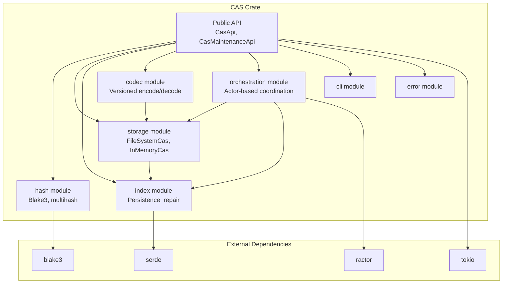

# CAS Agent Guide

> **CAS** is the content-identified object store. `put(bytes)` → hash; `get(hash)` → bytes.
> Deduplicates identical content via Blake3-256. Foundation for deterministic workflows.
> Used by Conductor (state), MediaPM (materialization), and CAS internally.

This guide captures implementation context that is easy to miss from signatures
alone.

## Core model contract

- Treat CAS as an "everything is a diff" system at planning/index level:
  full blobs are logically diff-from-empty identity roots even when persisted
  as raw full payload bytes for fast reads.
- Keep storage/index behavior deterministic and reconstructable:
  - hash identity uses validated BLAKE3 values,
  - object fan-out pathing is deterministic,
  - diff lineage must remain acyclic.
- Preserve runtime-agnostic async boundaries in API contracts; runtime-specific
  scheduling details remain adapter-side.

## Context map

- `StorageActor` is the write/read gateway for `put/get/delete/set_constraint`.
- `IndexActor` is the persistence coordinator for `redb` snapshot flushes.
- `OptimizerActor` runs rewrite/prune maintenance passes.
- `CasNodeActor` is the wire-command façade that composes the three actors.

### Interaction rules

- `StorageActor` may request index flushes via `IndexActorMessage::FlushSnapshot`.
- `StorageActor` may request optimizer actions when disk pressure increases.
- `CasNodeActor` dispatches commands to child actors; it does not bypass them.

## Invariants

- A non-empty hash should exist in redb only if at least one on-disk object file
  exists (`<hash>` or `<hash>.diff`).
- Full objects are stored as raw payload bytes with no headers.
- Delta objects are stored as `.diff` files using the oxidelta-backed payload
  format.
- Persisted object payload files are read-only by default after successful CAS
  writes (`<hash>` and `<hash>.diff`).
- CAS-owned overwrite/delete paths may temporarily clear read-only bits before
  replacing or removing object files.
- Delete is transitive for delta descendants to avoid orphan reconstruction paths.
- Constraints never persist an explicit empty-only candidate list; empty base is
  implicit at read time.
- Optimizer candidate scoring must preserve the depth/size tradeoff contract:
  minimize $Cost = Size(Delta) + \alpha \cdot Depth(Chain)$ and avoid changes
  that collapse storage size at the expense of pathological reconstruction
  depth.

## Storage and retrieval behavior

- Keep root empty-content identity bootstrap behavior stable.
- Retrieval must resolve base ancestry deterministically before applying delta
  reconstruction.
- Keep full-object and delta-object persistence semantics explicit in index and
  runtime code paths so read behavior remains predictable.

## Failure resilience

- Writes stay atomic (`tempfile` on same mount + atomic rename).
- Under disk pressure, preserve soft/hard-threshold behavior:
  - soft threshold enables compression-first optimization behavior,
  - hard threshold rejects writes and surfaces explicit out-of-space errors.

## Documentation requirement (strict)

- In `src/cas/**/*.rs`, document touched files thoroughly:
  - module docs via `//!`,
  - item docs via `///` for public and private items.
- Prefer rich docs (purpose, invariants, side effects, failure behavior,
  and performance rationale where relevant) over brief labels.
- For tests, include concise guarantee-oriented doc/comments describing what
  user-facing or invariant behavior the test protects.

## Codec versioning protocol

- This crate is currently unreleased; backward compatibility is **not**
  required between in-development wire versions.
- Keep `DeltaState` in `src/cas/src/codec/object.rs` as the stable,
  version-agnostic source of truth.
- Put each on-disk wire format in its own file under
  `src/cas/src/codec/versions/` (for example `v1.rs`, `v2.rs`).
- Inside `versions/vX.rs`, do **not** import unversioned structs from outside
  `versions/`.
- A `versions/vX.rs` file may reference only the immediately previous version
  file, and only to implement version-to-version isomorphism/migration.
- Implement latest-version ↔ unversioned-struct isomorphism in
  `versions/mod.rs`, not in `vX.rs` files.
- Keep an explicit `DO NOT REMOVE` policy docstring at the top of each file in
  `versions/`.
- Files outside `codec/versions/` and `index/versions/` must interact with
  versioned symbols only through each folder's `versions/mod.rs` API surface;
  never import `versions::vX` directly.
- `versions/mod.rs` must not directly re-export `versions::vX` structs/types;
  expose unversioned APIs/wrappers there instead.
- Non-`versions/` modules should keep unversioned runtime data structures and
  use `versions/mod.rs` only for serialization/deserialization boundaries.
- For the `index/` tree specifically, modules outside `index/versions/` should
  import unversioned facade symbols from `index/mod.rs` instead of importing
  `index::versions::*` paths directly.
- In non-`versions/` index modules (for example `index/db.rs`, `index/graph.rs`,
  `index/state.rs`), do not add `version` fields or explicit version-checking
  logic. Keep those concerns in `index/versions/` and expose only
  version-agnostic helpers through the facade.
- Keep versioned envelope structs `pub(crate)`; they are internal to the codec
  boundary and must not leak into the public API.
- Every wire version must provide an `IsoPrime` between its envelope and a
  version-local state type in `versions/`.
- `versions/mod.rs` must provide the `IsoPrime` bridge between the latest
  version-local state and unversioned runtime `DeltaState`.
- Do not add manual `From`/`Into` or ad-hoc `to_state`/`from_state` conversion
  methods for version envelopes; use optics exclusively.
- Implement version-to-version migration through optic composition
  (`old_iso.view` -> `new_iso.review`) so payload bytes are not recompressed.
- Delegate hash byte encoding/decoding to `rust-multihash` via the `Hash`
  helpers; do not manually parse multihash varints in envelope code.
- Do **not** apply Unicode NFD normalization in CAS codec structs/fields;
  NFD normalization is reserved for mediapm filepath handling only.

### Automated enforcement

- The versioning convention is CI-enforced for both version roots:
  - `src/cas/src/codec/versions/mod.rs` test
    `versioned_files_keep_policy_guard_and_boundary_rules`
  - `src/cas/src/index/versions/mod.rs` test
    `versioned_files_keep_policy_guard_and_boundary_rules`
- These tests scan `versions/v*.rs` files and fail if a version file:
  - removes the `DO NOT REMOVE` policy guard docstring,
  - imports unversioned runtime structs directly, or
  - references non-adjacent versions (anything other than `vN` or `vN-1`).
- Additional guard tests also fail when any non-`versions/` Rust file directly
  imports/references `versions::vX`; non-version files must go through
  `versions/mod.rs`.
- When adding `vN.rs`, keep the policy guard text and boundary rules intact.

## Operational notes

- Disk pressure is evaluated before accepting writes.
  - Soft threshold: enable compression-first mode.
  - Hard threshold: reject writes with `CasError::OutOfSpace` and trigger prune.
- In-flight deduplication (`DashMap<Hash, Arc<Notify>>`) ensures a hash is
  persisted once even when many concurrent puts race.

---

## Detailed Specification

The following sections consolidate cross-crate specification content relevant to CAS, inlined from the external spec files that previously held them.

### Cross-Crate Data Flow

```text
User Input (mediapm.ncl)
    ↓
MediaPm Configuration Parsing
    ├─→ CAS: Content-address media
    ├─→ Conductor: Synthesize workflows
    └─→ Builtins: Tool registration
    ↓
Conductor Workflow Execution
    ├─ Step 1: import (builtin) → CAS store
    ├─ Step 2: ffmpeg (managed tool) → CAS store
    ├─ Step 3: media-tagger (managed tool) → CAS store
    └─ Step N: export (builtin) → Materialized files
    ↓
CAS-Backed Materialization
    └─ Direct materialization to final output paths

Temp extraction directory (mediapm_tmp_dir, for zip processing only)
    └─ Extract → materialize → cleanup
    ↓
State Persistence (state.ncl)
    └─ Lock records: path → media_id, variant, hash
```

### Shared Invariants

#### 1. Content Identity Contract

**Principle**: Same bytes → same hash (always)

| Crate | Implementation |
|-------|----------------|
| **CAS** | Blake3-256 multihash; `from_content()` is deterministic; `Hash::composite(&[Hash])` produces deterministic composite hash via `blake3(h₁.bytes() ‖ h₂.bytes() ‖ …)` |
| **Conductor** | CAS hash used for state blob identity; external_data keyed by hash; StringList input hashing uses `Hash::composite` |
| **Builtins** | Pure builtins (echo, archive) produce deterministic payloads |
| **MediaPM** | Lock records keyed by `(media_id, variant)` → CAS hash; materializer StringList hashing uses `Hash::composite` |

**Verification**: If same input produces different hash across runs, it's a bug.

**Composite hash invariant**: All StringList composite hash computations across conductor and materializer must use `Hash::composite` to prevent drift. The 4 independent implementations were unified under `Hash::composite` in `refactor(cas): add Hash::composite and deduplicate StringList hash computation`.

#### 2. Constraint Correctness Contract

**Principle**: Base selection respects explicit constraints

| Crate | Enforcement |
|-------|-------------|
| **CAS** | `set_constraint_batch()` validates each op's bases exist; optimizer honors constraints |
| **Conductor** | External data → CAS → constraint metadata preserved across loads |
| **Builtins** | N/A (read-only, no constraints) |
| **MediaPM** | Workflow state persisted in CAS; constraints implicit (content-addressed) |

**Verification**: If optimizer rewrite violates explicit constraints, it's a bug.

#### 3. Reconstructability Contract

**Principle**: Stored bytes are retrievable exactly

| Crate | Guarantee |
|-------|----------|
| **CAS** | `get(hash)` returns exact bytes; delta chains reconstructible |
| **Conductor** | State blob persisted to CAS; can round-trip serialize ↔ deserialize |
| **Builtins** | Output bytes persist; pure outputs are deterministic |
| **MediaPM** | Files materialized from CAS are byte-identical to source |

**Verification**: If retrieved bytes differ from stored, it's a bug.

#### 4. Atomicity Contract

**Principle**: Operations succeed or fail cleanly (no partial state)

| Crate | Mechanism |
|-------|-----------|
| **CAS** | Temp file + atomic rename; index snapshots on mutation; `put_new_full_object()` rolls back in-memory index entry + deletes orphaned file if `persist_index_batch()` fails |
| **Conductor** | State persisted atomically; workflow fails fast on conflicts |
| **Builtins** | File operations succeed or rollback (no orphaned state) |
| **MediaPM** | Direct materialization to final output paths; CAS integrity trusted by default |

**Verification**: If partial state persists after failure, it's a bug.

#### 5. Determinism Contract

**Principle**: Identical inputs → identical outputs (pure paths only)

| Crate | Scope |
|-------|-------|
| **CAS** | `put()` and `get()` are deterministic; `optimize()` may change encoding |
| **Conductor** | Pure workflows deterministic; impure workflows may vary on retries |
| **Builtins** | Pure (echo, archive) deterministic; impure (fs, import, export) side-effect-driven |
| **MediaPM** | Lock state deterministic; sync can skip if hash unchanged |

**Verification**: If pure operation produces different output, it's a bug.

#### 6. Schema Sync

The NCL↔Rust schema sync contract applies to conductor and mediapm but not CAS, which uses Rust-native serialization for codec and index schemas. See conductor/mediapm AGENTS.md for NCL-specific rules.

### CAS Integrity Verification

The content-addressed storage layer implements configurable integrity verification that re-checks BLAKE3 hashes when objects are read. Verification is gated by a list of trigger strategies (`VerifyTriggerStrategy`):

- `Always` — Re-verify on every `get()`.
- `Modified` — Re-verify when the object's mtime has changed since the last put or verify (fieldless variant; no per-entity timestamp is tracked).
- `Sample { denominator }` — Re-verify on a 1-in-N probabilistic basis.
- `Stale { timeout }` — Re-verify when the elapsed time since the last put or verify exceeds the timeout.

All strategies are evaluated on every `get()`; verification runs if *any* matching strategy triggers.

**Configuration** (`CasIntegrityConfig`):

```rust
pub struct CasIntegrityConfig {
    pub verify_on_read: Vec<VerifyTriggerStrategy>,
    pub reconstructed_bytes_cache_ttl: Duration,
}
```

Default `verify_on_read`: `[Modified, Sample { denominator: 100 }, Stale { timeout: 604800s }]`.
Default `reconstructed_bytes_cache_ttl`: `3600s`.

Reconstructed-object bytes are cached with a configurable TTL (`reconstructed_bytes_cache_ttl`) to reduce redundant decoding work. No separate integrity-result cache is maintained; verification decisions are made fresh on every `get()` call against object-file metadata and the strategy list.

**Runtime wiring** (`MediaRuntimeStorage`, `RuntimeStorageConfig`):

The CAS integrity configuration is wired through the runtime storage config stack:

- `MediaRuntimeStorage.verify_on_read_sample_denominator: Option<u64>` — overrides the `Sample` strategy denominator (default: 100).
- `MediaRuntimeStorage.verify_on_read_stale_timeout_secs: Option<u64>` — overrides the `Stale` strategy timeout in seconds (default: 604800, 7 days).
- `MediaRuntimeStorage.reconstructed_bytes_cache_ttl_secs: Option<u64>` — overrides the reconstructed-bytes cache TTL in seconds (default: 3600, 1 hour).

These three fields (plus `instance_ttl_seconds`) are mirrored in `RuntimeStorageConfig` (conductor crate) and converted to `CasIntegrityConfig` via `MediaRuntimeStorage::to_cas_integrity_config()`. The resulting config is passed through `RunWorkflowOptions.cas_integrity_config` to the conductor orchestration layer.

All four `Option<u64>` fields in `MediaRuntimeStorage` use `#[serde(deserialize_with = "deserialize_option_u64_from_number")]` to accept both `N::PosInt` and `N::Float` representations, because Nickel exports all numbers as `f64`.

### Integration Boundaries — CAS ↔ Conductor

**Entry Point**: Conductor requires `CasApi` trait object at startup

- `SimpleConductor::new(cas: Arc<C: CasApi>)`

**Operations**:

1. External data stored in CAS: `put_from_uri(uri) → Hash`
2. Workflow state serialized to CAS: `put(orchestration_state_bytes) → Hash`
3. Tool content materialized from CAS: `get(hash) → Bytes`
4. Index repair on startup (optional): `repair_index() → IndexRepairReport`

**Ownership**:

- **Conductor owns**: External data refs, state blobs, input bindings
- **CAS owns**: Storage, persistence, optimization, constraint metadata

**Contract**:

- Conductor may call CAS operations concurrently (thread-safe)
- CAS doesn't reference Conductor types (no circular dep)
- Failures are propagated as-is (no translation)

### Key References

| Aspect | Details |
|--------|---------|
| **Public Traits** | `CasApi`, `CasMaintenanceApi` |
| **Types** | `Hash`, `Constraint`, `ConstraintBatchOp`, `ObjectInfo`, `OptimizeReport` |
| **Backends** | `FileSystemCas`, `InMemoryCas` |
| **Performance** | O(1) full, O(depth) delta; mmap + buffer pool |

### Filesystem Locking

The `FileSystemCas` backend uses an advisory lock file to coordinate access across processes:

| Property | Value |
|----------|-------|
| Lock file location | `<store_root>/lock` |
| Lock type | `fs4::fs_std::FileExt::try_lock_exclusive()` (non-blocking) |
| Scope | Per-store-filesystem — all `FileSystemCas` instances sharing the same root |
| Release | On `File` drop (closes file descriptor) |
| Error type | `CasError::StoreLocked { root: PathBuf }` |
| Wait behavior | `FileSystemRecoveryOptions.wait_for_lock: bool` (default `false`). When `true`, retries in a loop with backoff instead of failing immediately. |
| State | `FileSystemState.lock_file: Option<File>` — held for the lifetime of the `FileSystemCas` instance |

**Contract**: The lock is advisory — cooperative processes must respect it. Non-cooperative processes (e.g., a direct `cp` or `rsync` into the store) are not prevented but risk corrupting the index or creating inconsistent state.

### Concurrent Mutation Safety (Delta Chain Race)

`get()` for delta-chain objects uses a two-phase plan-then-execute pattern to
avoid holding the index read lock across disk I/O, which would block concurrent
writes:

1. **Plan phase** (under index read lock): Walk the delta chain metadata from
   the index, building a `ReconstructionPlan` with ordered `ChainLink` entries
   (base hash → ... → leaf hash). No disk I/O occurs in this phase.
2. **Execute phase** (outside lock): Reconstruct by reading object payloads from
   disk and applying VCDIFF patches sequentially. The index lock is released
   before any disk reads.

A version counter guard (`FileSystemState.reconstruction_version: AtomicU64`)
protects against the plan/execute gap:

- On every index mutation (`delete()`, `optimize_target_if_beneficial()`), the
  counter is incremented with `Release` ordering after the index write.
- `get()` snapshots the counter with `Acquire` ordering before the plan phase,
  then performs a relaxed check after the plan phase.
- If the version changed between plan and execute, the entire get() is retried
  once. Repeated version changes indicate sustained concurrent mutation and
  propagate the error to the caller.

This design ensures concurrent GC/delete/optimize operations cannot cause
`get()` to decode a VCDIFF patch whose base object has been removed or
rewritten between reading the chain metadata and reading the payload files.

**Retry-once guarantee**: A single retry covers the common case where a
concurrent writer finishes one index mutation between plan and execute. If the
writer is sustained (many rapid mutations), the retry fails and surfaces
`CasError::CorruptObject` with the reconstruction context — the caller can
retry at a higher level or fail gracefully.

### Known Limitations

- **Advisory lock**: The store lock is advisory only. Cooperative processes that attempt `try_lock_exclusive()` will be serialized, but a process that bypasses the lock (direct filesystem manipulation, a CAS client built without locking) can still cause concurrent-access corruption.
- **Index false negatives**: Index-backed existence checks may return `false` for objects that exist in storage (conservative by design). Callers must fall back to storage for a definitive answer.
- **Manual filesystem modification**: Direct manipulation of files under the CAS store root (adding, removing, or modifying files outside the CAS API) is unsupported and may produce silently incorrect index state.
- **Recovery scope**: `repair_index()` only verifies and rebuilds the index from existing storage objects. It does not detect or repair corrupted object content (bit rot) — that requires an external integrity-verification tool such as a periodic `blake3sum` audit.

### Index-Backed Existence Checks

**`contains()` / `contains_many()`**:

```rust
impl IndexState {
    /// Returns true when `hash` is known to exist in storage.
    ///
    /// Guarantees:
    /// - `true` means the object is retrievable (no false positives),
    /// - `false` means the object may still exist (conservative — caller
    ///   must fall through to storage for a definitive answer).
    pub fn contains(&self, hash: &Hash) -> bool { ... }

    /// Batch variant — checks up to `hashes.len()` entries in one call.
    pub fn contains_many(&self, hashes: &[Hash]) -> CasExistenceBitmap { ... }
}
```

**Index invalidation strategy**:

- The index is populated lazily on first existence check, then incrementally updated as new objects are stored.
- Object removal (prune, GC) removes entries from the index synchronously.
- Index rebuild is triggered on startup if the stored index version differs from the code version.

**Accepted guarantee trade-off**: False negatives are acceptable (index misses fall back to storage). False positives are NOT acceptable — `contains(hash) == true` must always be correct. This is enforced by:

- Index entries are only added after successful `put()` or confirmed storage-layer `exists()`,
- Index entries are removed synchronously during delete operations,
- On-disk index persistence uses the same atomic-commit pattern as the object store.

**Integration with Conductor**: The `exists_many` method on `CasApi` would first query the index, then batch-check any remaining unknowns against storage. This split ensures the index remains a pure optimization: correctness does not depend on it.

**Performance target**:

- Hot index (fits in RAM): O(1) per check, zero syscalls,
- Cold index (first run, partial load): O(misses) stat(2) calls plus batch fill,
- Expected throughput: 10,000+ checks per millisecond on modern hardware.

### Index Repair & Recovery Scan

The CAS `repair_index()` operation rebuilds the index from the actual storage contents. The scan pipeline uses a two-pass approach to minimize memory pressure:

**Pass 1 — Catalog scan**: Walk the storage backend and classify each object into a `ScannedObjectCatalog` with two maps:

| Map | Type | Contents |
|-----|------|----------|
| `full_objects` | `BTreeMap<Hash, ObjectMeta>` | Metadata only (hash, size, compression). Stream-verified during scan; bytes discarded after verification. |
| `delta_objects` | `BTreeMap<Hash, StoredObject>` | Full bytes retained in memory. Needed for delta-chain reconstruction. |

**Pass 2 — Index reconstruction**: Walk the delta chain roots reachable from `delta_objects`, reconstruct full content on demand, and insert entries into the rebuilt index.

**Memory model**: Recovery memory is `O(delta_count × delta_size)` instead of `O(total_store_bytes)`. Full-object bytes are streamed and discarded; only delta-object bytes are held in memory for reconstruction.

**Error handling**: CAS errors propagate via `?` regardless of workflow purity; no auto-retry on CAS failure.

### Performance

**Hot paths**:

| Path | Target | Technique |
|------|--------|-----------|
| **CAS read** (full object) | O(file_size) | mmap for ≥64KB; buffer pool for small |
| **CAS delta read** | O(depth × patch_size) | Concurrent candidate scoring (8 tasks) |
| **CAS stream read** (large object) | O(file_size) | Streaming chunks (256 KiB) via `stream::unfold`; small objects ≤256 KiB read in one chunk |
| **CAS materialize** (full object fast path) | O(file_size) | `fs::copy` for filesystem backend — kernel-level copy, no userspace buffer allocation; delta fallback via `get()` + write |

**Resource bounds**:

| Resource | Default | Config |
|----------|---------|--------|
| Delta chain depth | 32 | `MAX_DELTA_DEPTH` |
| Buffer pool size | 128 | `FILESYSTEM_STREAM_BUFFER_POOL_MAX_BUFFERS` |
| Actor RPC timeout | 8 sec | `FILESYSTEM_OBJECT_ACTOR_RPC_TIMEOUT_MS` |
| Optimizer concurrency | 8 | `FILESYSTEM_CANDIDATE_EVAL_CONCURRENCY` |

**Mmap lease & actor RPC deadlock prevention**:

The `FileSystemCas` backend uses a `FileObjectActor` (ractor actor) to serialize all file mutations per store. Large objects (≥64 KB) are served via mmap with reference-counted `ActiveMmapLease` entries tracked in an `ActiveMmapRegistry`.

- **Fix A** — Drop the mmap lease (`drop(target_bytes)`) before any actor RPC for the same hash (applied in `optimize_target_if_beneficial`).
- **Fix C** — `wait_for_no_active_mmap` is compiled out on Unix (`#[cfg(not(target_os = "windows"))]` no-op) because POSIX `rename(2)`/`unlink(2)` keep the old inode alive for existing mmap holders. Preserved on Windows.
- **Fix D** — Batch message variant `PersistObjectVariants(Vec<(Hash, StoredObject)>)` processes multiple variants in a single actor message loop, avoiding N sequential RPC round-trips in `persist_rewritten_dependents`. Timeout scales linearly with plan count: `8s × count`.

**Content-addressed memory lifecycle**: Use `bytes::Bytes` for all CAS-resident data to enable zero-copy sharing and cheap clones (ref-count bumps). Avoid `Vec<u8>` for hot-path CAS data in public APIs. CAS `get()` returns `Bytes`; `materialize_to_path()` skips the `Bytes` round-trip entirely when the backend can fast-path via `fs::copy`.

**Recovery memory**: CAS `repair_index()` uses `O(delta_count × delta_size)` memory instead of `O(total_store_bytes)` — full objects are streamed and discarded; only delta-object bytes are held in memory for chain reconstruction.

---

### Part 1: CAS Edge Cases

#### 1.1 Delta Chain Corruption & Recovery

**Issue**: Specification states "adjacent-only migrations" and "O(depth) reconstruction" but does not address partial delta chain loss.

**Scenarios**:

| Scenario | Current Spec | Gap |
|----------|---|---|
| Intermediate delta base deleted during optimization | "Index repair" mentioned but not detailed | No explicit rollback strategy |
| Delta chain depth exceeds MAX_DELTA_DEPTH (32) | Optimizer avoids creating longer chains | What if old chains exceed limit after config change? |
| Corrupted delta (bytes don't apply cleanly) | Codec error raised | Does CAS fall back to full object? Automatic? |
| Orphaned deltas (no base references them) | Prune removes them | Is prune automatic on GC or manual? |
| Cyclic delta reference (A → B → A) | Addressed via `check_no_cycle()` in `storage/chain.rs` | Detected before chain traversal in both filesystem and in-memory backends; `HashSet`-based visited tracking |

**Risk**: Silent data corruption if intermediate base is manually deleted and reconstruction is attempted.

**Recommendations**:

- ✅ Done: cyclic delta reference detection via shared `check_no_cycle()` helper
- Document fallback: if reconstruction fails, **automatically promote to full object copy**
- Specify prune trigger: automatic (on size threshold), manual (operator invokes), or both
- Add test: "corrupted delta chain recovery" with orphaned intermediate base

#### 1.2 Concurrent Mutation During Optimization

**Issue**: Specification states optimizer "concurrently scores candidates (8 tasks)" but does not detail interaction with concurrent puts/deletes.

**Scenarios**:

- Optimizer reads full object for candidate scoring; meanwhile `put()` writes new version
- `delete()` removes object mid-optimization
- Two optimizations run concurrently on overlapping object sets

**Current Spec**: "CAS doesn't reference Conductor types; failures propagated as-is"

**Gap**: No isolation guarantee (e.g., snapshot vs. live reads)

**Risk**: Optimizer producing invalid encoding if object mutated during scoring; stale indexes if deletes race with optimization.

**Recommendations**:

- Explicit isolation: **Optimizer takes immutable snapshot of object set at start** (or uses "version" guard)
- Document: **concurrent puts with identical content are deduplicated** (single write, multiple waiters) vs. race (last write wins)
- Add test: "concurrent optimize + put + delete" scenario

#### 1.3 Constraint Satisfaction Impossibility

**Issue**: `set_constraint_batch()` validates each op's bases exist, but no check for **circular or impossible constraints**.

**Scenario**: Object A with current base = B; `set_constraint_batch([Set { target_hash: A, potential_bases: [C] }])` where C depends on A (direct or transitive).

**Current Spec**: "Optimizer honors constraints"

**Gap**: Constraint-graph DAG validation at `set_constraint_batch()` API not yet implemented; delta-chain cycle detection exists at the storage layer.

**Risk**: Optimizer fails at runtime when trying to resolve circular constraint.

**Status**: Delta-chain cycle detection is implemented via `check_no_cycle()` in `storage/chain.rs`. Constraint-graph-level DAG validation on `set_constraint_batch()` remains as future work.

**Changes (Phases 1–3/5)**:

- Per-constraint forced backup snapshots removed — `set_constraint_batch()` persists all ops in a single `persist_index_batch` call.
- Three call sites in `step_worker` now batch into a single `set_constraint_batch()` call.

**Recommendations**:

- **Constraint graph DAG validation** on `set_constraint_batch()`: refuse if introducing cycle
- Add explicit rule: "Constraints must form a DAG; cycles rejected at set time"
- Add test: "circular constraint detection"

#### 1.4 Hash Algorithm Agility

**Issue**: Specification mentions "Add variant to `HashAlgorithm` enum" for future algorithms, but no migration strategy for **existing persisted hashes**.

**Scenario**: System running with Blake3-256 needs to migrate to SHA3-256; existing CAS contains only Blake3 hashes.

**Current Spec**: "No speculative forward-compatibility; only N → N+1 migrations"

**Gap**: No hash algorithm versioning layer; codec doesn't tag algorithm in hash envelope.

**Risk**: If hash algorithm is updated, old CAS becomes incompatible.

**Recommendations**:

- **Hash envelope must include algorithm discriminant** (not implicit from context)
- Add `HashAlgorithm` field to wire format (even if currently always Blake3)
- Document: "Hash algorithm upgrades require data migration (re-hash all objects)"
- Add test: "cross-algorithm hash comparison (should fail or require re-hash)"

#### 1.5 Out-of-Space Handling

**Issue**: Specification mentions "OutOfSpace (triggers prune)" but does not specify **automatic vs. manual prune invocation** or **retry semantics**.

**Current Spec**: "Fail-fast; no partial state"

**Gap**: Who retries after prune? User code or CAS internal?

**Risk**: Silent data loss if prune removes needed objects.

**Recommendations**:

- Explicit policy: **Automatic prune on OutOfSpace** (within transaction) or **return error, caller retries after external prune**
- If automatic: specify prune strategy (LRU, oldest first, cost model)
- If manual: caller responsibility to invoke `prune()` and retry `put()`
- Add test: "out-of-space + prune + retry" happy path

#### 1.6 Mmap Failure & Fallback

**Issue**: Specification states "mmap for ≥64KB; buffer pool for small" but does not address **mmap failure or unsupported file systems**.

**Scenarios**: CAS on network file system without mmap support; file system permissions prevent mmap; mmap request exceeds OS limit.

**Current Spec**: Performance optimization only

**Gap**: No fallback; error handling unspecified.

**Risk**: If mmap fails, entire read fails instead of gracefully degrading to buffer-based read.

**Mmap lease deadlock** (resolved):

- `optimize_target_if_beneficial` could deadlock with `FileObjectActor` when a caller held an `ActiveMmapLease` for hash H while sending a `PersistObjectVariant(H)` RPC.
- **Fix**: Drop mmap lease before actor RPC in the caller; `wait_for_no_active_mmap` is a no-op on Unix; preserved on Windows. Batch `PersistObjectVariants` message added.

**Recommendations**:

- **Fallback to buffer-pool read on mmap failure** (not hard error)
- Log warning if mmap unavailable (may impact performance)
- Add test: "mmap unavailable → fallback to buffer pool"

#### 1.7 Index Repair Semantics

**Issue**: Specification mentions `repair_index()` returns `IndexRepairReport` but does not specify **what corruption is detected or how it's repaired**.

**Current Spec**: "Index repair on startup (optional)"

**Gap**: No definition of "repair" — is it automated or advisory?

**Risk**: Unclear when to invoke; customer doesn't know if index is healthy.

**Recommendations**:

- ✅ Done: Repair scope documented (3-layer defense — startup orphan scan, `exists()`/`exists_many()` filesystem fallback with auto-healing, `put_new_full_object()` rollback on index persistence failure)
- Document repair scope: "Detects orphaned entries, duplicate entries, version mismatches; removes orphaned, de-duplicates, auto-upgrades schema"
- Make explicit: **Repair never deletes user data** (only index/metadata)
- Add test: "index corruption scenarios → repair restores consistency"

#### 1.8 Index/Filesystem Desync (Resolved)

**Issue**: After a process crash or partial write, the CAS `index.redb` may lack entries for blob files that exist on disk. This causes `exists()` to return false for orphaned files.

**Root cause**: Race window between `persist_object_variant()` (file write) and `persist_index_batch()` (redb write) in `put_new_full_object()`.

**Resolution** (3-layer defense):

1. **Startup orphan scan**: `repair_orphaned_objects_invariant()` in `open_with_alpha_and_recovery()` walks the storage root, finds files not in the index, reads their hashes, and heals them into the in-memory index.
2. **`exists()`/`exists_many()` filesystem fallback**: When a hash is absent from the in-memory index, probe the filesystem directly. If found, heal the index entry (`heal_orphaned_object()`) and return true.
3. **`put_new_full_object()` rollback**: If `persist_index_batch()` fails after a successful file write, remove the in-memory index entry and delete the orphaned file.

#### 1.9 Concurrent Access During Recovery

**Issue**: The `repair_index()` scan pipeline opens storage objects for streaming verification while other processes may concurrently write to the store.

**Resolution**: The lock file at `<store_root>/lock` serializes exclusive access. `FileSystemRecoveryOptions.wait_for_lock` controls behavior when the lock is already held:

| `wait_for_lock` | Lock available | Lock held |
|----------------|----------------|-----------|
| `false` (default) | Acquire lock, proceed with recovery | Return `CasError::StoreLocked` immediately |
| `true` | Acquire lock, proceed with recovery | Retry with backoff until lock acquired |

**Recovery memory safety**: After the `ScannedObjectCatalog` split, `full_objects` stores only metadata (bytes discarded after stream verify), and `delta_objects` retains full bytes only for delta objects. Memory drops to `O(delta_count × delta_size)`.

| Scenario | Risk | Mitigation |
|----------|------|------------|
| Recovery scan while concurrent write | Partial-write observation | Lock serializes; exclusive access during scan |
| Concurrent `put()` on same hash | Race: scan may miss new object | Index rebuild re-scans after lock; missed entries = false negative (acceptable) |
| Stale NFS lock after process crash | Lock file exists but holder is dead | Manual lock removal; `wait_for_lock=true` may livelock on stale NFS locks |
| Process crash mid-recovery | Partial index written | Atomic commit: index write is all-or-nothing |

#### 1.10 verify_time = 0 Recovery

**Issue**: Newly stored or migrated objects have `verify_time = 0`. The Stale strategy compares `now - 0 > timeout`, which always triggers verification on first access.

**Current Spec**: "A value of 0 means never verified"

**Gap**: No guidance on how Stale strategy treats `verify_time = 0`. Stale is part of the default config, so every object migrated from v1 will be considered stale and verified on first access after migration.

**Risk**: Every object migrated from v1 gets verified on first access after migration — potentially mass re-verification on next sync.

**Recommendations**:

- Stale strategy should treat `verify_time = 0` as "stale" and trigger verification
- Consider staggering first-access verification across maintenance windows to avoid latency spike
- Document that first sync after v1→v2 migration may be slower due to verification catch-up

#### 1.11 Orchestration State V1→V2 Decode Migration

**Issue**: `decode_state()` in the conductor state model only handled V2 envelope format after the V2 persistence migration, breaking backward compatibility with persisted V1 orchestration state envelopes.

**Fix**: Version dispatch added to `decode_state()`:

1. Parse raw JSON `version` field
2. V2 → existing CAS-ref path
3. V1 → inline-instance path (deserialize V1 envelope, convert each instance via `tool_call_instance_v1_v2_iso` then `tool_call_instance_v2_iso`, return with `latest::VERSION`)
4. Unknown version → error

**Self-healing**: After V1→V2 decode, state is re-persisted via `persist_and_publish_state()` which calls `encode_state()` (always V2). Subsequent loads use the V2 path.

**Risk**: Low. V1→V2 migration is a one-time decode cost per stale state blob. No data loss — the ISO bridges preserve all V1 fields.

#### 1.12 Reconstructed-Bytes Cache Invalidation on Delete/Prune

**Issue**: When an object is deleted or pruned from storage, its `reconstructed_bytes_cache` entry in `FileSystemState` persists until TTL expiry, potentially serving stale or dangling references.

**Current Spec**: "Entries are evicted when the underlying object is deleted or pruned"

**Gap**: Eviction trigger is specified but not how it is enforced — synchronous deletion on write path or lazy check on read?

**Risk**: A concurrent `get(hash)` after `delete(hash)` could hit the cache and return stale data.

**Recommendations**:

- On `delete()`, synchronously remove the corresponding `reconstructed_bytes_cache` entry
- On `prune()`, clear all cache entries for pruned hashes (batch removal)
- Add a lazily-checked generation counter
- Test: "delete then get returns NotFound rather than cached bytes"

#### 1.13 Concurrent get() Race in reconstructed_bytes_cache Fill

**Issue**: Two concurrent `get(hash)` calls both miss the cache and both reconstruct the same object, duplicating work.

**Current Spec**: Not specified

**Gap**: No concurrency control for the cache-fill path

**Risk**: Unnecessary double-reconstruction — doubled latency and I/O.

**Recommendations**:

- Use a per-hash lock (e.g., `HashMap<Hash, Mutex<()>>`) to serialize reconstruction for the same hash
- First caller reconstructs and populates cache; second caller finds cache hit
- Never hold multiple hash locks simultaneously (deadlock avoidance)
- Test: "concurrent get() same hash reconstructs only once"

#### 1.14 Stale Strategy with verify_time = 0

**Issue**: Overlaps with 1.10 but focuses on Stale strategy interaction with `verify_time = 0` in production workloads.

**Scenarios**:

- Large library sync after v1→v2 migration: every object triggers Stale verification
- Mixed environment: some objects have `verify_time` from a previous runtime, some are 0
- After `repair_index()`, all objects reset to `verify_time = 0`

**Current Spec**: Stale triggers when `now - verify_time > timeout`; `0` is treated as "infinitely stale"

**Gap**: Stale strategy does not distinguish between "just written with `verify_time = 0`" and "verified yesterday but now stale"

**Risk**: Mass re-verification after index rebuild or migration

**Recommendations**:

- Clarify: `verify_time = 0` always triggers Stale (equivalent to "never verified")
- Document that index rebuild resets all `verify_time` to 0
- Consider a grace-period parameter: if `verify_time = 0` and object age (file mtime) < grace period, skip Stale verification

#### 1.15 Sample Strategy Determinism Across Restarts

**Issue**: The Sample strategy uses randomness to select which objects to verify. Non-deterministic sampling means the same object may be sampled repeatedly or never, depending on restart state.

**Current Spec**: "Verify a random fraction (default 1%) of recently-fetched objects"

**Gap**: No determinism guarantee; sampling is not reproducible

**Risk**: Unpredictable coverage; hard to audit or test

**Recommendations**:

- Use hash-derived seed (e.g., `hash.bytes[..8]` as u64 seed) so sampling is deterministic per object
- Document that Sample strategy is per-access probabilistic, not per-object guaranteed
- Provide `sample_seed` config option to override the derivation
- Test: "same hash sampled consistently across runs"

#### 1.16 verify_time Interaction with Delta Chain Reconstruction

**Issue**: Delta chain reconstruction produces a full object from base + deltas. The reconstructed object's `verify_time` is ambiguous.

**Current Spec**: Not specified

**Gap**: No rule for what `verify_time` means on a delta-reconstructed object

**Risk**: Stale strategy may re-verify unnecessarily or miss verification.

**Recommendations**:

- Reconstruction should not modify any chain member's `verify_time`
- The reconstructed object's `verify_time` should be the minimum of all chain members' `verify_time` (most conservative)
- Or use reconstruction timestamp when reconstructing for read (do not persist verify_time to disk)

#### 1.17 System Clock Jump (verify_time > now)

**Issue**: If the system clock jumps backward, `verify_time` may be greater than `now`, causing nonsensical duration calculations.

**Current Spec**: None — assumes monotonic time

**Gap**: No handling for `verify_time > now`

**Risk**: Stale strategy computes `now - verify_time` as a negative duration, which underflows to a very large positive value, triggering unnecessary verification on every access.

**Recommendations**:

- Clamp `now - verify_time` to `Duration::ZERO` when `verify_time > now` (treat as "just verified")
- Log a warning when clock skew is detected
- Optionally reset `verify_time` to `now` on clock skew detection
- Test: "clock jumps backward → no mass re-verification"

#### 1.18 Reconstructed-Bytes Cache Interaction with Verification

**Issue**: CAS has a single caching layer — `reconstructed_bytes_cache` that holds fully-reconstructed object bytes with a 3600s TTL. No separate integrity-result cache exists.

**Current Spec**: "Reconstructed-object bytes are cached with a TTL of 3600s"

**Gap**: No ordering rule between cache lookup and verification.

**Risk**: Returning cached bytes without re-verifying could mask silent corruption that occurred after the cache entry was created.

**Recommendations**:

- On `get()`: check verification strategies first (against file metadata). If verification triggers, re-read from disk and re-verify regardless of cache state.
- The cache serves only to avoid redundant delta-chain reconstruction, not to skip integrity checks.
- TTL expiry triggers re-read from disk, which triggers a fresh reconstruction and a fresh verification decision.
- Test: "object in reconstructed_bytes_cache but stale mtime → re-verified on get"

#### 1.19 Concurrent GC During Step Execution

GC sweep runs concurrently with workflow step execution. If a step materializes a new CAS object between `list_all_hashes()` and the actual deletion in `gc_sweep()`, the new object won't be in the initial hash set and won't be deleted.

**Mitigation**: Sweep computes the set difference `all_hashes - roots` at the start of the sweep. Objects added during sweep execution are not in `all_hashes` and are therefore not deleted. The sweep is eventually consistent: the next sweep pass will catch any orphans missed due to concurrent modification.

#### 1.20 GC vs Active State Pointer

The root set includes `state.state_pointer` and all instance output pointers. If the state pointer changes during GC (e.g., a concurrent workflow commit), the sweep might delete objects referenced by the old state pointer but not the new one.

**Mitigation**: The background GC loop bypasses the actor mailbox and reads the state pointer + current state directly from the shared `StateStoreClient`. The state store actor processes these reads sequentially with workflow commits (same single-threaded mailbox), so each read returns a consistent snapshot.

**Remaining risk (accepted)**: If a workflow commit advances the state pointer between a state snapshot and the next GC cycle, the next sweep uses the old external_data roots (because they came from that snapshot's `state.external_data`). This is bounded: the next GC cycle will use the latest state snapshot.

#### 1.21 Background GC Loop

The conductor node actor spawns a single background GC loop in `pre_start`. The loop:

1. **Phase 1 — Wait for initialization**: Spin-waits on the `gc_initialized` flag. This flag is set after the first successful `LoadResolvedState` or `ReplaceResolvedState` call gives the state a populated `external_data` field.
2. **Phase 2 — Periodic GC**: Enters a loop that loads the current state (whose `external_data` carries root hashes), reads state pointer from the state store actor, calls `run_cas_gc_sweep()`, then sleeps `GC_INTERVAL_SECONDS` (3600).

**Mailbox bypass**: The revised loop calls `run_cas_gc_sweep()` directly from the background task, not through the actor mailbox. The `RunGc` handler is preserved for CLI use.

**Race fixed (2026-06-07)**: Previously, the loop fired `RunGc` immediately in Phase 1 before any state was loaded. With empty `external_data`, the CAS sweep computed an empty root set and deleted all objects not protected by `recently_written`. The two-phase approach eliminates this race by deferring the first GC until after external_data roots are populated.

**Race fixed (2026-06-07) — progress bar blocked by GC**: Previously, the background loop sent `RunGc` through the actor mailbox, blocking `SubmitWorkflow`. The mailbox bypass eliminates this ordering hazard.

#### 1.22 Cross-Crate StringList Hash Drift (RESOLVED)

**Issue**: Four independent implementations of the same composite hash pattern (`blake3(elem₁ ‖ elem₂ ‖ …)` for StringList-to-hash) were spread across the codebase — any future edit to one could silently drift from the others.

**Affected sites (pre-fix)**:

| Site | File | Pattern |
|------|------|---------|
| `ResolvedInput::from_string_list()` | `src/conductor/src/model/state/mod.rs` | `blake3::Hasher` loop |
| `resolve_list_input_binding_hash_only()` | `src/conductor/src/orchestration/actors/step_worker/mod.rs` | `blake3::Hasher` loop |
| `persist_resolved_list_input()` | `src/conductor/src/orchestration/actors/step_worker/mod.rs` | `blake3::Hasher` loop |
| materializer StringList arm | `src/mediapm/src/materializer/resolve.rs` | `blake3::Hasher` loop |

**Root cause (original sync bug)**: The conductor's `resolve_list_input_binding_hash_only()` previously mixed positional index into element hashes, while the materializer used plain `blake3(elem)`. Empty lists matched accidentally (both produce `blake3("")`), but non-empty lists produced different hashes.

**Resolution (`Hash::composite`)**: Extracted the canonical `Hash::composite(&[Hash]) → Hash` into the CAS crate and updated all 4 sites to use it.

**Design notes**:

- `Hash::composite` does not accept raw bytes or length prefixes — callers must pre-hash each element with `Hash::from_content`.
- Empty slices produce a deterministic but distinct hash (`blake3("")`).
- Single-element `Hash::composite(&[h])` wraps the element hash without identity — the output differs from the element hash itself.

#### 1.23 Composite Hash Across Conductor/Materializer

The materializer's StringList arm does **not** parse `${...}` interpolation; any workflow with interpolated StringList elements silently produces different hashes than if the literal `${...}` text were resolved. This was analyzed and explicitly skipped — the materializer lacks env-var context for full interpolation support, and cross-crate coupling risk outweighs benefit given that the deduplication via `Hash::composite` already eliminates future drift risk.

#### 1.24 Streaming (`get_stream`) Edge Cases

- **File deleted mid-stream**: Lazy stream fails on next chunk read with `CasError::Io`. Caller can retry after confirming hash via `contains()`.
- **Truncated file**: `read_exact` on last chunk yields `UnexpectedEof` → `CasError::Io`. Treat as integrity failure; fall back to `contains()` or repair.
- **Zero-length file**: Small-object fast path (≤256 KiB) handles cleanly; large-object path must check length before chunked loop, yield empty `Bytes` on zero length.
- **Concurrent writes during stream**: Immutable CAS objects by convention; concurrent writes represent integrity violation regardless of streaming.

#### 1.25 `materialize_to_path` Edge Cases

- **Destination exists**: `fs::copy` overwrites atomically. Caller should verify intent — accidental overwrite loses user edits.
- **Read-only parent**: Returns `CasError::Io` with `EACCES`. Validate write permissions before materialization.
- **Cross-device copy**: `fs::copy` falls back to read+write via VFS (no kernel fast-path).
- **Delta object fallback**: If requested hash is delta-only (no full object file), falls back to `get()` + `tokio::fs::write`. Fast path only applies to full objects.

#### 1.26 Memory Lifecycle (`Bytes` vs `Vec<u8>`) Edge Cases

- **Large object clone**: `Vec<u8>` clone is O(content_size); `Bytes` is O(1) ref-count increment. Use `Bytes` for all CAS data paths.
- **Zero-copy fast path**: `fs::copy(object_path, dest)` avoids `Bytes` allocation entirely for large materialization.
- **Stream vs full buffer**: Use `get()` for objects ≤256 KiB; `get_stream()` for larger or unknown-size objects.
- **`Bytes`→`Vec<u8>`**: Avoid conversion. Keep as `Bytes` as long as possible; convert only at API boundaries requiring `Vec<u8>`.

## Part 2: Additional CAS Specifications

### 2.1 Decision Rationale

#### Why CAS Instead of Named Files?

Every piece of data hashes to a Blake3-256 hash; store once, reference many. Identical content deduplicates automatically. Verification is hash recomputation. Trade-off: human-readable names are replaced by hashes — lock files map `(media_id, variant) → hash` to bridge this.

#### Why Actor-Based Orchestration for CAS?

Actors (ractor) serialize access to mutable storage/index state, guaranteeing no race conditions on index mutations without lock deadlocks. Slight message-round-trip latency trade-off for thread safety and bounded concurrency.

### 2.2 Performance Constraints

| Path | Constraint | Technique |
|---|---|---|
| CAS optimizer algorithm | Greedy scoring | Score all objects as delta candidates; cost = `delta_size + base_access_time`; top N=8 selected (configurable). Goal: balance encoding size vs reconstruction time. |
| Delta reconstruction cache | LRU, 1 GB max, 1h TTL | Reconstructed full objects cached in memory. Repeated delta-chain reads hit cache instead of re-reconstructing. |

### 2.3 Testing Requirements

**Delta Chain Robustness** — Add `tests/e2e/delta_chain_robustness.rs`:

- [ ] Corrupted delta → recovery path
- [ ] Orphaned deltas (deleted base) → integrity check detects
- [ ] Chain exceeding `MAX_DEPTH` after config change → pruning triggered
- [ ] Concurrent optimization + delete → no race condition
- [ ] Out-of-space + prune + retry → succeeds

### 2.4 Troubleshooting

#### CAS returns NotFound for a Hash I Just Stored

| Symptom | Cause | Resolution |
|---|---|---|
| `CAS NotFound(hash)` after `put()` | Hash computation mismatch | `assert_eq!(Hash::from_bytes(&data)?, cas.put(data).await?)` |
| Same error | Wrong CAS instance (e.g., `InMemoryCas` vs `FileSystemCas`) | Use same instance for put + get |
| Same error | Index corruption (rare) | Run `repair_index()` |

### 2.5 Implementation Checklist: New CAS Backend

- [ ] Implement `CasApi` (put, get, contains, delete)
- [ ] Implement `CasMaintenanceApi` (optimize, prune, repair, gc_sweep)
- [ ] Include error types: `NotFound`, `OutOfSpace`
- [ ] Property tests: `put(x) → get() == x` determinism
- [ ] Stress tests: concurrent puts, hash collisions
- [ ] Benchmark against `FileSystemCas`
- [ ] Document resource limits and O(1)/O(log n) guarantees
- [ ] Update this file with backend comparison

### 2.6 Extension Points

- **New hash algorithms**: Add variant to `HashAlgorithm` enum, implement multihash trait, update multicodec code table.
- **Index-backed existence checks**: Design proposal — `IndexState::contains(&self, hash) → bool` with false-negative tolerance (miss falls back to storage), no false positives. Populated lazily on first check, updated incrementally. See `future-extensions.md` for full API spec.

### 2.7 Cross-Crate: CAS Versioning vs Conductor Versioning (cf. §6.1)

CAS internal object format version is independent of Conductor config version. No cross-crate version coupling. Both must carry explicit version markers, but they evolve independently with separate migration bridges.

### 2.8 Ambiguity Resolved: Index Repair Semantics (§7.6)

`repair_index()` updates the on-disk index to the current schema version and removes orphaned entries. It does **not** re-hash objects — only metadata is updated. Original object data is untouched. This is an in-place update, not a full rebuild.

## Architecture Diagram


