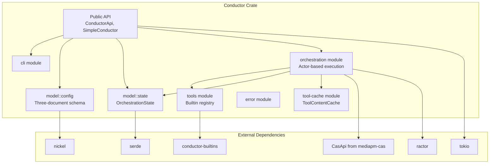
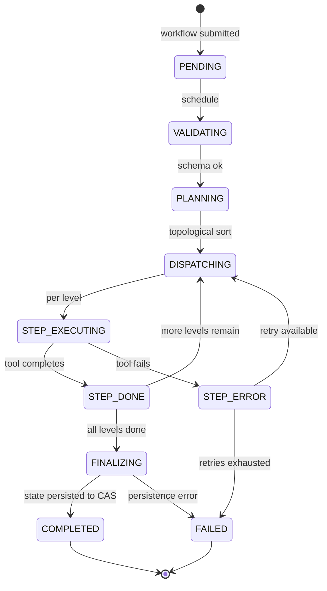

# Conductor Crate Instructions

> **Conductor** is the deterministic workflow engine. Steps defined in Nickel config are
> planned via topological sort, dispatched to workers, and outputs captured to CAS.
> Pure workflows are deterministic; impure ones may vary on retries. Uses a three-document
> config model (user/machine/state) with fail-fast validation, actor-based orchestration,
> and template-expanded step inputs.

This file defines crate-local guidance for `src/mediapm-conductor/`.
Follow this together with the workspace root `AGENTS.md` and relevant `.agents/instructions/*.instructions.md` files.

## Scope

- Applies to all files under `src/mediapm-conductor/`.
- Treat this file as the primary implementation policy for conductor behavior, with root `AGENTS.md` as the workspace-wide baseline.
- If rules conflict, prefer root `AGENTS.md` for global policy and this file for conductor-specific design/behavior details.

## Orchestration contract

- Keep conductor as a functional orchestration engine over CAS: deterministic planning/keying in pure logic, with process/filesystem effects isolated to execution boundaries.
- Keep user intent and machine-managed runtime state separated across `conductor.ncl` and `conductor.generated.ncl`; unresolved non-mergeable conflicts fail fast and require manual resolution.
- Runtime orchestration remains async + actor-oriented (`ractor`) with explicit message contracts and predictable supervision behavior.

## Current Stack and Entry Points

Use concrete files as source of truth:

- Crate manifest: `src/mediapm-conductor/Cargo.toml`
- Library entry: `src/mediapm-conductor/src/lib.rs`
- CLI entry: `src/mediapm-conductor/src/main.rs`
- CLI implementation: `src/mediapm-conductor/src/cli.rs`
- Runtime orchestration: `src/mediapm-conductor/src/orchestration/coordinator.rs`, `src/mediapm-conductor/src/orchestration/actors/`, `src/mediapm-conductor/src/orchestration/protocol.rs`
- Config model: `src/mediapm-conductor/src/config/mod.rs`
- State model: `src/mediapm-conductor/src/state/mod.rs`
- Versioned config schema + migration bridge: `src/mediapm-conductor/src/config/versions/`

Key ecosystem (from `Cargo.toml`):

- Async runtime: `tokio`
- Actor framework: `ractor`
- Serialization: `serde`, `serde_json`
- CAS integration: `mediapm-cas`
- Hashing: `blake3`
- CLI: `clap`

## CLI/API Parity Contract

- Keep conductor CLI operations API-backed by default: command handlers in `src/mediapm-conductor/src/cli.rs` should call `ConductorApi` methods (through `SimpleConductor`) instead of duplicating orchestration logic.
- When adding or changing CLI commands, update `ConductorApi` and actor-client routing in the same change if behavior must be available programmatically.
- CLI-only ergonomics (argument parsing, editor/environment precedence, output formatting) may differ, but validation and mutation semantics must match API paths.

## Progress bar boundary (no indicatif in library)

- The conductor **library** must never depend on `indicatif`. Progress is communicated upward via `RunWorkflowOptions.step_progress: Option<Box<dyn Fn(usize, usize, &str) + Send + Sync>>` (completed, total, step_name).
- The conductor **CLI binary** (`src/mediapm-conductor/src/cli.rs`) can create `ProgressGroup` from `mediapm-utils/progress` and wrap it in a callback.
- `DownloadProgressSnapshot` and `ProgressCallback` from `mediapm-utils` are available in the library for download progress.

## Configuration Document Model

Conductor uses two config documents plus one runtime state document:

- User-edited config: `conductor.ncl`
- Program-edited config: `conductor.generated.ncl`
- Volatile runtime state: resolved from grouped runtime path config (`RunWorkflowOptions.runtime_storage_paths`), default `.conductor/state.ncl`

Grouped runtime path defaults:

- runtime root (`conductor_dir`): `.conductor`
- volatile state path (`conductor_state_config`): `<conductor_dir>/state.ncl`
- filesystem CAS store (`cas_store_dir`): `<conductor_dir>/store`
- schema export directory: `<conductor_dir>/config/conductor`
- tool-content cache directory (`conductor_tools_dir`): `<conductor_dir>/tools`

Schema export behavior contract:

- both CLI workflow entrypoints and API workflow execution must export conductor schemas to `<conductor_dir>/config/conductor` before runtime execution continues.

Document contract:

- `conductor.ncl` is treated as user-edited input and is not machine-mutated.
- `conductor.generated.ncl` stores machine-managed setup/config declarations.
- `conductor.ncl` and `conductor.generated.ncl` may define grouped runtime storage fields under one `runtime` record: `runtime.conductor_dir`, `runtime.conductor_state_config`, `runtime.cas_store_dir`, and optional platform-keyed inherited host env-name map `runtime.inherited_env_vars`. The `cas_store_dir` field accepts any CAS locator string (filesystem path or URL).
- Runtime inherited env-name defaults are host-specific (`SYSTEMROOT`, `WINDIR`, `TEMP`, `TMP` on Windows; empty list elsewhere) and merge user, machine, and invocation-option values with case-insensitive de-duplication.
- resolved state path (default `.conductor/state.ncl`) stores volatile runtime state only and may define only `version`, `impure_timestamps`, and `state_pointer`.
- All three files must define explicit top-level numeric `version` markers.
- `conductor.ncl` and `conductor.generated.ncl` share the full schema surface; resolved runtime state path (default `.conductor/state.ncl`) is a strict volatile subset.
- Effective configuration is resolved by merging all three documents.
- Conflicts must fail fast with explicit workflow errors.
- End-user automation for setup operations (for example add-tool/import-tool and add-external-data/import-data flows) must mutate only `conductor.generated.ncl`.
- Once setup is recorded through machine-document automation, do not require duplicate tool declarations in `conductor.ncl` just to make workflows runnable.

Dual-file ownership model summary:

- `conductor.ncl` is human-owned intent and workflow/tool declarations.
- `conductor.generated.ncl` is machine-owned operational state such as content maps and machine-derived runtime metadata.
- Conductor embeds Nickel evaluation in-process (`nickel-lang-core`) and does not delegate schema evaluation to an out-of-process secondary interpreter.

## Conductor Builtin Tool Strategy

This repository follows the design principle that conductor builtins are the "connective tissue" for bootstrapping and cross-platform consistency. The official baseline set is:

- `echo` (reference pure pass-through runtime contract)
- `fs` (rooted filesystem staging operations: ensure_dir, write_text, copy)
- `import` (`kind=file|folder|fetch` ingestion to pure bytes)
- `export` (`kind=file|folder` filesystem materialization)
- `archive` (pure ZIP-only pack/unpack/repack transforms)

All other domain logic remains external tooling or mediapm workflow behavior.

For portable string-manipulation tasks in workflows, prefer provisioning `sd` via the `tool-presets` feature (`mediapm_conductor::tools::catalog::sd::entry()`) instead of platform-specific shell tools (`sed`, PowerShell regex one-offs, etc.).
Use `sd` for deterministic text rewrites where possible so workflow behavior stays consistent across Windows/Linux/macOS runners.

Tool catalog entries use the all-platform `ToolCatalogEntry` model under `src/mediapm-conductor/src/tools/catalog/` (for example `catalog/sd.rs`) with re-exports in `catalog/mod.rs`. Each entry defines per-OS download URLs and archive formats for all three supported platforms (`windows`, `linux`, `macos`).

Tool preset download invariants:

- All platform payloads are provisioned into content-addressed storage/content maps; there is no host-platform-only download path.
- Runtime command selection stays selector-driven via `${context.os == ...}` conditionals so the correct executable is chosen at execution time without changing the downloaded payload set.

## Tool Schema and Runtime Invariants

When editing tool/config schema behavior, preserve these invariants:

1. Tool name is immutable identity and must include version in name (example: `compose@v1`).

2. Tool-level `version` field is not used.

3. Builtin tool definitions in persisted config are strict: only `kind`, `name`, and `version` are allowed.

4. Executable tool definitions may declare `inputs`, `command`, `env_vars`, `success_codes`, and explicit `outputs`.

5. Workflow step `inputs` are always tool-call input data (for both executable and builtin tools).

6. For executable tools, workflow step inputs must reference declared executable tool inputs; missing required inputs are errors unless `tools.<tool>.runtime.input_defaults` provides the input. Tool-level defaults under `tools.<tool>.inputs.<input>.default` are unsupported.

7. For builtin tools, step inputs are pass-through bindings and builtin crates enforce their own strict argument/input contracts.

8. Workflow-step input bindings are typed call-site values: scalar `string` or `string_list` (list-of-strings). Both forms support `${...}` interpolation with expression forms `${external_data.<hash>}` and `${step_output.<step_id>.<output_name>}`; list bindings apply interpolation per item. Input-binding interpolation is text-oriented and does not support materialization directives such as `:file(...)` or `:folder(...)`; unsupported `${...}` expressions are invalid.

9. `${step_output.<step_id>.<output_name>}` references define the workflow DAG implicitly; there is no explicit `depends_on` field.

10. Tool execution is kind-tagged directly on each tool (`kind = "executable"` or `kind = "builtin"`) rather than nested under `tool.process`.

11. Step-level `process` overrides are not part of the workflow-step contract.

12. Outputs are explicit and capture-based (`stdout`/`stderr`/`process_code`/`file`/`folder`) at the tool definition.

13. Step `outputs` configure per-output persistence policy (`save`, `force_full`) only and can only target declared tool outputs.

14. `tools.<tool>.runtime.content_map` is executable-only and sandbox-relative: keys ending with `/` or `\\` mean destination directories whose mapped CAS bytes must be ZIP payloads to unpack there; keys without a trailing slash/backslash mean destination files whose mapped bytes are written directly; `./` (or `.\\`) is valid and means sandbox-root unpack;
    separate content-map entries must not overwrite the same target file path; every referenced hash must be rooted in top-level `external_data`; absolute and escaping paths are invalid.

15. `tools.<tool>.runtime.description` is optional human-facing metadata only;
    it must not affect instance identity, scheduler behavior, or cache keys.

16. Workflow `name` and `description` are optional human-facing metadata only;
    workflow identity remains the workflow map key and runtime behavior/cache keys must not depend on those fields.

17. Cache rematerialization checks are scoped to outputs actually referenced by `${step_output...}` workflow-step inputs; missing unreferenced outputs do not force rerun for otherwise cache-hit instances.

18. Keep step-output references minimal so independent steps can remain in parallelizable topological levels.

19. Builtin `import`/`export` path semantics for `kind=file|folder` are: `path_mode` defaults to `relative` and resolves `path` against the outermost config directory, `relative` paths must not escape that root, and `path_mode=absolute` requires an explicit absolute `path`.

20. Orchestration-state snapshots must include explicit top-level `version`.

21. `ToolCallInstance.metadata` is persistence-normalized: executable metadata remains `ToolSpec`-shape, while builtin metadata persists only `kind`/`name`/`version`; `impure_timestamp` belongs at instance top-level, not inside metadata. Decode must reject extra builtin metadata fields.

22. `ToolCallInstance.inputs` persist CAS hash references (no inline `plain_content` payload and no separate `source_hash` provenance field).

23. For duplicate equivalent tool-call instances merged under one instance key, persisted output `persistence` must be the effective merged policy across all callers (`save`: logical AND, `force_full`: logical OR).

    Merge rationale:

    - `save` remains enabled unless every equivalent caller opts out,
    - `force_full` remains enabled if any equivalent caller requires full-data persistence.

24. Any human-facing orchestration-state JSON output (for example CLI `state` output or demo artifacts) must render the persisted wire-envelope shape so builtin metadata stays strict (`kind`/`name`/`version`) and does not leak runtime-only optional fields.

25. If a cached referenced `${step_output...}` payload fails CAS integrity

    checks, conductor may auto-recover only for pure workflows by warning, dropping affected cached instances, deleting the corrupt hash, and retrying the workflow once. Impure workflows fail without auto-retry unless `retry_impure` is enabled. When `retry_impure` is `true`, conductor applies the same cache-invalidation and retry logic to both pure and impure steps. Configure `retry_impure` via `RunWorkflowOptions.retry_impure` (API), `runtime.retry_impure` (conductor.ncl), or `--retry-impure` (CLI).

26. `tools.<tool>.runtime.max_retries` controls per-tool outer retry budget

    after the initial failed call. Valid values are `-1` (use runtime default) or non-negative integers. Runtime unified execution normalizes `-1` to the current default retry policy.

27. Newly captured output references must initialize persistence from the resolved output specification policy before equivalent-call merge logic is applied; do not seed new output entries with unconditional saved defaults.

28. When a pure workflow step encounters a `CorruptObject` CAS error (delta chain race with concurrent GC), conductor invalidates the tool content cache entry for the step's tool and retries. This lets the retry re-fetch and re-extract clean content from CAS. Impure workflows fail without cache invalidation or auto-retry unless `retry_impure` is enabled, which extends the same recovery behavior to impure steps.

Instance-key rationale to preserve:

- Equivalent-call dedup identity excludes tool content-map payload details and excludes merged persistence flags so metadata/content-map churn does not invalidate logically equivalent historical executions.

## Reverse-diff optimization intent

- Preserve conductor-to-CAS optimization hints that bias storage so frequently consumed outputs remain fast-access roots while related inputs may be stored as diffs when safe.
- Constraint patch planning must skip the CAS empty-content root identity so optimization does not emit invalid reverse-diff constraint updates.

If adding validation, apply it both where practical:

- schema bridge validation (`config/versions/mod.rs`)
- runtime unification/execution checks (`orchestration/coordinator.rs` and `orchestration/actors/step_worker/mod.rs`)

## `${...}` Template Syntax Contract

Template expansion behavior is implemented in `src/mediapm-conductor/src/orchestration/actors/step_worker/template.rs`.

Supported token forms:

- `${<name>}`
  - JavaScript-like bare identifier interpolation for input keys.
- `${inputs.<name>}`
  - Decodes input bytes with lossy UTF-8 conversion and injects text.
- `${inputs["<name>"]}` / `${inputs['<name>']}`
  - JavaScript-like bracket notation for input keys.
- `${*inputs.<name>}`
  - Standalone executable command-argument unpack token.
  - The token must occupy the full command argument entry.
  - Runtime expands list inputs into one argv entry per list item.
  - Scalar inputs expand into one argv entry when non-empty.
- `${*<condition> ? <true> | <false>}`
  - Standalone executable command-argument conditional unpack token.
  - The token must occupy the full command argument entry.
  - Runtime evaluates one conditional expression and emits one argv entry when the selected branch renders non-empty.
- `${<selector>:file(<relative_path>)}`
  - Uses one selector form above, queues bytes for `<relative_path>`, then injects that path string.
- `${inputs.<name>:file(<relative_path>)}`
  - Queues input bytes for `<relative_path>` under an ad hoc temporary execution directory, then injects that relative path string.
- `${context.os}`
  - Injects host platform text (`windows`, `linux`, or `macos`).
- `${context.working_directory}`
  - Injects the current process working directory as a text path string.
- `${<left> <op> <right> ? <true> | <false>}`
  - Comparison conditional with operators `==`, `!=`, `<`, `<=`, `>`, `>=`.
  - Branch values resolve recursively and support selector/materialization special forms (for example `inputs.payload:file(payload.txt)`).
- `${<operand> ? <true> | <false>}` / `${!<operand> ? <true> | <false>}`
  - Truthiness conditional where non-empty scalar values and non-empty list values are truthy.
- `${<expr1> && <expr2> ? <true> | <false>}` / `${<expr1> || <expr2> ? <true> | <false>}`
  - Logical-and (`&&`) and logical-or (`||`) combine sub-conditions.
  - `&&` binds tighter than `||` (standard precedence).
  - Parentheses group sub-conditions: `${(<expr1> || <expr2>) && <expr3> ? <true> | <false>}`.
  - A leading `!` negates a primary: `${!(a == "x") ? <true> | <false>}`.
  - The branch separator `|` is always distinct from `||`: `||` inside the condition is consumed by the recursive-descent parser; a lone `|` outside any depth-tracked delimiter ends the condition and begins the false branch.
- `\${...}`
  - Escapes interpolation start and renders literal `${...}`.
- JavaScript-like string escapes in literal spans are supported.
  - Examples: `\\`, `\n`, `\t`, `\xNN`, `\u{NNNN}`.

Rendering scope:

- All `${...}` spans are parsed.
- Unsupported expression forms fail explicitly (no silent literal fallback).
- `${context.config_dir}` is unsupported in template rendering and unsupported in workflow-step input bindings.

Rules:

- Absolute file paths in `file(...)` are rejected.
- Unknown inputs fail workflow resolution.
- List-typed inputs are invalid in normal `${...}` interpolation and are only valid in standalone unpack tokens (`${*...}`) inside executable command argument arrays.
- `${...` without a closing `}` fails workflow resolution.
- Unsupported/trailing escape sequences fail workflow resolution.
- Malformed `:file(...)` tokens (for example missing closing `)`) fail workflow resolution.
- `path_regex` template literals should avoid raw bracket escapes (`\[`/`\]`); prefer regex-safe literals such as `\x5B` and `\x5D` when matching bracketed markers.
- Conditional branches that include literal `?` or `|` content must quote that content as a string (for example `"2:v:0?"`) so parser control tokens are not misinterpreted.

When changing parser/templating logic, update Rust docstrings in:

- `render_templates`
- `render_template_value`
- `resolve_template_token`

  and any schema-field docs that reference template usage.

## Rust module split layout convention

When splitting one conductor Rust module into multiple files, use folder-module layout consistently:

- move `foo.rs` to `foo/mod.rs`,
- place sibling module files in `foo/*.rs`,
- place unit tests as `#[cfg(test)]` blocks inline in the source file they test. If the inline block exceeds ~300 lines, split into a themed sibling file `foo_<theme>.rs` declared with `#[cfg(test)] mod foo_<theme>;`.

Avoid keeping both `foo.rs` and `foo/mod.rs` for one module and avoid `#[path = "..."]` for ordinary in-crate module/test placement.

## GC Pipeline Logging

The `run_cas_gc_sweep()` function in `gc.rs` emits `tracing::info!` messages at each of its 5 phases (1/5 through 5/5) so that operators can observe GC progress. The sweep itself (`gc_sweep` in `maintenance.rs`) logs per-batch progress during `delete_many` calls. This addresses the previously observed issue of GC hanging at 100% CPU with no visible output.

## Process and Builtin Execution Semantics

Execution dispatch is decided per tool:

- Process tool: run `process.command[0]` with resolved arguments from remaining command entries.
- Builtin tool: dispatch by builtin name/version.

Guidance:

- Keep builtin dispatch deterministic and explicitly version-gated.
- Builtin runtime logic must live in `src/mediapm-conductor-builtins/*` crates, including `echo`; do not re-implement builtin behavior inline inside `src/mediapm-conductor` runtime code.
- Each builtin crate must expose both:
  - a library API for conductor dispatch, and
  - a standalone binary (`src/main.rs`) so builtin behavior can run independently during debugging and validation.
- Builtin crates must share one identical input contract shape:
  - CLI uses standard Rust flags/options and all CLI values are strings,
  - API input uses `BTreeMap<String, String>` args plus optional raw payload bytes for content-oriented operations. Builtins may optionally define one default CLI option key so one value can be

    provided without spelling the key, but explicit keyed input must remain supported and map to the same API key. Builtin execution must fail fast on undeclared keys, missing required keys, and invalid argument combinations; do not silently ignore mismatches. When a builtin's successful non-error result is pure, the success payload may be deterministic bytes or `BTreeMap<String, String>`. Impure builtins may instead primarily communicate success through side effects. The only allowed API-vs-CLI difference is argument encoding ergonomics (flag transport on CLI vs key/value map in API). CLI failures may use ordinary Rust error types; do not coerce failures into fake string-only success payloads.
- Builtin crates must use explicit crate versions in their own `Cargo.toml` (`version = "..."`) instead of inheriting workspace package version.
- Ensure process execution errors preserve useful stderr context.
- Guard external executable subprocesses with a bounded timeout (default `900` seconds) so stuck child processes cannot stall worker actors forever; allow explicit operator override via `MEDIAPM_CONDUCTOR_EXECUTABLE_TIMEOUT_SECS`.
- Execute external tools with stdin disconnected (`Stdio::null`) so accidental interactive prompts cannot block worker actors indefinitely.
- Create an isolated temporary cwd only when a step actually needs to execute.
- The temporary cwd is ad hoc execution scratch space, not a directory tied to tool identity or cached instances.
- Materialize merged `tool_content_maps[tool_name]` into that cwd using relative paths only, with directory-form keys (`/` or `\\` suffix) unpacked as ZIP payloads, including `./` for sandbox-root unpack.
- Reject `content_map` collisions where separate entries would materialize the same file path; allow merges when paths are distinct.
- Treat all tool-relative paths (`process.command[0]`, template `:file(...)`, and output `capture.file.path`) as relative to that cwd.
- Reject absolute/traversal paths (`..`, rooted/prefixed paths); do not allow sandbox escape.
- Keep output capture behavior explicit and per-output.
- `capture.kind = "file"|"folder"` stays path-template based; `capture.kind = "file_regex"|"folder_regex"` evaluates regex against normalized sandbox-relative paths (`/` separators on all hosts).
- Regex file capture must resolve to exactly one file; zero or multiple matches are workflow errors.
- Regex folder capture (`folder_regex`) may resolve zero to many paths; zero matches are valid.
- `folder_regex` capture rename expansions (capture-group based) must remain deterministic and fail fast on post-rename path collisions.

## Tool-Content Cache

The tool-content cache lives at `<conductor_tools_dir>/` (default `<conductor_dir>/tools/`, overridable via `--conductor-tools-dir` on the CLI or `RuntimeStoragePaths.conductor_tools_dir` in the API).

**This cache is owned exclusively by the conductor crate.** No other crate (`mediapm`, etc.) may read from or write to it.

Design invariants (implemented in `src/mediapm-conductor/src/tool_cache/mod.rs`):

- **Cache key**: the tool id from the conductor config (the map key in `tools`), sanitized to a filesystem-safe name. One cache entry per tool id: `<conductor_tools_dir>/<sanitized_tool_id>/`.

- **Cache-hit check**: `<entry>/metadata.json` stores the complete `tool_content_map` (`BTreeMap<String, Hash>`) alongside a version sentinel and a last-used Unix timestamp. A cache hit requires the stored map to equal the current map exactly; any change in keys or hashes causes a miss and triggers full re-extraction.

- **Payload root**: `<entry>/payload/` is the extraction root for all `tool_content_map` entries. File entries are written at their relative key paths; directory entries (keys with a trailing `/` or `\\`) are unpacked from ZIP payloads. `./` (or `.\\`) means the ZIP is unpacked directly into `payload/`.

- **Bundled tool content**: bundle dependency payload bytes into one managed tool record only for mediapm **same-step companion** dependencies (for example `yt-dlp` companions such as `ffmpeg`/`deno`). For mediapm **cross-step** dependencies (for example media-workflow steps selecting a separate dependency tool id), keep payload bytes in the dependency tool's own `tool_content_map`; do not inline those bytes into the requesting step tool. In all cases, do not model runtime lookups by pointing one tool at another tool's cache entry directory; each step reads only its own `payload/` tree as runtime source of truth.

- **TTL**: cache entries expire after 24 hours of non-use. Last-used time is refreshed on every cache hit. `ToolContentCache::prune` is called best-effort at the start of each `ToolContentCache::materialize` call; prune errors are logged and ignored.

- **Sandbox materialization**: step workers hard-link (with copy fallback) files from `<entry>/payload/` into the per-step sandbox cwd via `ToolContentCache::link_to_sandbox`.

When modifying the cache implementation, keep all three public API methods (`materialize`, `link_to_sandbox`, `prune`) in `src/mediapm-conductor/src/tool_cache/mod.rs` and their callers in `step_worker/mod.rs`.

## Versioned Schema Editing Policy

For config schema files under `src/mediapm-conductor/src/config/versions/`:

- This repository may intentionally evolve `v1` directly when requested.
- Do not add compatibility shims unless explicitly requested.
- Keep Rust bridge structs synchronized with `.ncl` contracts.
- Keep unversioned/latest Nickel contract aliases (`validate_document` and `envelope_contract`) in `mod.ncl`; versioned files (`vN.ncl`) should expose only version-suffixed contracts (`validate_document_vN`, `envelope_contract_vN`).
- Keep test fixtures aligned with current schema semantics.

If schema shape changes, update together:

- `v1.ncl`
- `v_latest.rs`
- bridge mappings in `versions/mod.rs`
- runtime model in `config/mod.rs` (if runtime semantics changed)
- affected examples/tests

## Example Policy

Examples live under `src/mediapm-conductor/examples/`.

- `demo.rs` may generate persistent inspectable artifacts under `.artifacts/demo/`.
- `demo.rs` should clear `.artifacts/demo/` before each run so generated examples remain deterministic and easy to inspect.
- `demo.rs` should exercise all official builtins (`echo`, `fs`, `import`, `export`, `archive`) at least once.
- `demo.rs` should keep generated `conductor.ncl` newcomer-friendly by including explicit default grouped runtime storage values as schema fields (not comments): `conductor_dir = .conductor`, `conductor_state_config = .conductor/state.ncl`, `cas_store_dir = .conductor/store/`.
- When demonstrating filesystem flows in `demo.rs`, prefer compact pipelines that keep builtin `import` at the beginning and builtin `export` at the end, while minimizing intermediate filesystem-oriented steps.
- `demo.rs` should persist orchestration state snapshots to a file under `examples/artifacts/demo/` and print only the file path (not full state JSON payloads) to stdout.
- Non-demo examples should prefer ephemeral behavior unless persistence is essential to the teaching goal.
- Keep example tool definitions consistent with current schema invariants.

## Validation Workflow

**For development:** Use targeted cargo aliases from `.cargo/config.toml`:

- `cargo test-pkg mediapm-conductor` — test only conductor crate
- `cargo clippy-pkg mediapm-conductor` — lint only conductor crate
- `cargo fmt-check` — check formatting on all files

Conductor-focused development loop after meaningful edits:

1. `cargo fmt --all`
2. `cargo fmt-check`
3. `cargo test-pkg mediapm-conductor`
4. `cargo clippy-pkg mediapm-conductor`
5. `cargo build-pkg mediapm-conductor --all-targets --all-features`
6. If examples changed, run representative examples (especially `demo`).

**Before submitting (pre-push):** Run full workspace validation:

- `cargo fmt-check`
- `cargo clippy-all`
- `cargo test-all`

See `.cargo/config.toml` for all available validation aliases and shortcuts.

## Rust Docstring Expectations

For touched Rust code in this crate:

- Add/refresh `///` or `//!` docs for behavior changes.
- Document invariants, edge cases, and side effects (not just names).
- When behavior depends on configuration merging or schema rules, state that explicitly.
- For templating, include supported token forms and failure conditions.

## Change Discipline

- Keep edits scoped and coherent; avoid unrelated refactors.
- Preserve actor/runtime boundaries (`orchestration/` vs `config/` and `state/`).
- Prefer explicit errors over silent coercion.
- When conflicts are possible, fail with actionable messages including field or tool names.

## Detailed specification cross-reference

- The monolithic `crate-specifications.md` and `elaboration-pass-edge-cases.md` have been deleted. All specification and edge-case content is now inlined above or linked via `.agents/instructions/spec-development-index.instructions.md`.
- Keep this conductor-local guide as the authoritative source for orchestration/config/tool invariants.

---

## A. Cross-Crate Data Flow (Conductor Context)

The data flow between CAS, Conductor, Builtins, and MediaPM, viewed from the Conductor perspective:

```text
┌───────────────────────────────────────────────────────────────┐
│                        Conductor                              │
│  ┌─────────────────┐    ┌──────────────────────────────┐      │
│  │  State Model     │    │  Orchestration              │      │
│  │  (3-document)   │───▶│  - Coordinator               │      │
│  │  user/machine/   │    │  - Step Workers              │      │
│  │  state           │    │  - Scheduler                 │      │
│  └─────────────────┘    └──────┬───────────────────────┘      │
│                                │                              │
│  ┌─────────────────────────────▼────────────────────────┐     │
│  │  Execution Layer                                      │     │
│  │  ┌──────────┐  ┌──────────┐  ┌───────────┐           │     │
│  │  │ Process  │  │ Builtin  │  │ Tool      │           │     │
│  │  │ Runner   │  │ Dispatch │  │ Content   │           │     │
│  │  │          │  │          │  │ Cache     │           │     │
│  │  └────┬─────┘  └────┬─────┘  └─────┬─────┘           │     │
│  └───────┼──────────────┼──────────────┼─────────────────┘     │
│          │              │              │                        │
│          ▼              ▼              ▼                        │
│  ┌────────────────────────────────────────────────────────┐     │
│  │  CAS Backend (mediapm-cas)                             │     │
│  │  - put/get/delete                                      │     │
│  │  - delta chains                                        │     │
│  │  - index management                                    │     │
│  │  - GC sweep                                            │     │
│  └────────────────────────────────────────────────────────┘     │
│                                │                                │
│                                ▼                                │
│  ┌────────────────────────────────────────────────────────┐     │
│  │  conductor-builtins (echo/fs/archive/import/export)    │     │
│  │  - CLI binaries + library API                          │     │
│  │  - Pure (echo, archive) vs Impure (fs, import, export) │     │
│  │  - Fail-fast validation                                │     │
│  └────────────────────────────────────────────────────────┘     │
└───────────────────────────────────────────────────────────────┘
         │                            │
         ▼                            ▼
┌──────────────────┐    ┌──────────────────────────────┐
│  MediaPM         │    │  Filesystem (sandbox, store)  │
│  - Workflow      │    │  - tools_dir/                 │
│    synthesis     │    │  - store/                     │
│  - Tool          │    │  - state.ncl                  │
│    provisioning  │    │  - .env.generated             │
│  - Hierarchy     │    │                               │
│    materializ'n  │    └──────────────────────────────┘
└──────────────────┘
```

**Key flows (Conductor-centric)**:

1. **Config → State**: User/machine NCL configs are merged and resolved into `OrchestrationState` (CAS blob).
2. **State → Execution**: Instances from state are probed for cache hits; uncached steps are dispatched to workers.
3. **Worker → CAS**: Step outputs are captured and persisted to CAS; new instance keys are stored in state.
4. **Worker → Builtins**: Builtin steps dispatch to `conductor-builtins/*` via library API or CLI subprocess.
5. **Worker → Process**: Executable steps run subprocesses with sandboxed cwd and content-map materialization.
6. **Tool Cache → Worker**: `ToolContentCache` materializes tool payloads from CAS into `tools_dir/<id>/payload/`.
7. **Worker → Tool Cache**: `link_to_sandbox` hard-links payload files into the step sandbox.
8. **Progress → Caller**: Coordinator emits `WorkflowStepEvent` on an optional channel for progress display.
9. **GC → CAS**: Background loop and CLI `run_gc` run full CAS maintenance (index optimize, constraint prune, GC sweep, index compact) using root set computation from `run_cas_gc_sweep()`.

## B. Shared Invariants (Conductor-Relevant Rows)

| Invariant | Applies To | Description |
|---|---|---|
| **3-document config** | Conductor, MediaPM | User intent (`conductor.ncl`) + machine setup (`conductor.generated.ncl`) + volatile state (`state.ncl`). Machine documents are never user-edited. |
| **Deterministic workflow keys** | Conductor | Instance key = hash(tool_id + sorted inputs + impure_timestamp). Equivalent calls produce same key regardless of content-map details or persistence flags. |
| **Explicit version markers** | Conductor, Builtins, MediaPM | Every persisted document carries top-level `version: u32`. Sequential migrations only. |
| **Fail-fast validation** | Conductor, Builtins | Validation before execution; undeclared config keys, missing required tool inputs, and unresolvable template expressions are errors. |
| **CAS integrity trusted** | Conductor, Builtins | CAS `get()` returns bytes that match the requested hash; no additional integrity checks at call site. |
| **Impure timestamp** | Conductor | Instance key includes `impure_timestamp: Option<ImpureTimestamp>` for non-deterministic steps. `None` = pure (deterministic). |

## C. Integration Boundaries (Conductor-Centric)

### CAS ↔ Conductor

- **State persistence**: Conductor serializes `OrchestrationState` to CAS as a content-addressed blob; `state_pointer` (hash) is stored in the volatile state document.
- **Input resolution**: Step inputs are resolved to CAS hashes (Pass 1) and loaded on demand (Pass 2). `ToolCallInstance.inputs` stores only `ResolvedInputKey` (hash), not full content.
- **Output capture**: Step outputs are persisted to CAS; `outputs` in `ToolCallInstance` reference CAS hashes.
- **GC coordination**: Conductor provides root set (external data, state pointer, instance outputs, instance blob hashes) for CAS GC sweep.
- **Existence checks**: `CasExistenceBitmap` for batch cache probing across step outputs.
- **Content map materialization**: `tools.<tool>.runtime.content_map` entries are resolved from CAS into step sandbox directories.

### Conductor ↔ Builtins

- **Dispatch**: Builtin tools are dispatched by kind (`kind = "builtin"`) via `dispatch_builtin()`. Builtin runtime logic lives in `src/mediapm-conductor-builtins/*` crates, not in `src/mediapm-conductor`.
- **API contract**: Builtin library API uses `BTreeMap<String, String>` args + optional raw payload bytes. CLI uses `--arg KEY VALUE` with all string values.
- **Determinism**: Pure builtins (echo, archive) produce identical output for same input. Impure builtins (fs, import, export) may vary on retries.
- **Fail-fast**: Builtins reject undeclared keys, missing required keys, and invalid combinations immediately.
- **Version gating**: Builtin dispatch is explicitly version-gated (`name@version`). Each builtin crate has its own `Cargo.toml` version.

### MediaPM ↔ Conductor

- **Workflow synthesis**: MediaPM synthesizes workflows from `mediapm.ncl` definitions and passes them to Conductor for execution via `ConductorApi`.
- **Progress events**: Conductor emits `WorkflowStepEvent` through an optional channel; MediaPM renders progress bars from these events.
- **Runtime storage paths**: MediaPM passes grouped runtime paths (`conductor_dir`, `conductor_state_config`, `cas_store_dir`, `conductor_tools_dir`) via `RunWorkflowOptions.runtime_storage_paths`.
- **Tool provisioning**: MediaPM provisions managed tools and populates `machine.tools` with runtime fields; Conductor materializes content maps into step sandboxes.
- **State persistence**: MediaPM persists machine state (`state.ncl`) and conductor state blob independently; consistency is verified on startup.

## D. Orchestration State Decode Migration

The `decode_state()` function at `src/mediapm-conductor/src/state/mod.rs` handles V1→V2 migration of persisted `OrchestrationState` blobs:

### V2 Schema Changes

- `OrchestrationStateAuxV2` replaces the flat `aux` map with structured per-instance `AuxData`.
- `AuxData` gains `last_unreachable: ImpureTimestamp` (non-optional in runtime, bridged from `Option<ImpureTimestampV2>` on wire).
- `ToolCallInstanceV2.metadata` gains `persistence_overrides: Option<...>` for per-output persistence policy.

### Runtime-Only State Field

- `OrchestrationState` gains `instance_blob_hashes: BTreeSet<Hash>` — a runtime-only field (skip-serialize, skip-deserialize) that caches the CAS hashes of per-instance encoded `OrchestrationStateEnvelopeV2` blobs. Populated during V2 decode from `OrchestrationStateEnvelopeV2.instances[*].hash`. The root set computation in CAS GC sweep includes these hashes so per-instance blobs are not orphaned.

### Migration Bridge (`versions/v2.rs`)

- V1→V2 migration uses manual serde conversion for type-safe field mapping.
- `aux` entries lacking `last_unreachable` receive `ImpureTimestamp::now()` during migration.
- The V2 ISO bridge maps `Option<ImpureTimestampV2>` (wire) to non-optional `ImpureTimestamp` (runtime), converting `None` to `now()`.
- Post-processing inserts `AuxData { last_unreachable: now }` for any instance key that still lacks an entry (no `aux` record at all).

### Deserialization Guarantee

After `decode_state()` runs, every instance key has a corresponding `aux` entry with a populated `last_unreachable`. This eliminates all `None`-checking from GC and other runtime code paths. Type-enforcement replaces defensive validation.

### Cutoff Computation

Instance TTL uses `Option<u64>` with `#[serde(deserialize_with = "deserialize_option_integral_u64")]` to accept both `N::PosInt` and `N::Float` (Nickel exports all numbers as f64). The coordinator resolves `None` to `DEFAULT_INSTANCE_TTL_SECONDS` (604800 — 7 days) via `set_instance_ttl` before passing to the state-store actor. Cutoff = `SystemTime::now() - Duration::from_secs(ttl)`.

## E. Instance Key Lifecycle and Failure Recovery

### Instance Key Derivation

Instance keys in Conductor are derived deterministically:

```text
instance_key = blake3(tool_id || sorted_inputs_hash || impure_timestamp)
```

Where:

- `tool_id` = the tool name+version from config (content-map details excluded from identity).
- `sorted_inputs_hash` = blake3 over the sorted `(name, hash)` pairs of `ResolvedInputKey` entries.
- `impure_timestamp` = `Some(timestamp)` for impure steps, `None` for pure (deterministic) steps.

### Failure Recovery Safety

The design ensures prior successful instances remain reachable after a step failure:

1. **`state.clone()` on error** (coordinator error checkpoint): When a step fails, the coordinator calls `commit_run(next_state: state.clone(), pending_unsaved_hashes: BTreeSet::new())`. `state.clone()` preserves ALL current instances — no entries are discarded. Pending unsaved hashes are cleared (the failed step contributed no new CAS objects), but the prior state is untouched.

2. **Append-only `OrchestrationState`**: The `instances` map only grows via insertions — old entries are never removed. Old CAS blobs remain reachable as long as any caller holds their hash.

3. **State pointer advances on both success and failure**: The `state_pointer` always points to the latest checkpoint. On error, `pending_unsaved_hashes` is empty, meaning unsaved-output GC protection is weaker.

4. **Instance GC (post-implementation)**: The `OrchestrationState` instance map is pruned by configurable TTL-based GC (`gc_instances(cutoff)` called from `commit_run()` and `persist_and_publish_state()`). This removes stale `ToolCallInstance` entries from the in-memory snapshot before serialization. Old CAS blobs (pre-GC) remain reachable until `state_pointer` advances past them.

### Worked Example

- Step 1 succeeds → instance key K1 stored in `instances` → CAS blob B1 created.
- Step 2 fails → coordinator calls `commit_run(state.clone(), ...)` → CAS blob B2 created (contains K1 from Step 1, no entry for failed Step 2).
- `state_pointer` references B2 (containing K1) → K1 remains reachable.
- Step 2 retried → new instance key K2 derived (may differ if impure) → on success, K2 added alongside K1.
- Outcome: Step 1's I/O is always available via K1.

### Instance GC Lifecycle

Instance GC uses a two-phase reachability-first approach:

1. **Phase 1 — Reachability scan**: From the current `OrchestrationState`, collect all instance keys referenced by workflow steps whose inputs are still satisfiable (all referenced external data and step outputs exist). These are "reachable" instances.

2. **Phase 2 — TTL sweep**: For unreachable instances, compute `now - last_unreachable` and compare against `instance_ttl_seconds`. Instances whose elapsed time exceeds TTL are removed from the state blob before persistence.

The `last_unreachable` timestamp is set to `ImpureTimestamp::now()` on first detection of unreachability (not on every scan). This prevents rapid TTL expiry from brief unreachability windows.

**GC trigger points**: `commit_run()` and `persist_and_publish_state()` in `StateStoreService` compute the cutoff and call `gc_instances()` before persisting the state blob to CAS. `SetInstanceTtl` cast message loads the TTL from runtime config into the state-store actor at startup.

## G. CAS GC Sweep

The CAS `CasMaintenanceApi` exposes GC sweep capabilities used by Conductor.
The unified entry point `run_cas_gc_sweep()` in `gc.rs` runs the full maintenance sequence in order:

1. **`optimize_once()`**: Rewrites unconstrained objects under the optimizer policy (background priority by default).
2. **`prune_constraints()`**: Removes stale constraint entries from the index.
3. **`gc_sweep(&self, roots: &BTreeSet<Hash>)`**: Deletes all objects NOT in the root set. Computes `all_hashes - roots` and deletes orphans via `delete_many()`.
4. **`compact_index()`**: Compacts the durable index (redb) to reclaim space.

This function is called by all three GC paths:

- **Background loop** (node actor `pre_start`)
- **Actor `RunGc` handler** (CLI-triggered via `conductor gc`)
- **CLI `run_gc` subcommand** (standalone, bypassing the actor)

All paths converge on `run_cas_gc_sweep()` — the CLI previously had inline duplicate logic that has been removed.

### Concurrent Sweep Guard

`gc_sweep` in `FileSystemCas` is protected by a `gc_in_progress: AtomicBool` guard (same pattern as `optimize_in_progress`), preventing concurrent sweeps from racing on the index and recently-written set. `compare_exchange` rejects concurrent calls with `CasError::invalid_input("gc_sweep is already running")`.

### Root Set Composition

A shared `compute_gc_roots()` in `gc.rs` computes the root set from:

- `user.external_data` + `machine.external_data` values
- `state_pointer` (the current orchestration-state hash)
- Instance output/input pointers from the `OrchestrationState` pointed to by `state_pointer`
- Instance blob CAS hashes (the per-instance encoded blobs referenced by `OrchestrationStateEnvelopeV2` that are tracked in the runtime-only `instance_blob_hashes` field)

`external_data` is also stored as a runtime-only (non-serialized) field on `OrchestrationState` itself. The decoupled `run_cas_gc_sweep()` reads `state.external_data` directly instead of receiving a separate parameter — keeping root computation unified with the state it governs.

`content_map` entries are not iterated directly — the decode-time invariant (`vet_latest_envelope`) enforces `content_map ⊆ external_data`, so all content-map hashes are covered by external_data roots.

### Sweep Contract

Deleting a non-root object that is a delta base of a root object is safe — the CAS backend handles rebasing automatically during deletion. Sweep does not consider constraint metadata for root-set computation; constraints are orthogonal to reachability.

## H. Background GC Loop

The conductor node actor spawns a background task in `pre_start` that:

1. **Waits** for the `gc_initialized` flag to be set (via `Acquire` load with 1-second polling), which happens after the first successful `LoadResolvedState`, `ReplaceResolvedState`, or `RunGc` call populates the state's `external_data`. This prevents premature GC from sweeping all unprotected objects before state is loaded.

2. **Shared state**: The actor state holds `shared_state_store: Arc<OnceLock<StateStoreClient>>`. The OnceLock is populated by `SubmitWorkflow` (after `ensure_runtime_support()`), `LoadResolvedState`, and `ReplaceResolvedState` (via `coordinator.state_store()` after success). Previously the OnceLock was only populated by `SubmitWorkflow`, leaving a window where phase-1 succeeded but the background loop hung on a missing state store. The `external_data` lives directly on `OrchestrationState` — no separate synchronization is needed.

3. **Enters a periodic loop**: loads the current state from the coordinator via `state_store.current_state()` and calls `run_cas_gc_sweep()` with it (bypassing the actor mailbox entirely), then sleeps `GC_INTERVAL_SECONDS` (3600) and repeats. The `RunGc` handler is preserved for CLI use.

The `gc_initialized` flag is an `Arc<AtomicBool>` on `ConductorActorState`, shared with the background task. It is also set as a backstop after any successful `RunGc` handler execution.

> **Agent policy — do NOT disable the background GC loop**: The `None` TTL passed to `RunGc` means "use configured/default" — this is correct. Agents must NEVER alter `GC_INTERVAL_SECONDS` to an absurdly large value or make the loop a no-op to avoid implementing GC properly. If the GC loop causes issues, fix the GC implementation — do not disable it.

## I. Channel-Based Workflow Progress Events

Conductor no longer renders progress bars internally. Instead, it emits workflow step completion events through an optional channel. The consumer (mediapm service layer) creates the channel, owns the `MultiProgress` and `ProgressBar` instances, and renders progress based on received events.

### API Types (`src/mediapm-conductor/src/api.rs`)

- **`WorkflowStepEvent`**: struct with fields: `total_steps: usize`, `completed_steps: usize`, `workflow_name: String`, `step_id: String`, `workflow_display_name: String`, `executed: bool`, `worker_index: usize`, `worker_count: usize`. Derives `Debug + Clone`.
- **`WorkflowProgressSender`**: type alias `tokio::sync::mpsc::UnboundedSender<WorkflowStepEvent>`.
- **`RunWorkflowOptions.progress_sender`**: `Option<WorkflowProgressSender>`.

### Coordinator Emission (`src/mediapm-conductor/src/orchestration/coordinator.rs`)

- `execute_workflows` accepts `progress_sender: Option<WorkflowProgressSender>`.
- Before the dispatch loop, `total_steps` is computed as the sum of `ds.step_outputs.len() + ds.ready_queue.len()` across all `dep_states`.
- After each step completion, if `progress_sender` is `Some`, a `WorkflowStepEvent` is sent via the channel with the step's worker index and total worker count.
- Completed steps are tracked via a local `completed_steps` counter (`saturating_add(1)` per event) rather than re-computed from dependency state lengths, ensuring every dispatched event is counted exactly once.
- The coordinator no longer imports or uses `pulsebar` at all.

### Consumer Rendering (`src/mediapm/src/service.rs`)

- Creates an `mpsc::unbounded_channel`, a `MultiProgress`, and spawns a `tokio` receiver task.
- On the first event, one overall bar and `worker_count` text-only worker lines are created. The overall bar uses format `"{msg}  [{bar:20}]  {pos}/{total}"` and worker lines use `mp.add_bar(0).with_format("{msg}")` (no bar, no total — pure text).
- Per-worker step counts are tracked in a `Vec<usize>` and incremented on each event using `event.worker_index`.
- The receiver task updates the overall bar's position and message on each event. The overall bar's per-event message uses the aggregate format `"completed {completed_steps}/{total_steps} steps"`. Worker lines show the current step and per-worker count: `"worker {wi}: {workflow}: {step}  ({count})"`.
- When the channel closes (sender dropped), the overall bar shows `"all workflows complete"` and each worker line shows `"worker {wi}: done  ({count})"`. A 75 ms settle delay flushes the render thread.

## J. Tool Content Cache

The `ToolContentCache<C>` struct at `src/mediapm-conductor/src/tool_cache/mod.rs` is the sole authority over the `tools_dir/` directory tree. No external code creates, reads, writes, or deletes anything inside cache directories — all TTL checking, metadata management, locking, extraction, and pruning is internal to this module.

### Public API

- `PAYLOAD_DIR_NAME` — literal `"payload"`, the subdirectory name inside each tool cache entry where extracted content lives.
- `sanitize_tool_id(name) -> String` — replaces reserved filesystem characters with `_`. Used by all callers to derive cache directory names.
- `ToolContentCache<C: CasApi + Send + Sync>`:
  - `new(tools_dir, cas)` — construct with a shared CAS backend.
  - `materialize(tool_id, content_map, ...) -> ToolCacheEntry` — core API: returns a RAII-guarded path to the cached tool payload.
  - `link_to_sandbox(entry, sandbox_dir)` — associated fn that hard-links the cache entry's payload into a per-step sandbox.
  - `prune()` — remove expired TTL entries.
  - `retain_only(active_ids)` — remove cache directories not in the provided set. Used by mediapm lifecycle for sync-time cleanup.

### Lock Protocol

Per-entry `flock` advisory locking via `fs4::FileExt`:

- **Fast path (cache hit)**: non-blocking `try_lock_shared()` on `tools/<sanitized_id>/.lock`. Returns `ToolCacheEntry` on success.
- **Slow path (cache miss)**: DashMap + `OnceCell` prevents redundant extraction: the first caller acquires the entry, subsequent callers wait. Extraction acquires an exclusive `flock` via blocking `lock()` inside `spawn_blocking`. After extraction the `.lock` file is recreated and a shared-lock fd replaces the exclusive fd (downgrade, no unlock gap). A semaphore limits concurrent extractions across different tool IDs.
- **Prune**: non-blocking `try_lock()` exclusive. Skip entries that return `WouldBlock`.

### Guard Lifecycle

`ToolCacheEntry` (the return type of `materialize()`) holds a shared-lock fd in an RAII guard. For direct-execution paths, the entry is held across the entire process spawn so the cache entry cannot be evicted mid-use. For one-shot callers (`resolve_managed_tool_executable`, `run_managed_tool`), the entry is dropped immediately after use.

**Safety**: Locks are per-open-file-description (standard `flock` semantics). Automatically released when the fd is closed — no manual unlock needed, even if the holding task panics.

**Platform guard**: Locking is gated behind `cfg(unix)`. On non-Unix platforms, `ToolCacheEntry` holds no fd and locking is a no-op.

### Cache Ownership Boundary

`ToolContentCache` owns `tools_dir/*` exclusively. External callers:

- Only receive `ToolCacheEntry` (path + RAII guard) from `materialize()`.
- Use `retain_only()` for bulk cleanup — never call `remove_dir_all` on cache directories.
- Never read/write `metadata.json` or check TTL externally.

### Sync-Time Stale-Content Pruning

During `reconcile_desired_tools` in `sync/mod.rs`, when an existing active tool is replaced by a newer version, the old tool's `content_map` is cleared from `machine.tools[*].runtime.content_map`. This prevents conductor step-tool preservation from matching stale content references against the old tool ID. The old tool ID's registry entry remains in `tool_registry` as a historical record, but without content references it will not be materialized.

## K. Performance (Conductor-Relevant)

### Hot Paths

| Path | Target | Technique |
|---|---|---|
| **Conductor planning** | < 10ms | Level-based topological sort (no DAG simulation) |
| **Conductor scheduling** | EWMA cost model + O(1) batch cache probe | Step-stream batch dispatch; `exists_many` via `CasExistenceBitmap` |
| **CAS materialize** (full object fast path) | O(file_size) | `fs::copy` for filesystem backend — kernel-level copy, no userspace buffer allocation; delta fallback via `get()` + write |

### Resource Bounds

| Resource | Default | Config |
|---|---|---|
| Delta chain depth | 32 | `MAX_DELTA_DEPTH` |
| Actor RPC timeout (CAS) | 8 sec | `FILESYSTEM_OBJECT_ACTOR_RPC_TIMEOUT_MS` |
| Conductor RPC timeout | 300 sec | `MEDIAPM_CONDUCTOR_RPC_TIMEOUT_SECONDS` |
| Materialization workers | CPU cores | Derived from hardware |

### Mmap Lease & Actor RPC Deadlock Prevention

The `FileSystemCas` backend uses a `FileObjectActor` (ractor actor) to serialize all file mutations per store. Large objects (≥64 KB) are served via mmap with reference-counted `ActiveMmapLease` entries tracked in an `ActiveMmapRegistry`.

**Deadlock scenario** (observed in `optimize_target_if_beneficial` — resolved by two-phase staging):

The optimizer and delete paths no longer send actor RPCs. Both use two-phase staging:

1. **Phase 1** (async, outside lock) — write new object variant to a staging path under `tmp/`.
2. **Phase 2** (under index write lock, sync-only) — `std::fs::rename(staging → final)`, remove the opposite variant, and update index metadata. A concurrent reader holding the read lock is blocked during Phase 2 and sees consistent state.

This eliminates both the mmap lease deadlock and a TOCTOU race where a reader could observe new file content with stale index metadata.

### Pulsebar Rendering (Terminal-Width Contract)

All progress messages must fit within the terminal width; detected via `terminal_size` crate; defaults to 80 cols. Step preview degrades gracefully (truncation with `...` suffix, `+N more` counter) to respect the available width.

## L. Key References (Conductor Table)

| Area | Reference |
|---|---|
| **Public Trait** | `ConductorApi` |
| **Implementation** | `SimpleConductor` |
| **Schemas** | 3-document (user `conductor.ncl`, machine `conductor.generated.ncl`, state `state.ncl`) |
| **Execution** | Actor-based (ractor), step-stream batch dispatch, adaptive scheduling, `CasExistenceBitmap` cache probe |
| **State model** | `src/mediapm-conductor/src/config/mod.rs`, `src/mediapm-conductor/src/state/mod.rs` |
| **Versioned config schema** | `src/mediapm-conductor/src/config/versions/` |
| **Orchestration** | `src/mediapm-conductor/src/orchestration/coordinator.rs`, `src/mediapm-conductor/src/orchestration/actors/`, `src/mediapm-conductor/src/orchestration/protocol.rs` |
| **Tool content cache** | `src/mediapm-conductor/src/tool_cache/mod.rs` |
| **Template expansion** | `src/mediapm-conductor/src/orchestration/actors/step_worker/template.rs` |
| **CLI** | `src/mediapm-conductor/src/main.rs`, `src/mediapm-conductor/src/cli.rs` (API-backed) |
| **Builtin dispatch** | `src/mediapm-conductor-builtins/*` (echo, fs, archive, import, export) |
| **Progress events** | `WorkflowStepEvent` in `src/mediapm-conductor/src/api.rs`, emission in coordinator, consumption in `src/mediapm/src/service.rs` |

## M. Known Limitations (Conductor-Relevant)

- **Advisory lock**: The CAS store lock is advisory only. Cooperative processes that attempt `try_lock_exclusive()` will be serialized, but a process that bypasses the lock can still cause concurrent-access corruption.
- **Index false negatives**: Index-backed existence checks may return `false` for objects that exist in storage (conservative by design). Callers must fall back to storage for a definitive answer.
- **Manual filesystem modification**: Direct manipulation of files under the CAS store root is unsupported and may produce silently incorrect index state.
- **Parallel sync**: State documents are not designed for concurrent writers. Only one workflow execution at a time per workspace.
- **Cross-workflow cache dedup**: The dependency-stream model dispatches ready steps from multiple workflows simultaneously via `FuturesUnordered`. Steps started in parallel do not see each other's in-flight cache entries, so identically-keyed outputs may both execute instead of one caching off the other. This is inherent to parallel dispatch, not a bug.
- **Diagnostics metrics in dependency-stream mode**: `worker_pool_size` may report 0 because `begin_level_metrics()` is not called in dependency-stream dispatch. A fallback uses `worker_metrics.len()` as a proxy.
- **Trace event completeness**: Dependency-stream dispatch only emits `StepCompleted` trace events. `LevelPlanned` and `StepAssigned` events are only present in the legacy sequential dispatch path.

## N. Conductor Edge Cases

### N.1 External Data Retrieval Failure (§2.1)

**Issue**: `import` tool fetching external data from URL may fail mid-fetch. Conductor's error handling for partial `external_data` during workflow execution is not fully specified.

**Scenarios**:

- HTTP 404 during `import` → `import` tool returns error, step fails
- Connection timeout during `import` → depends on tool timeout config
- Partial download (`import` completes but content truncated) → CAS hash mismatch

**Current behavior**: `import` tool failures propagate as step errors. Conductor's error recovery applies: pure workflows may auto-recover once (warn + drop + retry), impure workflows fail immediately.

**Recommendations**:

- Document that `import` failures are step errors; CAS integrity verification catches truncation on `put()`.
- For transient network errors, `import` tool should retry internally (configurable retry count).
- Conductor does NOT retry steps that fail due to `import` errors beyond the standard per-tool retry budget.

### N.2 Workflow DAG Cycle Detection (§2.2)

**Issue**: Workflow steps reference `${step_output.<step_id>...}` from other steps, forming a DAG. No explicit cycle detection.

**Current behavior**: The dependency-stream builder computes topological order. A cycle causes the topological sort to fail (no valid ordering) → workflow fails at dispatch time, not at execution time.

**Recommendations**:

- Document that workflow DAG cycles are detected at graph-build time (not execution time).
- Error message must include the cycle path for debugging.
- Add test: "circular step reference → graph build error".

### N.3 Missing External Data During Execution (§2.3)

**Issue**: A step references `${external_data.<hash>}` where `<hash>` does not exist in CAS.

**Current behavior**: Input resolution (Pass 1) fails at step execution time — the hash reference cannot be resolved. No auto-recovery for pure workflows because this is a missing-data error, not an integrity failure.

**Recommendations**:

- Document that missing external data references fail at step execution time (not workflow load time).
- Distinguish from CAS integrity failures: missing data is a configuration error; integrity failure is a storage error.
- Pure workflows auto-recover from integrity failures (warn + drop + retry) but NOT from missing data.

### N.4 Document Merging Conflict Resolution (§2.4)

**Issue**: `conductor.ncl` and `conductor.generated.ncl` may define conflicting values for the same field. The merge semantics for different field types (scalar, record, array) differ.

**Current behavior**: Nickel merging semantics apply: non-mergeable conflicts (scalar vs. scalar, different types) fail fast. Machine document takes priority for mergeable fields (records are deep-merged, arrays are concatenated). The exact merge behavior for each field is defined by Nickel's `&` operator.

**Recommendations**:

- Document that merge conflicts follow Nickel's `&` operator semantics (not custom merge logic).
- Non-mergeable conflicts (same scalar field with different values) fail with explicit error pointing to both documents.
- Machine document wins for all mergeable fields. There is no per-field priority configuration.

### N.5 Actor Panic or Message Loss (§2.5)

**Issue**: Actor-based orchestration uses `ractor` for supervision. An actor panic or message loss during workflow execution could leave the system in an inconsistent state.

**Current behavior**: `ractor` supervisors restart crashed actors. In-flight messages may be lost on crash. The state-store actor holds the authoritative `OrchestrationState` in memory; on restart, it reloads from the last CAS state blob. Running steps that complete during the restart window may have their outputs lost (no record of completion).

**Recommendations**:

- Document that `ractor` supervision restarts crashed actors with state reloaded from CAS.
- Running steps at time of crash may need re-execution (no in-flight recovery).
- State-store actor persistence: state is flushed to CAS on every `commit_run()` call. Crash between commits may lose the most recent in-memory changes.
- Add test: "coordinator crash → state reload from CAS, running steps re-executed on next run".

### N.6 Version Marker Absence (§2.6)

**Issue**: All three config documents must carry explicit `version` markers. A document without a version marker produces a decode error.

**Current behavior**: Documents without `version` fail deserialization. There is no default version assumption. Migration bridges only handle N → N+1 transitions; a document with version 0 or missing version produces an explicit error.

**Recommendations**:

- Document that all three config documents MUST have top-level `version: u32` (currently version 1 or 2 depending on schema).
- Error message: `"Config document <path> missing required 'version' field"`
- Add test: "missing version → error on load".

### N.7 Conductor Pulsebar Terminal-Width Contract (§2.7)

**Issue**: The progress display must respect terminal width to avoid garbled output.

**Current behavior**: Pulsebar rendering uses `terminal_size` crate to detect width; defaults to 80 cols. Step names are truncated with `...` suffix and `+N more` counter when exceeding available width.

**Recommendations**:

- Document that progress messages truncate gracefully to fit terminal width.
- Verify that all progress format strings (overall bar, worker lines) respect the width limit.
- The 75 ms settle delay ensures final state is rendered before `MultiProgress` is dropped.

### N.8 Instance GC Edge Cases (§2.8)

Six scenarios where instance GC interacts with other subsystems:

1. **GC during active workflow execution**: `gc_instances()` is called before state persistence in `commit_run()`. Running steps that complete after GC but before the next commit may have their outputs stored against a stale instance key. The next commit includes the newly-completed instances (added back by the append-only semantics).

2. **Instance TTL change between runs**: If the TTL is reduced between runs, instances that were previously reachable may become unreachable on the next commit. The `last_unreachable` timestamp is set to `now()` on first detection, so they survive at least one full TTL window before deletion.

3. **GC with zero instances (empty state)**: `gc_instances()` on an empty instances map is a no-op.

4. **Instance TTL = 0 (immediate expiry)**: Instances are GC'd on the next commit after they become unreachable. This is valid for testing but not recommended for production — it prevents any cross-run caching.

5. **Clock skew between GC evaluations**: If the system clock jumps backward, instances that would have been expired may survive longer. If the clock jumps forward, instances may be prematurely expired. The `last_unreachable` timestamp uses `SystemTime::now()`, which is susceptible to clock jumps.

6. **GC and concurrent write race**: The state-store actor serializes all mutations, so GC and instance writes are naturally serialized. No race condition exists.

### N.9 Tool Content Cache Race Conditions (§2.9)

Three race scenarios in the tool content cache:

1. **Concurrent materialize of same tool ID (cache miss)**: Two workers both miss the cache for the same tool ID simultaneously. The DashMap + `OnceCell` pattern ensures only one caller performs extraction; subsequent callers wait on the `OnceCell`. The exclusive `flock` during extraction prevents filesystem-level races.

2. **Cache eviction during active use (ENOENT/ENOTEMPTY)**: A prune or `retain_only` call removes a cache entry that a worker is actively using (holding a `ToolCacheEntry`). On Unix, `flock` prevents this: the exclusive lock for removal blocks until the shared lock is released. On non-Unix, no lock protection exists.

3. **macOS `flock` self-deadlock**: macOS `flock` implementation may block when the same process tries to acquire a second lock on the same file descriptor. The cache implementation uses separate file descriptors for shared (materialize) and exclusive (extraction) locks, avoiding this issue.

### N.10 Tool Max Concurrency Enforcement (§2.10)

**Issue**: `tools.<tool>.runtime.max_concurrency` controls per-tool concurrency limits. Steps dispatched beyond this limit must wait.

**Current behavior**: The coordinator uses a per-tool `Semaphore` (tokio). Before dispatching a step, the semaphore is acquired (async wait). On step completion, the permit is released. Steps waiting on the semaphore do not block the actor — they yield to other ready steps from different tools.

**Recommendations**:

- Document that `max_concurrency` is enforced via per-tool `Semaphore`.
- Default concurrency is unbounded (no semaphore) when `max_concurrency` is not set.
- The semaphore is shared across all workflows in the same `execute_workflows` call. Cross-workflow steps for the same tool compete for the same permits.

### N.11 Tool Max Retries Enforcement (§2.11)

**Issue**: `tools.<tool>.runtime.max_retries` controls the outer retry budget for failed steps.

**Current behavior**: The coordinator wraps step execution in a retry loop: `attempt = 0..=max_retries`. On each attempt, the step is dispatched to a worker. If the worker returns an error and `attempt < max_retries`, the step is re-dispatched after a delay. If all retries are exhausted, the step fails permanently and the workflow enters error state.

**Recommendations**:

- Document that `max_retries` is per-tool, not per-step, and applies across all workflows.
- Retry delay uses exponential backoff with jitter (not configurable per tool).
- A retry counter is maintained per-instance-key, not per-step-id. If the same instance key appears in multiple workflows, retries are shared.
- Default retry count is 0 (no retries) when not configured.

### N.12 Tool Identity Preservation During Workflow Re-Synthesis (§4.22)

**Issue**: `preserve_existing_generated_step_tools()` rewrites generated step tool ids from the existing workflow snapshot to maintain stable tool identities across sync cycles.

**Key scenarios**:

1. **Unchanged step with stable tool identity**: When `previous.tool == generated.tool`, the id is kept after validity check; the impure timestamp from the previous cycle is preserved.

2. **Step with changed tool identity (any tool)**: When `previous.tool != generated.tool`, the function checks whether the previous tool is still valid (exists in `machine.tools` with required `content_map` for `Executable` kinds). If valid, `generated.tool` is rewritten to `previous.tool.clone()`, preserving the old tool id. Only when the previous tool is no longer valid is the step marked as unmatched.

3. **Stale previous tool**: If the previous tool id no longer exists in `machine.tools`, or is an `Executable` kind whose `machine.tools` entry lacks a `content_map`, the step is unmatched regardless of kind.

4. **Tool version update with valid previous tool**: When a managed tool version changes, the generated tool identity differs from the previous one. Since the previous tool is still valid, the old tool id IS preserved. Tool version updates do NOT cause a refresh (`requires_refresh` is not triggered).

### N.13 Dependency Selector Inheritance Validation (§4.23)

**Issue**: `ensure_inherit_dependency_target_is_configured()` enforces that `inherit`/`global` selectors on tool dependencies require the target tool to be defined.

**Behavior**:

- During document load, the validator iterates all configured tools' dependency selectors.
- For each `inherit`/`global` selector, it checks: does `machine.tools.<dependency_name>` exist?
- If the target tool is missing, a `ValidationError` is emitted with the missing tool name.
- Only `rsgain`, `yt-dlp`, and `media-tagger` may define dependency selectors; other tools with `dependencies.*_version` selectors are rejected.
- When the dependency selector is a concrete version/tag (`{ version = "7.1" }` or `{ tag = "latest" }`), no validation is needed because the resolution uses built-in defaults.

### N.14 Worker-Based Progress Display (§4.24)

**Key design**:

- Conductor emits `WorkflowStepEvent` through `UnboundedSender` (never blocks).
- Each event carries `worker_index` and `worker_count` identifying which worker executed the step.
- Completed steps are tracked via a local counter (`completed_steps += 1`), not recomputed from dependency state lengths.
- The consumer (mediapm) creates the channel, renders one overall bar plus text-only worker lines.
- Worker lines use `mp.add_bar(0).with_format("{msg}")` (total=0; pulsebar renders `fraction()` as 1.0 at total=0, no crash).
- Per-worker `Vec<usize>` is indexed by `worker_index` — must stay in bounds (guaranteed by `worker_count` set on first event).
- 75 ms settle delay lets the render thread flush before `MultiProgress` is dropped.
- No settle delay in conductor (events are fire-and-forget).

### N.15 Cross-Crate: Builtin Failure Semantics vs Conductor Error Recovery (§6.2)

**Issue**: Builtins fail-fast on validation; Conductor has error recovery. Retry behavior must be explicit per error type.

**Contract**:

- **Validation errors (invalid arg)**: no retry (config/caller error).
- **Transient errors (timeout, network)**: retry N times (configurable per tool via `max_retries`).
- **Persistent errors (command not found)**: no retry.
- CAS errors propagate via `?` regardless of workflow purity; no auto-retry on CAS failure.

### N.16 Cross-Crate: Tool ID Collision — Builtin vs Managed (§6.4)

**Issue**: Builtin tools and managed tools share the same ID space.

**Contract**:

- Builtin IDs are reserved: managed tools cannot use builtin IDs.
- On machine config load, tool ID collisions are checked; managed tool IDs matching builtin IDs are rejected with an explicit error.
- The reserved set is defined by `registered_builtin_ids()` in the conductor crate.

### N.17 Cross-Crate: State Persistence Consistency (§6.5)

**Issue**: Conductor persists state to CAS; MediaPM persists lock to state.ncl. No atomic consistency across both.

**Contract**:

- State.ncl lock records must reference the CAS state blob hash.
- On startup: lock references are verified against the actual CAS state blob hash. If mismatch, fail with explicit error.
- Recovery requires manual state rollback or rebuild from CAS.

### N.18 Cross-Crate: NCL↔Rust Schema Sync (§6.8)

**Issue**: Rust `serde` structs must stay synchronized with NCL type annotations and contracts.

**Key design decisions**:

1. **Typed envelope pattern**: Parent struct wraps child via `#[serde(flatten)]` with `deny_unknown_fields` on parent.
2. **Versioned schemas**: Each schema version has a corresponding Rust struct in `versions/vN.rs`.
3. **Migration bridges**: N→N+1 migrations use manual serde conversion.
4. **Field-level type mapping**: Nickel number deserialization uses custom `deserialize_option_integral_u64` for `Option<u64>` fields to accept both `N::PosInt` and `N::Float`. All `Option<u64>` fields in config structs must use this deserializer. The Nickel `Enum` maps to Rust `String` + validation, not Rust enum.
5. **Test coverage**: Each schema version has round-trip tests (serialize → deserialize), migration tests (vN → vN+1), and rejection tests (invalid data).
6. **CI guard**: Schema files include `DO NOT REMOVE` comments that CI enforces.

### N.20 Two-Phase Input Resolution (Hash-First, Content-On-Demand)

Input resolution is split into two passes so the state-stored `ToolCallInstance` carries only lightweight hash references:

- **`ResolvedInputKey { hash: Hash }`** — a hash-only type used in `ToolCallInstance.inputs`. Stores only the content hash; occupies ~32 bytes per entry regardless of content size.
- **`ResolvedInput`** — full content type for the execution hot path. Includes `plain_content: Bytes` alongside the hash. Used only during active step execution, then dropped.

**Two-pass resolution in `StepWorker`**:

1. **Pass 1 (hash resolution)**: Resolve all bindings to their CAS hashes. Produce `BTreeMap<String, ResolvedInputKey>`. No CAS `get()` called — only `HashConstraint` evaluation and `content_map` key lookups. This map is stored in `ToolCallInstance.inputs`.
2. **Pass 2 (content loading)**: Scan step templates for `${input_name}` or `${input_name.path}` references. For each referenced input, call `cas.get(hash)` to load `Bytes` content. Produce `BTreeMap<String, ResolvedInput>` only for the referenced subset. Unreferenced inputs remain hash-only.

**ZIP member selectors** (`hash#member_path`): Pass 1 resolves the parent archive hash only. If a template references a ZIP member selector, Pass 2 loads the full archive, extracts the member, hashes the extracted content, and returns it as `ResolvedInput`.

**Invariants**:

- Every binding MUST resolve to a hash in Pass 1. A binding that fails hash resolution is a hard error.
- Pass 2 content loading is lazy: only inputs whose name appears in a template expression are loaded.
- `ResolvedInputKey` is comparable and hashable — instance key derivation uses input hashes directly without loading content.
- `ToolCallInstance.inputs` stores `ResolvedInputKey` exclusively.

### N.21 Two-Phase Input Resolution Edge Cases

#### N.21.1 Hash-Only Input (Content Never Requested)

If no template `${input_name}` reference exists for a binding, Pass 2 never loads its content. Memory impact: zero for that input — even GB-scale files cost nothing in memory. Content is still available via `content_map` → filesystem materialization.

#### N.21.2 Template References Undeclared Binding

A template `${typo_input}` referencing a name not in Pass 1 bindings MUST fail with a clear error listing declared inputs. Dot-path refs (`${audio.field}`) check base name; env refs (`${env.PATH}`) are handled separately.

#### N.21.3 List Inputs Spanning Multiple Bindings

`args.inputs = ["id1", "id2"]` — Pass 1 resolves each element to a hash independently. Pass 2 loads content for all list elements when the list appears in a template. Mixed lists (binding name + literal hash) distinguish by checking against declared names.

#### N.21.4 ZIP Member Selectors During Hash Resolution

`content_map."key" = "H(archive)#member"` requires loading the parent archive in Pass 1, extracting the member, and hashing the extracted content for instance key derivation. The archive `Bytes` is dropped immediately after extraction — only the member hash is retained. Nested ZIPs resolve iteratively.

#### N.21.5 Builtins Always Load All Content

Builtin steps have no template `command` to scan — ALL declared inputs have content loaded in Pass 2 (O(total input size) memory). Executable steps only load template-referenced inputs (O(referenced size) memory). The tool type (builtin vs executable) is known at step-synthesis time.

## O. Additional Conductor Specifications

### O.1 Decision Rationale

#### Why Nickel for Configuration?

Nickel provides parameterization, conditionals, and reusable templates that static formats (YAML/TOML/JSON) cannot express. Example: OS-conditional tool paths via `if context.os == "linux" then ...`. Trade-off: learning Nickel syntax; benefit: expressive, type-checked, reusable configs.

#### Why Three-Document Pattern?

Separation of concerns: user intent (`mediapm.ncl`), machine setup (`state.ncl`), runtime state (lock file). Each document has independent versioning and ownership. Clear ownership prevents merge conflicts.

### O.2 Performance: EWMA Scheduler Details (§8.2)

- **Alpha** (decay rate): 0.3
- **First-task initialization**: default estimate of 5 seconds
- **Worker pool size**: CPU cores, configurable via `CONDUCTOR_MAX_WORKERS`
- **Assignment**: round-robin across ready steps with per-tool `Semaphore` concurrency gating

### O.3 Testing Requirements

**External Data Error Handling** — Add `tests/e2e/external_data_and_validation.rs`:

- [ ] `put_from_uri(404)` → `NotFound` error
- [ ] `put_from_uri(timeout)` → `Timeout` error, retries N times
- [ ] `put_from_uri(partial download)` → cleanup + error
- [ ] Missing `external_data` during workflow → validation error at planning time
- [ ] Workflow DAG with cycle → cycle detection error at graph-build time
- [ ] Document version missing → parse error with actionable message

### O.4 Troubleshooting

#### Conductor Workflow Hangs

| Symptom | Cause | Resolution |
|---|---|---|
| Steps not advancing past timeout | Builtin crash without output | Add `timeout_ms` to step config; check builtin stderr |
| Same | Network timeout with no timeout configured | Set tool-level timeout in `tools.<tool>.runtime` |
| Same | DAG cycle (validation bug) | Run `conductor.validate_workflow()` to detect cycles |
| Same | Resource exhaustion | Reduce concurrent workers; check I/O pressure |

### O.5 Implementation Checklist: New Workflow Execution Backend

- [ ] Implement `ConductorApi` trait
- [ ] Implement state serialization (to CAS or other store)
- [ ] Implement builtin registration and invocation
- [ ] Write integration test: define → execute → inspect state
- [ ] Write concurrency test: parallel workflow execution
- [ ] Document failure modes (step failure, retry semantics)
- [ ] Verify determinism: pure workflows produce same output
- [ ] Benchmark planning time: <10ms for typical workflows

### O.6 Extension Points

- **New execution backends**: Implement `ConductorApi` trait, pass to `MediaPmService::new(...)`, swap without changing caller code.

### O.7 Cross-Crate References

| § | Issue | Contract |
|---|---|---|
| 6.2 | Builtin failure vs conductor error recovery | Validation errors → no retry. Transient errors → retry N times (`max_retries`). Persistent errors → no retry. CAS errors propagate via `?` regardless of purity. |
| 6.4 | Tool ID collision (builtin vs managed) | Builtin IDs are reserved; managed tools cannot use them. Check on config load via `registered_builtin_ids()`. |
| 6.6 | Cache invalidation across tool versions | `retain_only()` removes old cache entries; `content_map` cleared on version change so stale references are not preserved. |
| 6.7 | Instance key immutability | Instance key = `hash(tool_id + sorted_inputs + impure_timestamp)`. Immutable after first derivation. Changing tool_id or inputs produces a new key (no in-place mutation). |
| 6.8 | NCL↔Rust schema sync | Typed envelope pattern with `#[serde(flatten)]` + `deny_unknown_fields`. Versioned schemas in `versions/vN.rs`. Migration bridges via manual serde conversion. All `Option<u64>` fields use `deserialize_option_integral_u64`. |

### O.8 Ambiguities Resolved

#### Tool ID Format (§7.4)

Tool IDs are arbitrary strings; deduplication is exact string match (case-sensitive). No semver requirement on the ID format itself — version is tracked separately in `tools.<id>.runtime.version`.

#### Config Document Versioning (§7.7)

Version bump required for: removing a field, renaming a field, changing a field type, changing semantics. Version bump NOT required for: adding an optional field with default, adding a new optional top-level section. Sequential migrations only (N → N+1).

### O.9 Architecture Diagrams





## Appendix: Architecture Rationale & Non-Goals

### Simplified Actor Architecture

- **Only the StepWorker pool uses `ractor` actors** for parallel isolation.
- **DocumentLoader, Scheduler, StateStore** are plain async methods behind `Arc<RwLock<...>>` / `Mutex`, not separate actors.
- **Rationale**: an actor-per-concern design added ~400 lines of boilerplate (typed clients, message enums, spawn functions, RPC error handling) with little benefit. Plain async helpers are simpler and easier to maintain.

### API Trait Scope

`ConductorApi` keeps exactly three essential methods:

| Method | Purpose |
|---|---|
| `run_workflow(name)` | Run a workflow by name |
| `run_workflow_with_options(name, options)` | Run with override options |
| `get_runtime_diagnostics()` | Retrieve runtime diagnostic counters |

Intentionally removed from the old 9-method trait:

- `submit_workflow`, `poll_workflow`, `cancel_workflow` — synchronous execution, no async submission model.
- `get_workflow_status` — status returned directly from run calls.
- `export_state_to_path` — state persistence is internal; CLI commands handle export.
- `add_tool_config`, `remove_tool_config` — replaced by CLI import/remove and document mutation.

**Policy**: Do not add methods unless a concrete consumer demonstrates need.

### Non-Goals (Preserve)

These invariants must not be weakened:

- **Deterministic caching** — core value proposition, keep intact.
- **CAS integration** — fundamental design, do not bypass.
- **Multi-doc config model** — keep user (`.ncl`) vs machine (`.machine.ncl`) vs state separation.
- **Input binding interpolation** — `${external_data}`, `${step_output}`, `${env}` are essential.
- **Content map materialization** — required for managed tool execution.
- **GC** — important for long-running deployments.
- **ProvisionCache** — already well-factored, leave untouched.
- **ConductorError enum** — clean and minimal, do not expand unnecessarily.

### Verified Gaps vs Original Plan

1. **`state edit` subcommand** — planned (`$EDITOR` invocation) but never implemented. No `StateCommand::Edit` variant exists.
2. **`retry_impure: Option<bool>`** — remains in `ConductorRuntimeConfig` despite plan to centralize all defaults to `defaults.rs`.
