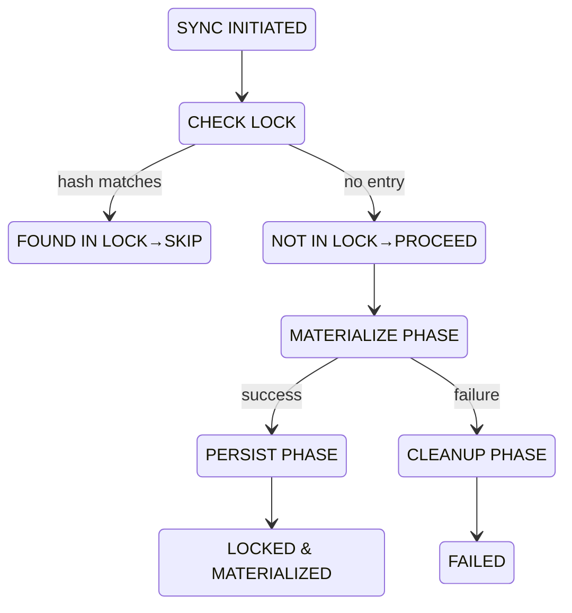
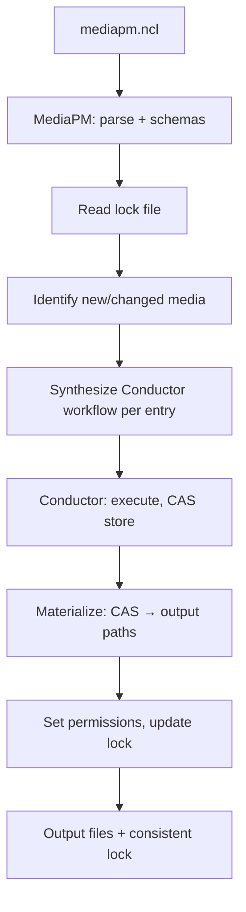

# Mediapm Crate Instructions

This file defines crate-local guidance for `src/mediapm/`.
Follow this together with workspace-wide policy in `AGENTS.md` and focused
instruction files in `.agents/instructions/`.

## Scope

- Applies to all files under `src/mediapm/`.
- Use this file for mediapm behavior and integration policy.
- If rules conflict, prefer root `AGENTS.md` for global policy and this file
  for mediapm-specific implementation details.

## Orchestration contract

- Treat `mediapm` as specialized media orchestration over conductor + CAS:
  deterministic planning/state reconciliation first, side effects second.
- Keep sync behavior atomic through direct materialization to final output paths;
  temp extraction under `.mediapm/tmp` is used only for zip processing.
- Preserve strict cross-platform path safety and deterministic link fallback
  behavior.

## Source of truth (mediapm)

Use concrete files as canonical references:

- Crate manifest: `src/mediapm/Cargo.toml`
- Library entry: `src/mediapm/src/lib.rs`
- CLI entry: `src/mediapm/src/main.rs`
- Error taxonomy: `src/mediapm/src/error.rs`
- Builtin media tagger implementation: `src/mediapm/src/builtins/media_tagger.rs`
- Config module root: `src/mediapm/src/config/mod.rs`
- Lockfile module root: `src/mediapm/src/lockfile/mod.rs`
- Config wire versions/migrations: `src/mediapm/src/config/versions/`
- Lockfile wire versions/migrations: `src/mediapm/src/lockfile/versions/`
- Integration tests: `src/mediapm/tests/`

Core dependency boundary:

- Compose CAS and Conductor via `mediapm-cas` and `mediapm-conductor`.
- Do not add direct dependencies from `src/mediapm/` to
  `src/conductor-builtins/*` crates.

## Runtime paths and resolution invariants

Keep these mediapm defaults and path rules intact:

- Runtime root defaults to `.mediapm/`.
- `mediapm.ncl` may optionally override runtime fields:
  `mediapm_dir`, `conductor_config`, `conductor_machine_config`,
  `conductor_state_config`, `inherited_env_vars`, `media_state_config`,
  `env_file`, `hierarchy_root_dir`, `mediapm_tmp_dir`,
  `conductor_tmp_dir`, `conductor_schema_dir`, and `mediapm_schema_dir`.
- `runtime.inherited_env_vars` is platform-keyed (`windows`, `linux`,
  `macos`, ...) where each value is an ordered list of environment-variable
  names. Runtime reads only the active host platform entry.
- Default runtime values:
  - `mediapm_dir = .mediapm`
  - `conductor_config = mediapm.conductor.ncl`
  - `conductor_machine_config = mediapm.conductor.machine.ncl`
  - `conductor_state_config = <mediapm_dir>/state.conductor.ncl`
  - `conductor_tmp_dir = <mediapm_dir>/tmp`
  - `conductor_schema_dir = <mediapm_dir>/config/conductor`
  - `media_state_config = <mediapm_dir>/state.ncl`
  - `env_file = <mediapm_dir>/.env`
  - `mediapm_schema_dir = <mediapm_dir>/config/mediapm`
- Materialized output root defaults to the directory containing the topmost
  `mediapm.ncl` (no implicit `library/` directory).
- Relative `runtime.hierarchy_root_dir` resolves relative to the topmost
  `mediapm.ncl` directory.
- Relative `runtime.mediapm_tmp_dir` resolves relative to effective
  `runtime.mediapm_dir`.
- Relative `runtime.conductor_tmp_dir` resolves relative to effective
  `runtime.mediapm_dir`.
- Relative `runtime.conductor_schema_dir` resolves relative to effective
  `runtime.mediapm_dir`.
- Relative `runtime.conductor_config`, `runtime.conductor_machine_config`,
  `runtime.conductor_state_config`, and `runtime.media_state_config` resolve relative to the
  topmost `mediapm.ncl` directory.
- `MediaPmPaths.tools_dir` (default `<mediapm_dir>/tools`) is passed to
  conductor as `RuntimeStoragePaths.conductor_tools_dir` so the conductor
  tool-content cache lives under the same workspace-scoped root. Customising
  `MediaPmPaths.tools_dir` automatically propagates into the conductor execution
  pipeline. The conductor tool-content cache is owned exclusively by the
  conductor crate; mediapm must not read from or write to
  `<tools_dir>/<tool_id>/payload/` directly. Runtime defaults and generated
  managed-tool paths must always resolve through `<tools_dir>/<tool_id>/payload/<os>`;
  the legacy `<tools_dir>/<tool_id>/<os>` layout is invalid.
- Runtime dotenv loading uses effective `runtime.env_file` (default
  `<mediapm_dir>/.env`) and keeps a colocated `.gitignore` containing only
  `/.env`.
- Runtime inherited env-name defaults follow conductor host defaults
  (`SYSTEMROOT`, `WINDIR`, `TEMP`, `TMP` on Windows; empty list elsewhere)
  and merge with configured names from the active host platform entry under
  `runtime.inherited_env_vars`.
- Generated managed-tool configs should not redundantly copy those inherited
  names into `tool_configs.<tool>.env_vars`; keep tool-config env vars for
  tool-specific overrides only.
- Generated default dotenv environment-variable lines stay commented (`# ...`)
  so user/shell environment values are picked up unless operators explicitly
  opt into file-based overrides by uncommenting entries.
- Managed-tool downloads always use one shared user-level cache root:
  `<os-cache-dir>/mediapm/cache/`. The layout is `cache/store/` for CAS
  payloads plus `cache/tools.jsonc`; additional `*.jsonc` indexes are allowed
  and participate in shared payload-retention decisions. Eviction stays fixed
  at 30 days of inactivity. Conductor standalone uses a separate base
  directory (`<os-cache-dir>/mediapm-conductor/cache/`) with the same flat
  layout. This user-level download cache is distinct from the workspace
  conductor tool-content cache under `<mediapm_dir>/tools/`; do not treat one
  path as the other's source of truth.
- Generated yt-dlp companion paths use env template refs
  (`${ENV.MEDIAPM_YT_DLP_FFMPEG_LOCATION}`, `deno:${ENV.MEDIAPM_YT_DLP_JS_RUNTIMES}`) in
  `input_defaults` instead of embedding absolute paths. Resolved absolute paths
  live only in `<conductor_dir>/.env.generated` (a `@generated` dotenv file,
  excluded from VCS). The machine document's `runtime.inherited_env_vars` is
  augmented with the generated variable names so conductor inherits them at
  execution time. **Absolute paths must never leak into any persisted
  `.ncl` config document, lock file, or cached state** — generated env files
  are the only allowed escape hatch.
- `tools.ffmpeg.max_input_slots` defaults to `16` when omitted and
  `tools.ffmpeg.max_output_slots` defaults to `4` when omitted; both
  bound generated ffmpeg indexed input/output slot fan-out.

## Media workflow pipeline expectations

Online-source pipeline contract:

1. downloader ingest,
2. optional transcode,
3. metadata application (default enabled).

Local-source pipeline contract:

1. import ingest,
2. optional transcode,
3. metadata application (default enabled).

Permanent-transcode policy:

- online defaults to enabled; local defaults to disabled,
- when enabled, pre-transcode source payload is not retained as primary cached
  product,
- transcode result becomes the cache product and is tracked as safety external
  data in lock state for controlled pruning.

## Versioning and migration policy

- Persisted `mediapm.ncl` documents must carry an explicit top-level numeric
  `version` marker.
- Persisted machine-managed `state.ncl` documents must carry an explicit
  top-level numeric `version` marker and use the top-level `state` payload
  field.
- Persisted machine-managed `state.ncl` tracks per-media workflow-step refresh
  state under `state.workflow_step_state.<media_id>.step-<index>` with
  `explicit_config` and optional `impure_timestamp`.
- Keep config wire-version dispatch and migration logic in
  `src/mediapm/src/config/versions/` (`mod.rs` + `vN.rs`).
- Keep unversioned/latest Nickel contract aliases (`validate_document` and
  `envelope_contract`) in `src/mediapm/src/config/versions/mod.ncl`; versioned
  files such as `vN.ncl` should expose only version-suffixed contracts
  (`validate_document_vN`, `envelope_contract_vN`).
- Keep machine-managed state wire-version dispatch and migration logic in
  `src/mediapm/src/lockfile/versions/` (`mod.rs` + `vN.rs`).
- Preserve sequential, explicit migration behavior across schema versions.
- Configuration document versioning rules:
  - Version bump REQUIRED: removing a field, renaming a field, changing field type or semantics.
  - Version bump NOT REQUIRED: adding an optional field with default, adding a new optional top-level section.

## Media schema and managed workflow reconciliation

For `media.<id>` semantics and runtime reconciliation:

- Media entries may define optional `title`, optional `description`,
  optional `workflow_id`,
  optional strict `metadata`, ordered `steps`, and optional `variant_hashes`
  CAS pointers by variant key.
- `mediapm media add` and `mediapm media add-local` should auto-populate
  `title`/`description` from lightweight online/local metadata probes when
  available, with deterministic fallback text when probes fail.
- `mediapm media add` should synthesize minimal default managed steps as
  `yt-dlp -> rsgain -> media-tagger`; `mediapm media add-local` should
  synthesize `import -> rsgain -> media-tagger`.
  Generated step options should stay minimal (only required/non-default
  values), and final output variants should rely on default `save = true`
  unless explicit `save = "full"` is needed.
- Tool requirements may set `ffmpeg_version` on `yt-dlp`, `rsgain`, and
  `media-tagger` (defaulting to inherit/global behavior when omitted).
  Managed-tool dependency handling is split into two explicit classes:
  - cross-step dependency (one mediapm step expands to multiple conductor
    steps that invoke other logical tools, including media-tagger ffmpeg
    runtime selection): do **not** inline dependency payload bytes into the
    requesting tool `content_map`, and do **not** fold dependency selector
    identity into the requesting tool id;
  - same-step companion dependency (the requesting tool needs companion bytes
    in the same conductor step, e.g. `yt-dlp` needing `ffmpeg` + `deno`):
    always inline companion payload bytes into the requesting tool
    `content_map`, and always fold companion selector identity into the
    requesting tool id.
- Metadata entries must be strict per key:
  - literal form: `<key> = "value"`
  - variant-binding form:
    `<key> = { variant = "<file-variant>", metadata_key = "<json-key>", transform = { pattern = "<regex>", replacement = "<replacement>" }? }`
  - variant-binding metadata must target file variants (not folder captures),
    and runtime extraction expects JSON-object payloads with string values.
  - when `transform` is provided, `pattern` is evaluated with full-match
    semantics against the extracted value and `replacement` supports regex
    capture-group substitution.
- Hierarchy paths may include `${media.id}` and
  `${media.metadata.<key>}` placeholders; config validation and runtime
  resolution must fail fast when referenced metadata keys are missing or
  unresolved.
- Hierarchy uses an ordered node-array schema (`hierarchy = [ { ... } ]`)
  with recursive `children`; legacy flat-map and `"/kind"` forms are
  intentionally unsupported (no backward compatibility).
- Hierarchy node kinds are explicit: `folder` (default), `media`,
  `media_folder`, and `playlist`.
  `media` nodes use required singular `variant`; `media_folder` nodes use
  required plural `variants` and may define `rename_files`.
  hierarchy `id` is optional on all node kinds and must be unique when
  provided. `media_id` is optional on all node kinds; `media` and
  `media_folder` require a non-empty effective `media_id` (direct or
  inherited).
- Hierarchy entries with `kind = "playlist"` emit playlist files and resolve
  members by ordered `ids` entries with optional per-item path-mode
  overrides; playlist item refs accept string shorthand (`"<id>"`) and
  object form (`{ id = "...", path = "relative"|"absolute" }`), where `id`
  always targets hierarchy-node `id` (not `media` map keys); playlist nodes
  must stay file leaves.
- Media-source entries must not define `media.<id>.id` overrides; playlist
  membership is owned by hierarchy-node ids only.
- Hierarchy flattening deduplication key is `(template_path, media_id)`. Same
  template path + different `media_id` is allowed; same path + same
  `media_id` is rejected as duplicate.
- Example/demo hierarchy should remain Jellyfin-compatible for media files:
  `music videos/<artist> - <title> [<media.id>]/<artist> - <title> [<media.id>](<ext>)`,
  with non-media sidecars grouped under `sidecars/`.
- Local ingest from `mediapm media add-local` is represented as an
  `import` step with `options.kind = "cas_hash"` and
  `options.hash = "blake3:<hex>"`.
- Each step declares `tool`, `input_variants` for non-source-ingest
  transforms (source-ingest tools `yt-dlp` and `import`
  must keep `input_variants` empty), `output_variants` as a
  map (`variant_name -> { save?, save_full? }`) with defaults
  `input_variants` and hierarchy `variants` selectors may use either exact
  strings (`"variant"`) or regex object syntax (`{ regex = "^variant$" }`);
  regex selectors are matched against available variant names and may resolve
  multiple variants for directory targets,
  `save = true`, `save_full = false`; hierarchy file-path variants must be
  file outputs whose latest producer keeps persisted-save semantics
  (`save = true` or `save = "full"`), while hierarchy directory-path variants may remain
  folder outputs with default `save_full = false`; `ffmpeg`, `rsgain`, and
  `media-tagger` output variants may also define optional `extension` to drive
  generated `output_path_<idx>` values; strict
  operation-specific `options`.
- Machine-managed state `managed_files` entries must persist canonical CAS hash
  strings for each materialized file, and workflow reconciliation must ensure
  every managed-file hash is rooted in conductor `external_data` alongside
  managed local-variant and tool-content hashes.
- Low-level list bindings (`option_args`, `leading_args`, `trailing_args`) live
  under the same step `options` map as other operation options.
- Managed media-tool step `options` are value-centric: users should provide
  option values (not raw option-key tokens). Runtime command templates
  translate those values to concrete CLI flags/arguments via conductor
  conditional + unpack syntax; when an option value is empty, runtime
  rendering must omit both the option key and the option value together.
- Managed `sd` rewrite commands must always include an explicit file operand
  (`inputs/input.ffmeta`) so executions stay file-backed and never block on
  stdin reads.
- Option values are scalar strings by default; ordered string-list values are
  only valid for `option_args`, `leading_args`, and `trailing_args`.
- For generated boolean-style option inputs, runtime templates only treat the
  exact string `"true"` as enabled. Any other value (including `"false"`,
  `"1"`, `"yes"`, and `"on"`) is treated as disabled.
- Managed `media-tagger` defaults should keep `strict_identification = "true"`
  unless callers explicitly override that input, and should default
  `write_all_tags = "true"` plus `write_all_images = "true"`.
  Managed defaults should also keep `save_images_to_tags = "true"`,
  `enable_tag_saving = "true"`, `clear_existing_tags = "false"`,
  `preserve_images = "false"`, `release_ars = "true"`,
  `caa_approved_only = "false"`,
  `ca_providers = "caa_release,url_relationships,caa_release_group"`,
  `caa_image_types = "all,-matrix/runout,-raw/unedited,-watermark"`, and
  `caa_image_size = "full"`. Picard defaults
  `embed_only_one_front_image = "true"`, but mediapm intentionally defaults
  `embed_only_one_front_image = "false"` so selected non-front CAA kinds can
  also be embedded. Keep default `cover_art_slot_count = 16` while
  workflow synthesis clamps effective slot fanout to available ffmpeg auxiliary
  input slots.
- `media-tagger` metadata-fetch mode should allow explicit MBID-driven runs
  without `input_content`; fingerprint/AcoustID autodetection still requires
  input media.
- When `media-tagger` needs AcoustID lookup (no explicit recording MBID
  override), missing/empty AcoustID credentials must fail immediately; valid
  key sources are CLI `--acoustid-api-key` or `ACOUSTID_API_KEY`, and
  provided-credential lookup/auth failures are surfaced as runtime errors. For
  `mediapm sync` workflow execution, include `ACOUSTID_API_KEY` in
  `runtime.inherited_env_vars` when relying on environment-based key lookup.
- `yt-dlp` output artifact families (for example subtitles/thumbnails/infojson
  and playlist sidecars) should be exposed via `output_variants`; description
  and infojson bind to file captures while folder families map to
  artifact-capture outputs in generated conductor workflows. When multiple
  output variants are declared on one yt-dlp step, synthesize one shared
  workflow call and merge required sidecar toggles instead of emitting one
  downloader process per output variant.
- output-variant values are object-driven across managed tools: `kind`
  determines default file-vs-folder capture behavior, and optional
  `capture_kind = "file"|"folder"` may override that default per
  variant.
- output-variant kind naming is strict (no legacy aliases): use `primary`
  for main transform outputs; yt-dlp folder-family kinds use plural labels
  (`subtitles`, `thumbnails`, `links`, `chapters`) while
  file-family kinds remain singular (`primary`, `description`, `infojson`,
  `comment`, `archive`, `annotation`, playlist file sidecars).
- yt-dlp output-variant `langs` is an optional capture-filter hint for
  subtitle-family artifacts; download language selection remains owned by step
  `options.sub_langs`.
- hierarchy directory entries may define ordered
  `rename_files = [{ pattern, replacement }, ...]` regex rewrites applied to
  extracted folder file members; file hierarchy targets must keep
  `rename_files` empty.
- Do not document or reintroduce a separate dedicated per-variant
  output-folder configuration model; folder/file behavior is defined by
  `kind` plus optional `capture_kind`.
- Generated yt-dlp variant synthesis must set explicit sidecar toggles per
  variant kind so primary/sandbox variants do not accidentally capture
  unrelated sidecar families.
- Playlist-only output variants must not capture single-item artifacts when
  playlist mode is disabled (`no_playlist = true`); keep playlist/non-playlist
  sidecar capture behavior explicitly gated.
- `yt-dlp` output-variant config objects must not define `format`; format
  selection belongs only in step `options.format`.
- Generated yt-dlp commands should use a deterministic post-edit filename
  marker (`__mediapm__`) before extension so one shared downloader run can
  safely isolate sidecar families without mixing outputs. Managed output
  captures must use regex selectors under `downloads/`; folder-regex captures
  should use capture groups to strip the marker before final ZIP member names
  so user-visible materialized sidecars do not expose the internal marker.
- Managed tool defaults should favor rich metadata capture and preservation:
  - `yt-dlp`: prefer `format = "bestvideo*+bestaudio/best"`, metadata/embed
    toggles enabled, `sub_langs = "all"`, manual subtitle capture enabled
    by default (`write_subs = "true"`, mapped to manual subtitle toggles
    only; automatic subtitles are not enabled by default) while broad
    translated subtitle pressure should still be reduced
    with precise `options.sub_langs` selectors and optional
    `options.sleep_subtitles`.
    Keep this mitigation anchored to documented upstream incidents in
    `https://github.com/yt-dlp/yt-dlp/issues/13831#issuecomment-3875360390`
    and
    `https://github.com/yt-dlp/yt-dlp/issues/13831#issuecomment-3712613129`:
    broad translated subtitle requests are the highest-risk path for
    `HTTP 429`, focused subtitle requests are usually lower risk, and
    extractor-args
    translation-skip knobs are not a reliable substitute for precise language
    selectors, highest-quality
    single-thumbnail capture by default
    (`write_thumbnail = "true"`, `write_all_thumbnails = "false"`),
    `merge_output_format = "mkv"`, chapter embedding enabled by default
    (`embed_chapters = "true"`, `split_chapters = "false"`), comments
    capture enabled by default (`write_comments = "true"`),
    `clean_info_json = "true"`, and all link sidecar formats enabled by
    default (`write_url_link = "true"`, `write_webloc_link = "true"`,
    `write_desktop_link = "true"`);
    Default managed cache path is `<mediapm_dir>/cache/yt-dlp`;
  - `ffmpeg`: default toward metadata-preserving copy behavior
    (`codec_copy = "true"`, `map_metadata = "0"`,
    `map_chapters = "0"`, `movflags = "+faststart"`)
    while allowing explicit per-step overrides for transcode flows;
  - `rsgain`: keep true-peak normalization defaults enabled with
    tool-level single-track defaults (`album = "false"`,
    `album_mode = "false"`), execute in `custom` mode directly on the
    managed media output, and keep default behavior
    container/stream-preserving (not audio-only). Managed ReplayGain merge
    synthesis should preserve single-track mode by default and only include
    album-family tags when callers opt in explicitly through step options;
  - `media-tagger`: keep strict identification enabled by default while
    populating broad MusicBrainz/Picard-compatible tag aliases and preserving
    existing source metadata unless explicitly overridden. Cover-art behavior
    should select one highest-quality payload per distinct artwork entry
    (prefer CAA original image URL, fallback to best thumbnail), apply
    Picard-like provider/type metadata behavior with mediapm default embedding
    fanout (`embed_only_one_front_image = "false"`; Picard defaults this to
    first-front-only), emit
    deterministic slot artifacts for ffmpeg `attached_pic` mapping, and keep
    compatible kind metadata in `coverart_*` tags. The emitted
    `coverart_*` metadata key family must stay synchronized with Picard
    cover-art metadata usage in
    `https://github.com/metabrainz/picard/blob/master/picard/coverart/image.py`.
    Default managed cache path is `<mediapm_dir>/cache` with shared layout
    `<mediapm_dir>/cache/store/` (CAS payloads) +
    `<mediapm_dir>/cache/media-tagger.jsonc` (metadata index); do not create
    dedicated media-tagger subfolders under `store/`.
- Online sources must be declared in downloader step `options.uri` (not
  top-level media fields).
- Each media entry reconciles to exactly one managed workflow:
  - default workflow id: `mediapm.media.<id>`
  - `workflow_id` may override the default.
- Managed workflow metadata behavior:
  - `name` defaults to `<id>` (without `mediapm.media.` prefix)
  - `description` may mirror `media.<id>.description`
  - identity remains the workflow map key; runtime/cache semantics must not
    depend on optional metadata.
- Variant-flow dependencies must be explicit with `${step_output...}` input
  bindings and matching `depends_on` edges.
- Managed workflow refresh behavior is strict and step-local:
  - refresh when explicit user-facing step config changes, or
  - refresh when mediapm-managed step `impure_timestamp` is missing.
  Unchanged explicit config with a present timestamp must preserve prior

  immutable step tool ids so existing outputs stay reusable across newer tool
  activations until users explicitly change config or clear timestamp state.

## Tool provisioning and catalog expectations

- `mediapm sync` and `mediapm tools sync` provision workspace-local tools under
  `.mediapm/tools/`.
- Tag-update default behavior differs intentionally:
  - `mediapm sync` defaults to skipping remote checks for tag-only selectors.
  - `mediapm tools sync` defaults to checking for updates.
- `mediapm.ncl` `tools.<name>` entries must define `version` or `tag` (or
  both matching); `recheck_seconds` is optional and controls how long release
  metadata cache entries can be reused before remote refresh. When omitted,
  release metadata defaults to one-day cache reuse.
- Immutable tool-id precedence is:
  - `mediapm.tools.<name>+source@git-hash`
  - `mediapm.tools.<name>+source@version`
  - `mediapm.tools.<name>+source@tag`
- Internal `media-tagger` launcher resolution always pins identity/version to
  the currently running `mediapm` package version, even when callers request
  moving selectors like `latest`.
- `conductor::registered_builtin_ids()` returns namespaced immutable ids (for
  example `mediapm.builtin.import@1.0.0`); when constructing
  `ToolKindSpec::Builtin`, map `name` to the process-name suffix
  (`import`/`export`/etc.) rather than copying the full namespaced id.
- Default catalog tracks:
  - `ffmpeg`: GitHub Releases, BtbN preferred on Windows with fallbacks
  - `yt-dlp`: GitHub Releases `latest`
  - `rsgain`: GitHub Releases `latest` ZIP assets
  - `media-tagger`: internal `mediapm` launcher shim that invokes
    `mediapm builtins media-tagger` (Chromaprint + AcoustID + MusicBrainz +
    FFmetadata + FFmpeg)
- Managed tool downloader planning should remain cross-platform (`windows`,
  `linux`, `macos`) even if later import/materialization may be host-filtered.
- Managed executable materialization should emit platform-prefixed
  `content_map` keys (`windows/`, `linux/`, `macos/`) or one shared `./` root
  for platform-identical payloads, and generated command selectors should use
  `${context.os == "<target>" ? ... | ...}` so every selector branch maps to
  one materialized target.
- Tool preset downloads are never platform-specific. Preset reconciliation must
  always download/provision all supported platform payloads, then rely on
  `${context.os}`-guarded command selectors to choose the correct executable at
  runtime.
- For GitHub release assets (especially ffmpeg), resolve concrete asset URLs
  from release metadata instead of assuming static
  `releases/latest/download/...` links.
- Keep default `yt-dlp` reconciliation concurrency constrained to one active
  call (`tool_configs.<yt-dlp-tool-id>.max_concurrent_calls = 1`) unless user
  config overrides it.
- Keep default `yt-dlp` conductor retry budget at one outer retry
  (`tool_configs.<yt-dlp-tool-id>.max_retries = 1`) because yt-dlp already
  has internal network retry controls.

Toolsmith reconciliation flow (`mediapm sync` / `mediapm tools sync`):

1. read desired tools from `mediapm.ncl`,
2. query registered tool state,
3. register/promote immutable tool identities for missing/mismatched versions,
4. persist active selection in lock state.

Before finalizing tool registration, keep validation deterministic:

- resolved tool identity must serialize to deterministic CAS-hashable metadata,
- executable validation should include a successful version probe (for example
  `--version`) where applicable.
- Tool cache version-invalidation policy:
  - Cache key includes `(tool_id, version, platform)`.
  - On version change: `preserve_existing_generated_step_tools()` rewrites
    generated step's tool id to the previous valid one, keeping impure
    timestamps stable.
  - New binary provisions separately; old binary remains until pruning removes
    it.

## Conductor integration boundary

When mediapm invokes conductor, always pass grouped runtime-storage paths
resolved from effective mediapm paths so volatile writes do not fall back to
standalone conductor defaults.

Effective grouped defaults:

- `conductor_dir = <mediapm_dir>`
- `conductor_state_config = <mediapm_dir>/state.conductor.ncl`
- `cas_store_dir = <mediapm_dir>/store`
- `conductor_tmp_dir = <mediapm_dir>/tmp`
- `conductor_schema_dir = <mediapm_dir>/config/conductor`

## Identity, sidecar, and storage invariants

- Canonical identity key is URI (`canonical_uri`), not display path strings.
- Content identity is BLAKE3 with object fan-out under
  `.mediapm/objects/blake3/<0..2>/<2..4>/<4..>`.
- Sidecars are derived from canonical URI digest under
  `.mediapm/media/<media-id>/media.json`.
- Object files are immutable once imported.
- Managed hierarchy outputs committed under resolved `runtime.hierarchy_root_dir`
  must be marked read-only after sync (including copied, linked, or symlinked
  managed paths when applicable).
- Runtime may temporarily clear read-only bits only for managed
  replacement/removal operations.
- Preserve `original.original_variant_hash` semantics.
- Keep `edits` lineage references valid (`from_variant_hash` and
  `to_variant_hash` must exist in `variants`).
- Keep schema version explicit and migrations sequential.
- Machine-managed state `managed_files` provenance stores per-file `media_id` (not source
  URI strings) together with `variant` and `last_synced_unix_millis`.
- Materializer verification enforces NFD-only filenames and rejects reserved
  path characters (`<`, `>`, `:`, `"`, `/`, `\\`, `|`, `?`, `*`).
- Link/write materialization order follows
  `runtime.materialization_preference_order` (must be non-empty and
  duplicate-free); default order is hardlink -> symlink -> reflink -> copy.

## Cross-crate consistency invariants

### Lock vs CAS hash referential integrity

- Pre-prune validation: maintain reachable hashes from lock records; prune must
  not remove hashes referenced by locks.
- If a lock references a deleted CAS hash, sync must re-download or fail with
  a clear error.
- `state.ncl` lock records must reference the CAS state-blob hash. On startup
  verify this reference; mismatch fails with explicit error requiring manual
  recovery.

### Direct materialization cleanup semantics

- If sync fails mid-materialization, cleanup of partially written files is
  automatic and unconditional. No manual cleanup needed; the API returns an
  error and partial files are removed.

### NCL↔Rust schema sync (typed envelope pattern)

- `MediaPmDocumentEnvelopeV1` wraps `MediaPmDocumentStateV1` via
  `#[serde(flatten)]`. Parent envelope carries `deny_unknown_fields`; child
  struct does NOT carry it (ignored under `flatten`).
- `PlatformInheritedEnvVars` is a `BTreeMap<String, Vec<String>>` type alias.
  Platform keys: `"windows"`, `"linux"`, `"macos"`.
- When adding a field to a versioned Rust struct: add to Rust struct + NCL
  schema + verify envelope catches stray keys + add round-trip test.

## Metadata cache behavior

Media probe metadata caches as JSONC for TTL-based reuse (86400s default).

- **Clock skew**: backward jump → treat as just-verified (skip eviction).
  Forward jump >86400s → mass eviction (acceptable, cache refills).
- **Concurrent access**: no cross-process support; last writer wins. Cache loss
  is non-fatal.
- **Corruption**: `open()` catches `serde_json` errors, warns, returns empty
  cache; replaced on next flush.
- **Key collision**: full Blake3 256-bit output used as key — no collision
  possible.
- **Stale entries**: no explicit invalidation on media-source removal. Entries
  are small (~one JSON object) and expire within 86400s.

## Design rationale

- **Why Nickel for config**: Orchestration needs parameterization and
  conditionals. YAML/TOML/JSON are static. Nickel evaluates to JSON for
  conductor consumption.
- **Why direct materialization**: Staged-and-commit adds complexity and disk
  overhead. Direct CAS→output-path writes are simpler and faster. Partial
  failures clean up; re-run resumes from lock records. `mediapm_tmp_dir` is
  for zip/sandbox only.
- **Why three-document pattern**: Clear ownership separation: user edits
  `mediapm.ncl`; machine generates `state.ncl`; lock file tracks processed
  media. Each independently versioned.

## Troubleshooting

| Problem | Cause | Resolution |
|---------|-------|------------|
| Sync partially succeeds; lock inconsistent | Crash during materialization (files written, lock write failed); disk full; permission error | Delete orphaned lock entries or re-run with `--force-resync`; clean orphaned output files; verify disk space and write permissions |

## Implementation checklists

### Adding a new managed tool

- [ ] Add tool spec to `mediapm.ncl` schema (name, version, selectors)
- [ ] Add tool provisioner (download, extract, verify hash)
- [ ] Add to tool registry (`src/mediapm/src/tools/`)
- [ ] Implement CLI/API wrapper if needed for execution
- [ ] Add provisioning + verification tests
- [ ] Document OS/dependency requirements
- [ ] Add example workflow

### Adding a new media source type

- [ ] Define source kind (URL, local file, CAS hash, etc.)
- [ ] Add to `mediapm.ncl` schema (version increment if incompatible)
- [ ] Implement source reader (retrieve bytes)
- [ ] Add to `src/mediapm/src/config.rs` (parse from config)
- [ ] Add to sync logic
- [ ] Write test with example config

### Adding a test feature

- [ ] Determine category: happy path, edge case, error, concurrency, performance
- [ ] Choose test module: `tests/e2e/`, `tests/int/`, `tests/prop/`
- [ ] Name: `test_<component>_<scenario>`
- [ ] Verify test fails without the feature (not trivially passing)
- [ ] Determinism-sensitive → fixed seeds; performance-sensitive → benchmark comment
- [ ] Verify passes in release; run 5× for flakiness check
- [ ] Add to CI (`.github/workflows/ci.yml`)

## Missing test coverage (mediapm-specific)

- [ ] Partial materialization failure (file 50 of 100) → rollback, lock unchanged
- [ ] Lock file partial write → detected on load, inconsistency error
- [ ] Invalid hierarchy `media_id` → error at config load
- [ ] Read-only file re-materialization → succeeds (clears read-only bit)
- [ ] Media ID reused with new content → new download, new lock
- [ ] Concurrent sync operations → serialized or isolated correctly
- [ ] Tool version change → new version downloaded
- [ ] Sync idempotency: sync twice → second sync is no-op
- [ ] CAS version + Conductor version mismatch → error with hint
- [ ] CAS prune removes hash in MediaPM lock → error or re-download
- [ ] State blob persisted but lock not updated → detected on startup

## Future extension points

- **New managed tools**: add to downloader catalog, define tool spec in
  `mediapm.ncl`, tool sync provisions.
- **New output variant kinds**: add to `OutputVariantKind` enum, update hierarchy
  materialization, extend CLI/API output handling.

## Sync performance expectations

- Two-level dispatch: cross-workflow dependency-stream dispatch in coordinator
  - per-workflow step execution with batch cache probe
  (`exists_many`/`CasExistenceBitmap`).
- Per-file hashing and materialization parallelized across available workers.
  No hash tree; flat per-file comparison.
- Lock reconciliation compares stored hash (in lock) with current file hash.
  Computed once per file (not incremental). Matching hashes → no
  re-materialization.

## Testing, validation, and docs bar

During development, prefer targeted cargo aliases from `.cargo/config.toml`:

- `cargo test-pkg mediapm`
- `cargo build-pkg mediapm`
- Run selective tests for changed behavior only during iteration, then run both
  demo examples before finishing any change set, running them normally in
  sequence (not in parallel):
  - `cargo run --package mediapm --example mediapm_demo`
  - `cargo run --package mediapm --example mediapm_demo_online`
- Do not run manual `cargo fmt`, `cargo check`, or `cargo clippy` in normal
  development loops; `prek.toml` commit hooks enforce those gates on commit.

Pre-push/full-workspace validation:

- `cargo fmt-check`
- `cargo clippy-all`
- `cargo test-all`

Both demo examples are mandatory post-change validation for mediapm work, not
optional push-time checks.

Example policy:

- Keep `mediapm_demo_online` as a full-sync example in normal validation and
  manual runs (`cargo run --example ...`). Prefer
  `MEDIAPM_DEMO_ONLINE_RUN_SYNC=true` when explicitly setting the variable.
- Do not rely on config-only fallback paths for normal `mediapm_demo_online`
  validation.
- Keep the demo fixture transcode fast: prefer ffmpeg stream-copy
  (`codec_copy = "true"`) into an audio-focused container/extension
  (`.m4a`) rather than demo-time audio re-encoding.

Rust docs quality bar for touched files:

- Add/refresh `//!` module docs and `///` item docs for public and private
  items.
- Document invariants, failure modes, and side effects (not just symbol names).

Internal module-boundary policy for this crate:

- Keep mediapm crate errors centralized in `src/mediapm/src/error.rs` and
  re-export them from `lib.rs`.
- Keep the media tagger implementation only under `builtins/` (do not create
  a second root-level `src/mediapm/src/media_tagger.rs`).
- Keep `config` and `lockfile` as folder modules rooted at
  `config/mod.rs` and `lockfile/mod.rs`.

## Reference instruction files

- `.agents/instructions/mediapm-architecture.instructions.md`
- `.agents/instructions/mediapm-testing-and-docstrings.instructions.md`
- `.agents/instructions/rust-workflow.instructions.md`

## Detailed specification cross-reference

This section consolidates content from the former
`.agents/instructions/crate-specifications.md` and
`.agents/instructions/elaboration-pass-edge-cases.md` (both deleted).
Treat this crate-local guide as authoritative for mediapm runtime and schema
behavior; the consolidated sections below are additive references.

---

## A — Crate Responsibilities Quick Reference

| Crate | Purpose | Type | Key Exports |
|-------|---------|------|-------------|
| **cas** | Content-addressed storage with delta encoding | Library + CLI | `CasApi`, `CasMaintenanceApi`, `Hash`, `FileSystemCas`, `InMemoryCas` |
| **conductor** | Deterministic workflow orchestration with CAS backing | Library + CLI | `ConductorApi`, `SimpleConductor`, `WorkflowSpec`, `OrchestrationState` |
| **conductor-builtins** (5 crates) | Standalone tool implementations (echo, fs, archive, import, export) | Library + CLI per crate | Builtin CLI/API executables |
| **mediapm** | Media library façade composing CAS + Conductor | Library + CLI | `MediaPmService`, `MediaPmApi`, `MediaPmDocument`, `MediaPmPaths` |

## B — Cross-Crate Data Flow

```text
User Input (mediapm.ncl)
    ↓
MediaPm Configuration Parsing
    ├─→ CAS: Content-address media
    ├─→ Conductor: Synthesize workflows
    └─→ Builtins: Tool registration
    ↓
Conductor Workflow Execution
    ├─ Step 1: import (builtin) → CAS store
    ├─ Step 2: ffmpeg (managed tool) → CAS store
    ├─ Step 3: media-tagger (managed tool) → CAS store
    └─ Step N: export (builtin) → Materialized files
    ↓
CAS-Backed Materialization
    └─ Direct materialization to final output paths

Temp extraction directory (mediapm_tmp_dir, for zip processing only)
    └─ Extract → materialize → cleanup
    ↓
State Persistence (state.ncl)
    └─ Lock records: path → media_id, variant, hash
```

## C — Shared Invariants Across Crates

### Content Identity Contract

Same bytes → same hash (always). Blake3-256 multihash;
`Hash::composite(&[Hash])` produces deterministic composite hash via
`blake3(h₁.bytes() ‖ h₂.bytes() ‖ …)`. All StringList composite hash
computations across conductor and materializer must use `Hash::composite`.

### Constraint Correctness Contract

Base selection respects explicit constraints.
`set_constraint_batch()` validates each op's bases exist.

### Reconstructability Contract

Stored bytes are retrievable exactly. `get(hash)` returns exact bytes; delta
chains reconstructible; state blob round-trips serialize↔deserialize.

### Atomicity Contract

Operations succeed or fail cleanly. Temp file + atomic rename; index
snapshots on mutation; direct materialization to final output paths; per-
workspace temp dirs (hash of workspace root under `std::env::temp_dir()`).

### Determinism Contract

Identical inputs → identical outputs (pure paths only). Echo and archive
are pure; fs, import, export are impure.

### NCL↔Rust Schema Sync Contract

Every versioned NCL document has a corresponding typed Rust struct at the
version layer, with an envelope struct carrying the explicit `version`
marker. `decode()`: deserialize JSON → typed envelope → extract inner
document. `encode()`: serialize inner → wrap in envelope → JSON.
`deny_unknown_fields` lives on the parent envelope (not the flattened child).

### Nickel Number Export Contract

Nickel stores all numbers as `f64`. When `eval_full_for_export()`
serializes to JSON, integer values become `N::Float` not `N::PosInt`.
Custom deserializers (`deserialize_option_u64_from_number` in mediapm,
`deserialize_option_integral_u64` in conductor) accept both representations.
All `Option<u64>` fields in `MediaRuntimeStorage` and `RuntimeStorageLatest`
use these deserializers.

## D — Integration Boundaries

### CAS ↔ Conductor

Conductor requires `CasApi` trait object at startup. Operations: external
data stored in CAS (`put_from_uri`), workflow state serialized to CAS,
tool content materialized from CAS, index repair on startup. Conductor may
call CAS concurrently; CAS doesn't reference Conductor types.

### Conductor ↔ Builtins

Conductor discovers builtins at compile time (`registered_builtin_ids()`).
CLI and API inputs/outputs must be identical (parity). Fail-fast validation:
undeclared keys rejected immediately. No encoding of failures in success
payloads.

### MediaPM ↔ Conductor

MediaPM creates Conductor at service startup, synthesizes `WorkflowSpec`
from media steps, adds managed-tool `ToolSpec` to machine config, loads/
merges user + machine + state documents, triggers
`conductor.run_workflow(...)` per media entry. MediaPM owns media-source
definitions, hierarchy materialization, tool provisioning. Conductor owns
workflow execution, step scheduling, state persistence. Conductor documents
isolated per-workspace. Sync materializes directly to final output paths.

### MediaPM ↔ CAS (Direct)

MediaPM materializes from CAS: content verification (check file hash
against lock), cache hit detection, link materialization via `cas.get()`.
All materialized files read-only after commit. Hashes must match;
mismatch → failed materialization (no fallback). Platform-independent path
resolution via `HierarchyPath` (normalized, slash-separated).

## E — Instance Output Existence Checking

During hierarchy materialization, the materializer checks whether each
candidate orchestration instance's required step outputs still exist in CAS.
For step outputs without ZIP member extraction, uses `cas.info(hash)` —
lightweight existence check (one redb lookup + one stat) instead of
`cas.get(hash)` which loads full content bytes. ZIP-member outputs still use
`cas.get(hash)` for member extraction.

Implementation: `instance_has_materializable_required_outputs()` in
`src/mediapm/src/materializer/resolve.rs`.

## F — Metadata Cache

**File**: `src/mediapm/src/metadata_cache.rs`

**Purpose**: Persistent on-disk cache for metadata resolution during hierarchy
instantiation and add-path workflows, with 1-day TTL based on non-usage.

**Backend**: Single JSONC file (`metadata.jsonc`) at
`<runtime_root>/cache/mediapm/`. Not CAS-backed. `BTreeMap<String, MetadataCacheEntry>`
with `serde_json::Value` payload and `last_access_unix_seconds` timestamp.

**Key Derivation**: `blake3::hash(media_id.as_bytes() or canonicalized_path.to_string_lossy().as_bytes()).to_hex()`.

**TTL**: 86400 seconds from `last_access_unix_seconds`. Entries evicted on load
(not on set). `get()` updates timestamp (in-memory dirty flag only).

**Persistence**: `set()` is in-memory dirty flag; timer-based batch flush
~300s cooldown; `flush()` writes via `AtomicFileOp` then renames; `Drop`
triggers final sync flush; load filters stale entries and writes back.

**Integration**: `MaterializationLookupContext` carries
`metadata_cache: Option<Arc<MetadataCache>>` and `tool_registry:
BTreeMap<String, ToolRegistryRecord>`. `extract_metadata_value_from_variant_payload()`
and `try_fetch_local_source_metadata_with_ffprobe()` check cache before probe.

**Contract**: Cache miss → probe → store → return. Cache hit (TTL valid) →
return cached. TTL expired → treat as miss. Serialization failure → miss
(log warning). File I/O failure → graceful degradation. Clock skew: if
`last_access_unix_seconds > now`, treat as just-verified no spurious eviction.

## G — CAS Integrity Verification

Configurable integrity verification that re-checks BLAKE3 hashes on `get()`.
Gated by `VerifyTriggerStrategy`:

- `Always` — re-verify on every `get()`
- `Modified` — re-verify when object mtime changed since last put/verify
- `Sample { denominator }` — 1-in-N probabilistic basis
- `Stale { timeout }` — re-verify when elapsed time exceeds timeout

All strategies evaluated on every `get()`; runs if any triggers.

**Configuration** (`CasIntegrityConfig` in conductor):

```rust
pub struct CasIntegrityConfig {
    pub verify_on_read: Vec<VerifyTriggerStrategy>,
    pub reconstructed_bytes_cache_ttl: Duration,
}
```

Default `verify_on_read`: `[Modified, Sample { denominator: 100 }, Stale { timeout: 604800s }]`.
Default `reconstructed_bytes_cache_ttl`: `3600s`.

**Runtime wiring** (`MediaRuntimeStorage` fields):

- `verify_on_read_sample_denominator: Option<u64>` — overrides Sample
  denominator (default 100)
- `verify_on_read_stale_timeout_secs: Option<u64>` — overrides Stale timeout
  (default 604800)
- `reconstructed_bytes_cache_ttl_secs: Option<u64>` — overrides cache TTL
  (default 3600)

These plus `instance_ttl_seconds` are mirrored in `RuntimeStorageConfig`
(conductor), converted via `MediaRuntimeStorage::to_cas_integrity_config()`,
and passed through `RunWorkflowOptions.cas_integrity_config`. All four
`Option<u64>` fields use `#[serde(deserialize_with =
"deserialize_option_u64_from_number")]`.

## H — Materialization & HierarchyPath

### HierarchyPath Type

`HierarchyNode.path` is a `HierarchyPath(Vec<String>)` newtype:

- Empty path (`vec![]`) is valid for root pass-through folder nodes
- Serde: zero components → `""`, one → `"abc"`, multiple → `["a", "b"]`
- Deserialize: splits bare strings by `/`, rejects empty components between
  delimiters (`trim_matches('/')`)
- Array form: each element is one component (no further splitting)
- `From<&str>` splits by `/`; `Default` yields empty path
- Components validated at flattening time: non-empty, no `.`/`..`, NFD normalized

### Hierarchy Path Sanitization

`hierarchy[*].sanitize_names` controls reserved-character replacement:

- `SanitizeNamesConfig` variants: `Disabled`, `Inherit`, `Enabled`, `Custom(…)`
- Serialization: `Disabled` → `false`, `Inherit` → `"inherit"`, `Enabled` → `true`,
  `Custom(…)` → `{ "<": "_", ... }`
- `Inherit` (default): inherit from parent; root seed is `Enabled`
- `Enabled`: replace reserved chars using effective mapping
- `Disabled`: skip replacement (reserved chars still rejected by validation)
- NFD normalization always enforced regardless of setting
- Replacement occurs after NFD normalization, before reserved-char validation
- `rename_files` replacement strings also sanitized
- Default mapping: `<` `>` `:` `"` `|` `?` `*` `/` `\\` → `_`

### Materialization Pipeline (five stages on `Vec<String>` component list)

1. `check_nfd_source()` — reject non-NFD source components
2. Template resolution — resolve `${...}` placeholders
3. Forced NFD normalization — `.nfd().collect::<String>()` after expansion
4. Per-component sanitization — `sanitize_path_component()` replaces reserved chars
5. `validate_components()` — ensure NFD, non-empty, no `.`/`..`/reserved chars,
   then join with `"/"`

### Reflink Materialization

Reflink uses `tokio::task::spawn_blocking` wrapping platform-specific syscalls:
Linux `FICLONE` ioctl via `libc` (btrfs/XFS), macOS `clonefile` (APFS), and
unsupported-stub for other platforms. Stubs report `io::ErrorKind::Unsupported`
to trigger ordered fallback. Linux path cleans up destination file on failure
so fallback copy doesn't see a stale truncated file. macOS `clonefile` is
atomic — no cleanup needed.

## I — Conductor Specification (MediaPM-Relvant Details)

### Step Dispatch (Dependency-Stream Model)

Coordinator builds per-workflow dependency graphs (`WorkflowDepState` with
`remaining_deps` + `dependents` + `step_outputs`) in Phase 1 — deduplicates
shared dependent steps, detects cycles, validates all referenced steps exist.
Phase 2 dispatches via `FuturesUnordered` loop across all workflows: seeds
`global_ready_queue` with zero-dependency steps, assigns workers round-robin,
processes completions, handles impure timestamp planning inline.

### Per-Tool Concurrency Enforcement

`UnifiedToolSpec::max_concurrent_calls` enforced at dispatch time. Coordinator
builds per-tool `tokio::sync::Semaphore` instances (values > 0 create
capacity-limited semaphore; -1 unlimited). Dispatch scans ready queue for
step whose tool has available capacity. `OwnedSemaphorePermit` held for entire
step duration. Applies to all tools, not only managed.

### Per-Tool Retry Enforcement

`UnifiedToolSpec.max_retries` enforced in dispatch loop. `dispatch_step_rpc`
wraps single RPC in retry loop. Semaphore permit held across all retries.
Fixed 500ms sleep between retries. Conductor normalizes -1 (omitted) to 3.
Mediapm may override per tool (e.g. yt-dlp defaults to 1).

### Instance Key Lifecycle

**Derivation** (`derive_instance_key()` in `step_worker/mod.rs`):
`BLAKE3(tool.name tagged + tool.metadata serialized + optional impure_timestamp + each input hash)`.
Operates on `BTreeMap<String, ResolvedInputKey>` — reads hashes directly
without loading content bytes. Deterministic for pure steps.

**Failure preservation**: On both success and error, coordinator calls
`commit_run(state.clone(), ...)` and advances `state_document.state_pointer`.
On error: `pending_unsaved_hashes` is empty. `state.clone()` preserves ALL
current instances — no entries discarded.

**Instance GC**: Two-phase reachability-first strategy:

1. GC root reachability: `referenced_instance_keys` (skip-serialized runtime
   field) — referenced instances NEVER evicted
2. Last-unreachable tracking: `aux.<key>.last_unreachable` — set when instance
   becomes unreachable
3. `gc_instances(cutoff)`: Phase 1 — mark (inject `AuxData` for unmarked
   instances), Phase 2 — evict (remove instances unreachable before cutoff)

**TTL**: `RuntimeStorageConfig.instance_ttl_seconds` (default 604800).
Coordinator resolves `None` to `DEFAULT_INSTANCE_TTL_SECONDS`.
`SetInstanceTtl` cast message loads TTL into state-store actor at startup.

**Deserialization guarantee**: After `decode_state()`, every instance key has
a non-optional `last_unreachable`. V2 ISO bridge maps `None` to `now()`.
Post-processing loop inserts `AuxData` for any key still missing an entry.

### CAS GC Sweep

`CasMaintenanceApi` exposes `list_all_hashes()` and
`gc_sweep(&self, roots: &BTreeSet<Hash>)`. Root set computed by
`compute_gc_roots()` from: user/machine `external_data`, `state_pointer`,
instance output/input pointers. `content_map` entries are covered by
`external_data` roots via decode-time invariance.

**Background GC loop**: Conductor node actor spawns background task that:

1. Waits for `gc_initialized` flag (set after first successful state load)
2. Reads shared `external_data` snapshot
3. Calls `run_cas_gc_sweep()` via shared state store client
4. Sleeps `GC_INTERVAL_SECONDS` (3600) and repeats

### Channel-Based Progress Events

Conductor emits `WorkflowStepEvent` through optional
`tokio::sync::mpsc::UnboundedSender<WorkflowStepEvent>`.

**Event fields**: `total_steps`, `completed_steps`, `workflow_name`, `step_id`,
`workflow_display_name`, `executed`, `worker_index`, `worker_count`.

**Consumer** (`src/mediapm/src/service.rs`): `sync_library_with_tag_update_checks`
creates channel, `MultiProgress`, spawns receiver task. On first event: one
overall bar + worker_count text-only worker lines. Overall bar format:
`"{msg}  [{bar:20}]  {pos}/{total}"`. Worker lines: per-worker step counts.
When channel closes: "all workflows complete", 75ms settle delay.

## J — Tool Content Cache

`ToolContentCache<C>` at `src/conductor/src/tool_cache/mod.rs` is sole
authority over `tools_dir/` directory tree.

**Public API**: `sanitize_tool_id(name)`, `new(tools_dir, cas)`,
`materialize(tool_id, content_map, ...) -> ToolCacheEntry`,
`link_to_sandbox(entry, sandbox_dir)`, `prune()`, `retain_only(active_ids)`.

**Lock protocol**: Per-entry `flock` advisory locking via `fs4::FileExt`.
Fast path (cache hit): non-blocking `try_lock_shared()`. Slow path (miss):
DashMap + `OnceCell` prevents redundant extraction; extraction acquires
exclusive `flock` in `spawn_blocking`; shared-lock fd replaces exclusive
(downgrade). Prune: non-blocking `try_lock()` exclusive.

**Guard lifecycle**: `ToolCacheEntry` holds shared-lock fd in RAII guard.
For direct-execution paths: held across entire process spawn. For one-shot
callers: dropped immediately after use.

**Platform guard**: Locking gated behind `cfg(unix)`. On non-Unix: no-op.

**Cache ownership boundary**: `ToolContentCache` owns `tools_dir/*` exclusively.
External callers only receive `ToolCacheEntry` from `materialize()`.
Use `retain_only()` for bulk cleanup — never call `remove_dir_all` on cache
directories. Never read/write `metadata.json` or check TTL externally.

**Stale-entry reporting**: `compute_stale_entry_report` in `lifecycle.rs`
reports entries whose `last_transition_unix_seconds` exceeds threshold.

## K — Performance, Versioning, Error Handling, Testing, Patterns

### Materialization Performance

**Reflink**: Platform-specific syscalls via `spawn_blocking`. Linux `FICLONE`
ioctl (btrfs/XFS), macOS `clonefile` (APFS), unsupported-stub for other
platforms. Stubs report `Unsupported` to trigger ordered fallback. Linux
cleans up destination on ioctl failure so fallback copy doesn't see stale
truncated file.

**Link order**: hardlink → symlink → reflink → copy (configurable via
`runtime.materialization_preference_order`).

### Versioning Policy

- Persisted documents carry explicit top-level numeric `version` marker
- Sequential, explicit migration behavior across schema versions
- CAS codec versions independent from Conductor document versions
- Read-side backward compatibility: V1 envelopes decoded and migrated to V2
- Write-side always produces V2

### Error Handling

- Builtins fail-fast on validation; errors propagate via `?`
- CAS errors propagated as-is (no translation)
- No auto-retry; explicit retry policy per tool via `max_retries`
- Direct materialization: automatic cleanup on failure (no orphaned files)

### Testing Strategy

- Public APIs have integration coverage
- Major features have end-to-end coverage
- Determinism/idempotency behavior tested
- Migration behavior documented and auditable
- Performance claims benchmark-backed
- Formatting/lint/tests pass in CI

### Common Patterns

1. **Content-addressed memory lifecycle**: `Bytes` type for CAS payloads;
   `put()` returns hash, `get()` returns `Bytes`
2. **Three-document config**: user intent (`mediapm.ncl`), machine setup
   (`conductor.machine.ncl`), volatile state (`state.ncl`)
3. **Actor-based orchestration**: `ractor` actors for coordinator, step workers,
   state store
4. **Type-erased API traits**: `CasApi`, `ConductorApi`, `MediaPmApi` — each
   with `dyn`-safe method surface
5. **Optics-based versioning**: versioned structs with ISO bridges;
   `From<super::v1::X> for X` for adjacent-version migration
6. **Direct materialization**: CAS → final output path without intermediate
   staging; temp dirs for zip processing only
7. **Two-phase input resolution**: hash-first (resolve `ResolvedInputKey` hashes
   from state), content-on-demand (`cas.get()` when needed)
8. **Deterministic workflow synthesis**: same config → same workflow → same
   output hashes (pure path)

## L — Conductor Edge Cases

### 2.1 External Data Retrieval Errors

`put_from_uri` must handle HTTP 404, timeouts, partial downloads. On
transient errors: retry N times. On persistent errors: fail immediately.
Missing `external_data` during workflow execution: validation error at
planning time (before any execution).

### 2.2 DAG Cycles

Circular dependencies between steps must be detected at plan time. The
dependency-graph builder in Phase 1 runs cycle detection via topological
sort validation. If a cycle is found, the workflow fails with a
deterministic error before any step executes.

### 2.3 Missing External Data During Execution

If a step's resolved input references a hash that doesn't exist in CAS,
execution fails with `CasError::NotFound`. The coordinator records the
failure, advances state pointer (with empty `pending_unsaved_hashes`), and
the workflow is marked as failed.

### 2.4 Document Merge Conflicts

The three-document merge (user + machine + state) must handle conflicts
deterministically. User intent always wins for overlapping keys. Machine
config defaults fill gaps. State is volatile and never overrides user intent.

### 2.5 Actor Panic

If a step worker actor panics, the `FuturesUnordered` yields the panic as
a `JoinError`. The coordinator captures it as a step failure, logs the
panic, and continues workflow execution (remaining steps still dispatched).
The failed step's tool semaphore permit is released by the dropped future.

### 2.6 Version Marker Absence

When a config document lacks an explicit `version` marker, decoding fails
with a parse error. No default version assumption.

### 2.7 Progress Event Timing

The first `WorkflowStepEvent` is emitted before dependency-graph construction
(`total_steps: 1, completed_steps: 0`) so the progress bar renders immediately
even during cold-start overhead (Nickel eval, actor spawning).

### 2.8 Instance GC Scenarios

- Instance with `referenced_instance_keys` entry → never evicted
- Instance without reference, `last_unreachable < cutoff` → evicted
- Instance without reference, no `aux` entry → gets one GC cycle of protection
- After `decode_state()`, all instances have non-optional `last_unreachable`

### 2.9 Tool Content Cache Race Conditions

Three scenarios resolved:

1. **Concurrent miss on same tool**: DashMap + `OnceCell` ensures only one
   extraction proceeds; others wait.
2. **Concurrent miss on different tools**: Semaphore limits concurrent
   extractions across tool IDs.
3. **Concurrent prune and materialize**: Non-blocking `try_lock()` on prune;
   `WouldBlock` → skip that entry. Materialize holds shared lock preventing
   exclusive prune.

### 2.10 Tool Max Concurrency Enforcement

Per-tool `Semaphore` from `max_concurrent_calls`. The dispatch loop scans the
ready queue for a step whose tool has available capacity instead of
unconditionally popping the front element. Steps at their limit are re-queued
at back (fairness).

### 2.11 Tool Max Retries Enforcement

`dispatch_step_rpc` wraps RPC in retry loop with 500ms sleep between attempts.
Conductor normalizes -1 to 3. The semaphore permit is held across all retry
attempts.

## M — Builtins Edge Cases

### 3.1 Path Traversal and Symlink Escape

Archive and fs builtins must reject path traversal (`../../etc`) in relative
mode. Symlinks in extracted archives must be sandbox-safe (depth limit
prevents hang; symlinks rejected or resolved against extraction root).

### 3.2 Windows Reserved Names

Names like `CON`, `PRN`, `NUL` must be rejected on Windows when creating
files/directories. Cross-platform: reserved names are rejected on all
platforms to prevent silent failure when a config is shared across OS.

### 3.3 Import URL Errors

Import from URL must handle HTTP 404, timeouts, DNS failures, and partial
downloads. On error: cleanup partial download, return error. No retry
(conductor owns retry policy).

### 3.4 Archive ZIP Bomb / Security

Extraction must enforce size and entry-count limits to prevent ZIP bomb
attacks. Symlinks in ZIP entries must be evaluated against the extraction
root (no escape). Entry timestamps should be deterministic (epoch or input
mtime) to preserve pure builtin determinism.

### 3.5 Export Disk-Full

Export must handle disk-full conditions gracefully: partial writes are
cleaned up, error is returned, no orphaned files.

### 3.6 CLI vs API Parity

Builtins must behave identically via CLI and API. Same input → same output.
CLI error codes and API `Result` types must convey equivalent failure
semantics.

## N — MediaPM Edge Cases

### 4.1 Partial CAS Sync Failure

If CAS sync (put) fails mid-way, already-synced objects remain in CAS.
The materializer must skip re-uploading them on retry. Implementation:
track per-hash completion, retry only failed hashes.

### 4.2 Hierarchy Node ID Suffix Convention

`media.<id>` and hierarchy node `id` are independent. Hierarchy node `id`
uses string shorthand, not `.id` overrides on media entries. The suffix
convention (e.g. `-folder`) is a naming hint, not an enforced rule.

### 4.3 Non-Existent Media Reference

If a hierarchy node references a `media_id` that doesn't exist in `media`,
the sync must fail at config validation time (before any materialization).

### 4.4 Tool Provisioning Failure Mid-Download

If a managed tool download fails mid-stream, partial download is cleaned up.
On next sync, the download is retried. The tool cache remains in its prior
state.

### 4.5 Lock File Partial Write / Corruption

Lock file uses `AtomicFileOp` (write to temp, rename). On crash between
write and rename, the previous lock file is preserved. Corrupted lock file
on load: deserialize error → warn and fail (no silent reset).

### 4.6 Platform-Independent Path Resolution Conflicts

`HierarchyPath` stores components as `Vec<String>`, joined by `/`. On
Windows, the materializer converts `/` to `\\` at the final write step.
Path components must not contain `/` or `\\` (rejected by sanitization).

### 4.7 Read-Only File Replacement

When materializing over an existing read-only file, the materializer clears
the read-only bit, writes new content, and re-applies read-only. This is
handled by `remove_existing_destination_path` before write.

### 4.8 Media ID Stability

A media entry's `id` is stable once created. Changing `id` creates a new
entry (no automatic migration from old ID). Lock records are keyed by
`(media_id, variant)`.

### 4.9 Concurrent Sync Operations

Concurrent syncs on the same `.mediapm` directory are not supported. Lock
file and state documents are not designed for concurrent writers. The second
sync will encounter a locked state and fail.

### 4.10 Managed Tool Configuration Change

When tool config changes (e.g. new version), tool-id preservation
(`preserve_existing_generated_step_tools`) rewrites the generated step's
tool id to the previous valid one. Mediapm impure timestamp is NOT refreshed
(synthesis emits `None` for refreshed steps; unchanged steps carry forward
prior timestamp). New version binary provisioned separately.

### 4.11 Hierarchy Path Sanitization Edge Cases

Five-stage pipeline (see §H). Key invariants: NFD normalization always
enforced; replacement after NFD normalization, before char validation;
`rename_files` replacement strings also sanitized; default mapping replaces
all reserved chars with `_`.

### 4.12 Hierarchy Flattening with rename_files

`rename_files = [{ pattern, replacement }, ...]` on directory nodes applies
regex rewrites to extracted folder file members. File nodes must keep
`rename_files` empty. Resolved replacement strings are sanitized using the
same effective replacement map.

### 4.13 Env Template Refs for yt-dlp Companion Paths

Generated yt-dlp companion paths use `${ENV.MEDIAPM_YT_DLP_FFMPEG_LOCATION}`
and `deno:${ENV.MEDIAPM_YT_DLP_JS_RUNTIMES}` in `input_defaults` instead of
embedding absolute paths. Resolved absolute paths live only in
`<conductor_dir>/.env.generated`. Machine doc's
`runtime.inherited_env_vars` augmented with generated variable names.

### 4.14 Stale .env.generated on Re-run

`<conductor_dir>/.env.generated` is regenerated on each sync. Old entries
are overwritten. If a tool is removed, its env vars are removed from the
generated file.

### 4.15 mediapm_dir with Custom Root

When `runtime.mediapm_dir` is customized, all default paths resolve relative
to it: `state.ncl`, `store/`, `tools/`, `tmp/`, `cache/`, `.env`,
`.env.generated`. Relative paths in runtime config resolve relative to
topmost `mediapm.ncl` directory.

### 4.16 Hierarchy Preset Do-Not-Overwrite by Node ID

When a hierarchy node with `id` is re-synced, existing materialized outputs
for that node ID are preserved if CAS hashes match (lock cache hit).
Different hash → re-materialize.

### 4.17 Hierarchy Preset Overwrite CLI Flag

CLI flag for forced re-sync: clears lock entry for specified
`(media_id, variant)` before sync, forcing re-materialization.

### 4.18 Dependency-Stream Cache-Probe Race Across Workflows

Steps from multiple workflows started simultaneously do not see each other's
in-flight cache entries. Naturally identical steps across workflows may both
execute (N executed instances) instead of one caching off the other.

### 4.19 Scheduler Diagnostics Metrics Fallback

`scheduler.runtime_diagnostics()` falls back to
`max(self.worker_pool_size, worker_metrics.len())`. Worker pool defaults to 0.

### 4.20 Trace Event Completeness

`LevelPlanned` and `StepAssigned` events no longer exist (removed with
`plan_level`/`execute_level`). Only `StepCompleted` is emitted.

### 4.21 assigned_steps_total Tracking Gap

`assigned_steps_total` incremented via `record_completion()` using
`saturating_add(1)` at each step completion.

### 4.22 Empty Directory Cleanup

Directories that become empty after materialization (all files moved or
deleted) are not automatically removed. Manual cleanup via `mediapm tools
prune` or similar.

### 4.23 CAS Existence Check vs Full Content Load

Instance output existence check uses `cas.info(hash)` for lightweight
verification instead of `cas.get(hash)` which loads content bytes. Only
ZIP-member outputs use `cas.get(hash)`. `cas.info()` may produce false
positives (index says present, storage missing) — caught downstream by
`cas.get()` during actual materialization.

### 4.24 Sync Boundary: Library Sync vs Tool Sync

- `sync_library` must NOT call `reconcile_desired_tools` (tool IDs change
  mid-sync → stale step-tool preservation, crash)
- `sync_tools` must NOT call `reconcile_media_workflows` (stale workflow
  rows in machine doc, double-registration)
- Library sync uses `collect_tools_requiring_sync()` and
  `append_tool_sync_hint_warning()` for hint-only stale tool detection

### 4.25 Tool Identity Preservation Detail

`preserve_existing_generated_step_tools` rewrites generated step tool IDs
to previously-valid IDs when config hasn't changed. Six key scenarios:

1. Tool version upgrade → old tool id preserved until next explicit change
2. Tool version downgrade → old tool id preserved (may point to cached binary)
3. Tool addition → new tool id generated, no preservation needed
4. Tool removal → removed from generated steps entirely
5. Config change (explicit step option changed) → impure timestamp refreshed
6. Config unchanged, impure timestamp present → prior tool id preserved

### 4.26 Dependency Selector Inheritance

`step.input_variants` and hierarchy `variants` selectors use exact strings
(`"variant"`) or regex objects (`{ regex = "^variant$" }`). Regex selectors
match against available variant names and may resolve multiple variants for
directory targets.

### 4.27 Worker-Based Progress Display

Progress bars are managed by consumer (mediapm service), not by conductor.
`MultiProgress` receives events via channel and renders: one overall bar +
per-worker text lines.

### 4.28 Hierarchy Sync Progress Display

Hierarchy materialization does not have per-file progress. The single
progress bar tracks `completed_steps/total_steps` across the entire
workflow execution phase.

### 4.29 Media Metadata Resolution Edge Cases

Six independent slots (`MediaSourceSpec.title`, `.artist`, `.description`,
`metadata["title"]`, `metadata["artist"]`, `metadata["album"]`) with
independent fallback chains. CLI flags prepended as `Literal` candidates.
`metadata["album"]` is single-entry `Literal` only present when `--album`
passed. Auto-built description references resolved slots.

### 4.30 Local Media ID from CAS Hash

When importing a local file, the media ID can be derived from the CAS hash
of the file content (deterministic). This enables deduplication: same file
content → same media ID.

### 4.31 Media Source Registration Do-Not-Overwrite

Registering a media source with an existing media ID preserves the existing
entry. New entries with new IDs are appended. No silent overwrite.

### 4.32 SERIAL_GUARD Removal and Temp Directory Strategy

Cross-process serialization guard has been removed. Temp directories use
per-workspace paths (hash of workspace root under `std::env::temp_dir()`).
ZIP extraction, sandbox directories, and regex capture working directories
are isolated per-workspace.

### 4.33 Nickel Float→Integer Deserialization

Nickel stores numbers as `f64`. `eval_full_for_export()` serializes integers
as `N::Float`. Custom deserializers (`deserialize_option_u64_from_number`
in mediapm, `deserialize_option_integral_u64` in conductor) accept both
representations. Affects `MediaRuntimeStorage` and `RuntimeStorageLatest`
`Option<u64>` fields. New `u64`/`u32` fields in NCL-deserialized structs
must include corresponding `#[serde(deserialize_with = "...")]` attributes.

## O — Metadata Cache Edge Cases & Cross-Crate Conflicts

### Metadata Cache Edge Cases

#### 5.1 Clock Skew Causes Mass Eviction

Clock jump forward >86400s: all entries evicted on next `open()` — cache
refills over time. Clock jump backward: entries appear future-dated; treat
`last_access_unix_seconds > now` as just-verified (skip eviction). Mass
eviction is a performance impact, not a correctness issue.

#### 5.2 Concurrent Access to Cache File

Two concurrent `mediapm` processes writing to same cache file: last writer
wins. No locking (single-process assumption). Cache loss is non-fatal
(refills on next probe). Documented: "Metadata cache does not support
concurrent processes."

#### 5.3 Cache File Corruption

Partial write (crash during `AtomicFileOp` rename) or filesystem corruption.
`open()` catches `serde_json` errors, logs warning, returns empty cache.
Previous cache replaced on first flush.

#### 5.4 Cache Key Collision

Full Blake3 256-bit hex output used as cache key — no collision possible
for non-truncated output. No action needed.

#### 5.5 Stale Entry for Deleted Media Source

Cache entries are only evicted by TTL expiry. No explicit invalidation on
media source removal. Acceptable because entries are small (one JSON object)
and expire within 86400s.

### Cross-Crate Conflicts

#### 6.1 CAS Versioning vs Conductor Document Versioning

CAS codec versions independent; Conductor document versions independent.
Read-side backward compatibility: V1 envelopes decoded and migrated to V2.
Write-side always produces V2. Coordination rule: Conductor must support
the CAS codec version it reads.

#### 6.2 Builtin Failure Semantics vs Conductor Error Recovery

Validation errors (invalid arg): no retry (user error). Transient errors
(timeout, network): retry N times (conductor-managed). Persistent errors
(command not found): no retry. Conductor normalizes `max_retries = -1` to 3.

#### 6.3 MediaPM Lock vs CAS Constraint Consistency

Lock records CAS hashes. CAS prune (explicit operation) can delete objects
referenced in lock. No coordinated invalidation. If lock references deleted
hash, next sync: `cas.get(H1)` → NotFound → error. Recommendation:
pre-prune validation using reachable-hash set from conductor/MediaPM.

#### 6.4 Tool ID Collision (Builtin vs Managed)

Builtin IDs are reserved. Managed tools cannot use builtin IDs. On machine
config load, tool ID collisions are detected and fail with error. Builtin
IDs: `echo@1.0.0`, `fs@1.0.0`, `archive@1.0.0`, `import@1.0.0`,
`export@1.0.0`.

#### 6.5 State Persistence Consistency Across Layers

Conductor persists state to CAS; MediaPM persists lock to `state.ncl`. No
atomic consistency across both. Consistency point: `state.ncl` lock records
must reference valid CAS state blob hash. On startup: verify lock references
valid CAS state blob; if mismatch, fail with explicit error. Recovery:
manual state rollback or rebuild from CAS.

#### 6.6 Cache Invalidation Across Tool Versions

Cache key includes (tool_id, version, platform). Tool-id preservation
(`preserve_existing_generated_step_tools`) preserves old tool ids across
version changes. Old version stays available until explicitly cleaned up.
New version provisioned separately.

#### 6.7 Instance Key Immutability and Failure Recovery

Failed workflow step cannot cause previously completed steps to lose their
I/O. `state.clone()` on error preserves ALL instances. `OrchestrationState`
is append-mostly; old CAS blobs remain reachable. In-flight steps' pending
outputs are unprotected on error (must be re-executed).

#### 6.8 NCL↔Rust Schema Sync Contract

Typed envelope pattern, dual decode path, `deny_unknown_fields` on parent
envelope. All `Option<u64>` fields use custom deserializers. Verification:
round-trip tests detect field mismatches.

## P — Visual Diagrams

### Materialization state machine



### End-to-end sync data flow


